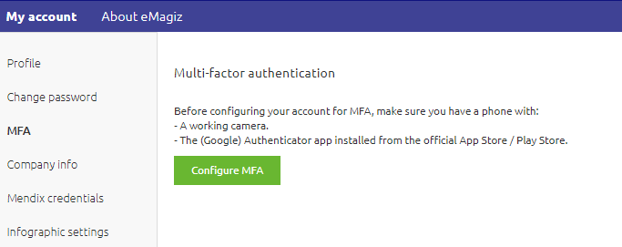

    

        <main class="micro-learning">
        <ul class="doc-nav">
            <li class="doc-nav__item"><a href="../../docs/microlearning/crashcourse-platform-index" class="doc-nav__link">Home</a></li>
            <li class="doc-nav__item"><a href="#intro" class="doc-nav__link">Intro</a></li>
            <li class="doc-nav__item"><a href="#theory" class="doc-nav__link">Theory</a></li>
            <li class="doc-nav__item"><a href="#practice" class="doc-nav__link">Practice</a></li>
            <li class="doc-nav__item"><a href="#solution" class="doc-nav__link">Solution</a></li>
        </ul>

##### Intro

# Configure MFA - User Account

In the previous microlearning, we learned a bit about the security basics of the eMagiz portal. 
In this microlearning, we will build on that by learning how to configure MFA for your user account.

Should you have any questions, please get in touch with academy@emagiz.com.

- Last update: March 1st, 2022
- Required reading time: 4 minutes

## 1. Prerequisites
- Basic knowledge of the eMagiz platform

## 2. Key concepts
This microlearning centers around learning to configure MFA on your user account.

With MFA, we mean Multi-factor authentication that prevents you from accessing sensitive data without going through a two-step authentication process.

MFA can help you:
- Secure data
- Better verify who is logging in

##### Theory

## 3. Configure MFA - User Account

In the previous microlearning, we learned a bit about the security basics of the eMagiz portal. 
In this microlearning, we will build on that by learning how to configure MFA for your user account.

At the moment, the eMagiz portal is secured to gain access to the Production environment of any customer-related eMagiz model. MFA is activated by default. In the future, we will expand this to request MFA on login for all users to enhance our security. Therefore it is mandatory to activate MFA on your user account. Note that the MFA is valid for 8 hours except for logging out. When you log out, the MFA code is automatically expired. This means that when you log in again within that timeframe, you still need to provide the MFA code again.

### 3.1 How to configure

To configure MFA on your user account, you need to execute the following steps.

- Navigate to the Administration section after being logged in at my.emagiz.com. This section is found in the top right corner.
- Select the MFA option from the left-hand menu. As a result, you will see the following.

- Download the Google authenticator app on your device
- Scan the QR code from the Google authenticator app on your device

- Once done, select the green button to indicate the setup is done

Note that you should contact your partner manager if you encounter problems while setting up your MFA.

##### Practice

## 4. Assignment

There is no assignment linked to this microlearning, as you can only set up your MFA once.

## 5. Key takeaways

MFA can help you:
- Secure data
- Better verify who is logging in

To set up MFA, you need:
- Google Authenticator App
- QR Code under the MFA section within the Administration section in the portal

##### Solution

## 6. Suggested Additional Readings

If you are interested in this topic and want more information, please read the help text provided by eMagiz.

## 7. Silent demonstration video

As the QR Code needs to be kept safe from a security standpoint, we cannot make a demonstration video for this microlearning.

</main>

