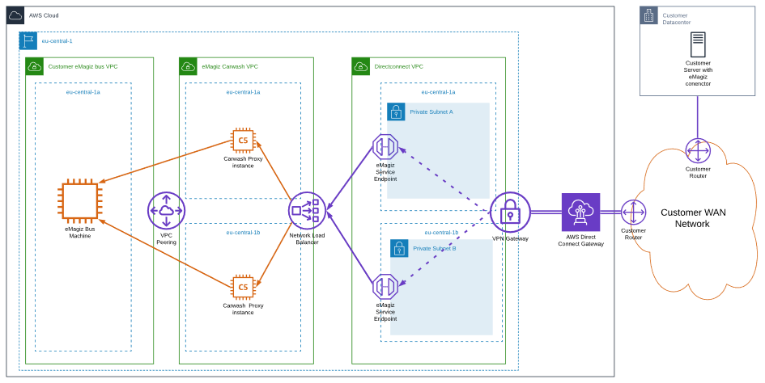
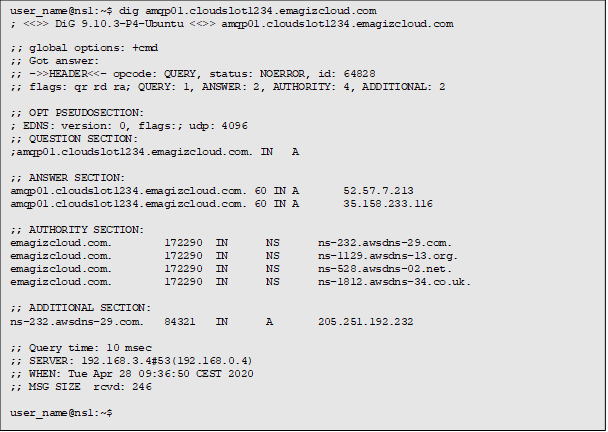
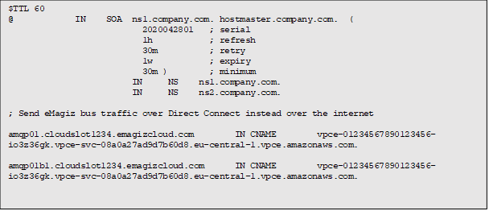

    

        <main class="micro-learning">
        <ul class="doc-nav">
            <li class="doc-nav__item"><a href="../../docs/microlearning/expert-solution-architecture-index" class="doc-nav__link">Home</a></li>
            <li class="doc-nav__item"><a href="#intro" class="doc-nav__link">Intro</a></li>
            <li class="doc-nav__item"><a href="#theory" class="doc-nav__link">Theory</a></li>
            <li class="doc-nav__item"><a href="#practice" class="doc-nav__link">Practice</a></li>
            <li class="doc-nav__item"><a href="#solution" class="doc-nav__link">Solution</a></li>
        </ul>

##### Intro

# AWS Direct Connect

In this microlearning, we will focus on how you can use AWS Direct Connect to connect to your eMagiz environment.
The Direct Connect solution acts like an extension of the customer network.

Should you have any questions, please contact academy@emagiz.com.

- Last update: April 1th 2021
- Required reading time: 5 minutes

## 1. Prerequisites
- Advanced knowledge of the eMagiz platform
- Expert knowledge of AWS Infrastructure

## 2. Key concepts
This microlearning centers around how you can use AWS Direct Connect to connect to your eMagiz environment.
With the AWS Direct Connect, we mean: An option that gives the client the option to directly connect their network to eMagiz without data travelling over the internet

This microlearning will explain how traffic needs to be routed over the dedicated connection by adding DNS records to the corporate resolving servers.
The network architecture Below is a technical representation of the connectivity between the customer network and the AWS deployment of a eMagiz Platform Instance of the customer. 

##### Theory

## 3. # AWS Direct Connect

This microlearning will explain how traffic needs to be routed over the dedicated connection by adding DNS records to the corporate resolving servers.
The network architecture Below is a technical representation of the connectivity between the customer network and the AWS deployment of a eMagiz Platform Instance of the customer. 

An eMagiz platfom instance is reachable via the internet via DNS records with below format:
amqp01.cloud<number>.emagizcloud.com (The primary node)
amqp01b1.cloud<number>.emagizcloud.com (The backup node)

### 3.1 Force eMagiz traffic over the Direct Connect

To force traffic from the customers network to the bus over a Direct Connect connection a change to the corporate DNS service needs to be done by adding overrides to the bus DNS records.
In the infrastructure drawing the Direct Connect VPC is an extension of the customer network. It contains IP numbering matching the customers network IP plan. 

From the received allocation two subnets are configured in separate AWS Availability Zones (datacenters). Within these subnets two endpoints are setup so the bus can be reached via the internal network. These “Service Endpoints” can be resolved via a DNS record with the following format: vpce-<unique_id>.vpce-svc-08a0a27ad9d7b60d8.eu-central-1.vpce.amazonaws.com

The private addresses which are resolved by above endpoint need to be added to the internal DNS servers as overrides so traffic to the public eMagiz Platform Instance DNS names are resolved to the internal IP addresses.
- An example of above change implemented in BIND can be followed in below blog posting: https://www.redpill-linpro.com/sysadvent/2015/12/08/dns-rpz.html
- Comparable solutions exist for Microsoft DNS servers: https://blog.simonw.se/override-a-single-external-hostname-with-internal-dns-entry/

### 3.2 Example implementation with BIND
An example customer has cloudslot123 and service endpoint vpce-01234567890123456-io3z36gk allocated to their private endpoint over Direct Connect. A DNS lookup before the change results connecting to the public internet endpoint of the eMagiz Platform Instance:

Creating a RPZ zone in the “company.com” dns servers:

After the change a DNS lookup to the bus results in answers over the Direct Connect (172.20.3.20 and 172.20.4.22):

##### Practice

## 4. Assignment

There is no assignment for this microlearning as the above implementation will only be done when a specific use case is identified.

## 5. Key takeaways

- AWS Direct Connect acts as an extension of the customer network
- Ensure that the DNS lookup is changed to look for internal IP addresses in stead of public ones.

##### Solution

## 6. Suggested Additional Readings

If you are interested in this topic and want more information on it please read the following:

- https://blog.simonw.se/override-a-single-external-hostname-with-internal-dns-entry/
- https://www.redpill-linpro.com/sysadvent/2015/12/08/dns-rpz.html

## 7. Silent demonstration video

There is no demonstration video for this microlearning. We believe that the implementation of this is too specific based on the used case that a video would not be beneficial.

</main>

