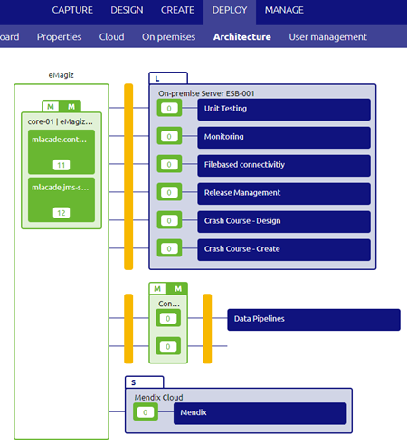
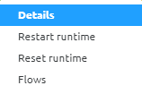
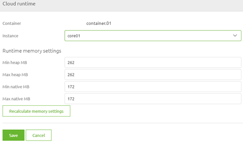
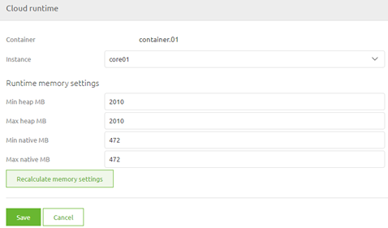
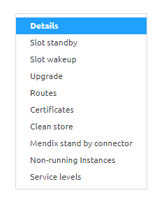
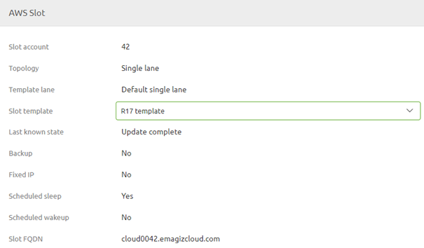

	

		<main class="micro-learning">
		<ul class="doc-nav">
			<li class="doc-nav__item"><a href="../../docs/microlearning/expert-solution-architecture-index" class="doc-nav__link">Home</a></li>
			<li class="doc-nav__item"><a href="#intro" class="doc-nav__link">Intro</a></li>
			<li class="doc-nav__item"><a href="#theory" class="doc-nav__link">Theory</a></li>
			<li class="doc-nav__item"><a href="#practice" class="doc-nav__link">Practice</a></li>
			<li class="doc-nav__item"><a href="#solution" class="doc-nav__link">Solution</a></li>
		</ul>

##### Intro

# Configure Needed Memory - Cloud

In the last microlearning, we learned how you together with eMagiz can determine the memory that is needed to run your solution.
In this microlearning, we will focus on how can configure the memory that each runtime needs within the boundaries of what is available on machine level.

In this microlearning, we will focus on runtimes that are running in the eMagiz Cloud. 
In other microlearnings, we will learn about configuring the correct runtime size for on-premise installations.
 
Should you have any questions, please contact academy@emagiz.com.

- Last update: February 23th 2021
- Required reading time: 5 minutes

## 1. Prerequisites
- Advanced knowledge of the eMagiz platform
- At least one runtime that is running in the eMagiz cloud

## 2. Key concepts
This microlearning centers around configuring the memory that is needed to run the parts of your complete integration landscape that run in the eMagiz cloud.
With configuration we mean: Based on the calculations assign the correct heap and non-heap memory per runtime in Deploy Architecture

- Configuration of memory takes place in Deploy Architecture
- eMagiz provides you with a recalculate button that will do the calculation for you
- Use the calculation made by eMagiz and checked by you to fill in the numbers if you deviate from the recommended settings

##### Theory

## 3. Configure Needed Memory - Cloud

In the last microlearning, we learned how you together with eMagiz can determine the memory that is needed to run your solution.
In this microlearning, we will focus on how can configure the memory that each runtime needs within the boundaries of what is available on machine level.

In case your solution falls within the assumptions of eMagiz you only have to use the recalculate button when you exceed a threshold (think back to the table we shared in the last microlearning)
and let eMagiz do all the heavy lifting.

In cases where all or part of the assumptions are violated, you can start with using the recalculate button and based on that change the settings to mimic your calculations.

### 3.1 Deploy Architecture

You can recalculate the memory settings when you navigate to Deploy -> Architecture

After you have entered start editing mode on this view you will be able to edit the exact memory settings per cloud runtime.

With a right click of your mouse, you can access the context menu and select the option called Details

Selecting this option will lead you to the following pop-up

As you can see, the details page tells you the current memory settings and gives you the option to recalculate based on the calculation done by eMagiz.

Do note that the complete difference between needed memory and allocated memory will be added to the heap memory of this container

### 3.2 Apply to environment

When you are satisfied with the changes you have made there is one more step left for you to do. This step is called Apply to environment. 
Pressing this button will send a command to the eMagiz Cloud to change the configuration of your eMagiz Cloud setup based on the changes made in Deploy Architecture.

When you open the context menu on the eMagiz cloud slot itself (right mouse click in Deploy Architecture away from the integration landscape overview) you can access the details page

On this page, you can track the progress of your update. When it says Update complete the command has been send and processed successfully.

##### Practice

## 4. Assignment

Compare the configuration of what is configured in Deploy Architecture with the calculation you made for the previous assignment
This assignment can be completed with the help of the (Academy) project that you have created/used in the previous assignment.

## 5. Key takeaways

- Configuration of memory takes place in Deploy Architecture
- eMagiz provides you with a recalculate button that will do the calculation for you
- Use the calculation made by eMagiz and checked by you to fill in the numbers if you deviate from the recommended settings
- When you are satisfied apply the changes to the eMagiz cloud slot linked to your project

##### Solution

## 6. Suggested Additional Readings

If you are interested in this topic and want more information on it please read the help text provided by eMagiz.

## 7. Silent demonstration video

As the assignment linked to this microlearning can only be executed in conjuncture with the eMagiz cloud we have opted to not make a video for now.

</main>

