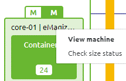
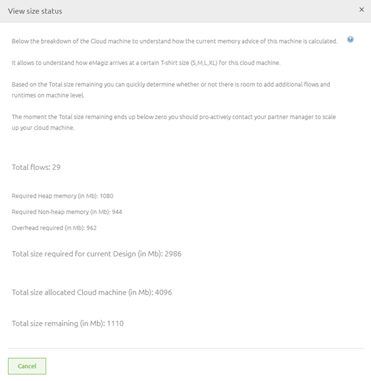
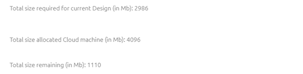
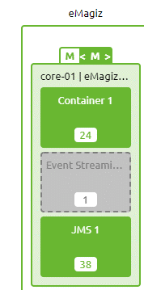

# Determining Needed Memory

In this microlearning, we will focus on how can stay in control of your integration landscape with the help of determining the needed memory footprint for your integration landscape.
As your integration landscape changes over time the need for more (or less) memory is evident. 

.Therefore it is crucial to know how you can determine the memory correctly.

Should you have any questions, please contact academy@emagiz.com.

- Last update: February 22th 2021
- Required reading time: 13 minutes

## 1. Prerequisites
- Advanced knowledge of the eMagiz platform

## 2. Key concepts
This microlearning centers around determining the memory that is needed to run your complete integration landscape.
With memory, we mean: A collection of memory types (heap, native and direct) that are needed to properly run a runtime (Java Virtual Machine)
With integration landscape we mean: A overview of all data integrations that are used to exchange data between systems

- eMagiz will help to determine the needed memory via the Design Architecture page.
- eMagiz works with pre-determined sizes that are represented via an S, M, L, XL structure. Every size has a certain amount of memory available
- When you exceed such a threshold you should upgrade (or downgrade) your memory in consultation with your partner manager
- Overhead for OS and support functionality (auto-healing, alerting, monitoring) needs to be taken into account

## 3. Determining Needed Memory

One of the key aspects of running a stable eMagiz solution is proper management of the needed memory to run all your integrations within your integration landscape.
To determine what is needed you get help from eMagiz in Design Architecture. 
In the Design Architecture eMagiz tells you based on our calculations what the recommended sizing of a **machine** should be. 
If this deviates from what is configured you should take a closer look at whether you indeed need more memory.

### 3.1 The calculation of eMagiz

In this section, we will delve into that recommendation to explain to you how you should interpret this recommendation so you can make the correct determination of how much memory is needed.

To calculate the memory eMagiz has determined that the flows that are running on the runtimes make up most of the memory. 
To calculate how much memory a single flow uses on average eMagiz uses several assumptions. These assumptions are the foundation of the recommended memory size by eMagiz.

- Limited use of 'non-standard' flows. So, are the number of components within a flow comparable to the 'standard' setup (i.e. an autogenerated onramp).
- Average message size of less than 100KbSize van de berichten
- Standard number of consumers
- Use of Java extensions such as Groovy Scripts
- Limited use of complex transformations
- Limited use of Xpath and SpEL expression related to large messages

As long as you do not deviate from the above assumptions at all or not too much the recommended sizing of eMagiz should work for you.

Based on the above assumption we made thresholds for the number of flows. 
If you pass a threshold (i.e. 50 flows) the recommended size of that runtime and therefore the machine the runtime is running on will increase.

All thresholds that are used by eMagiz can be found in the help text of eMagiz when checking the size status.

On top of the calculation of needed memory based on the number of flows eMagiz also accounts for the following 'overhead'

- OS
- Support functionality (auto-healing, alerting on infrastructure, monitoring on infrastructure)
- Buffer

For JMS processes the default is 500MB heap and 152MB non-heap. 
In most cases, there is no reason to deviate from this number until you reach a lot of throughput on a lot of flows.

### 3.2 Check size status

Now that we know how eMagiz calculates the needed memory based on the number of flows and certain categories of overhead we can turn our attention to the eMagiz tooling itself.
In eMagiz, in Design Architecture you can check the recommended size status given by eMagiz.

Selecting this option will lead you to the following pop-up

In this pop-up you see the calculation split up into three categories:

- Required heap memory
- Required non-heap (native) memory
- Required overhead

#### 3.2.1 Required overhead

The first segment we are going to take a look at is the required overhead. Under this category fall the following characteristics:

- OS
- Support functionality (auto-healing, alerting on infrastructure, monitoring on infrastructure)
- Buffer

Each of these characteristics has a pre-determined setting that we recommend for the proper working of eMagiz. 
We reserve 712MB for the OS, 50MB for the Support functionality, and a Buffer of 100MB **per** active runtime on a machine. 
If we tally this up for our example we end up with 962MB of overhead. Just as you can see in the pop-up:

#### 3.2.2 Required heap memory

As explained before the amount of memory needed is determined by the number of flows that are designed within your integration landscape. 
In eMagiz the memory allocation is divided into two parts:

- Heap memory
- Native (non-heap) memory

The heap memory is used to process messages and can be cleaned up via the garbage collection process. 
The native memory is used to start up your flows and keep them running. This part of the memory is allocated and not released in the same way as with heap memory.

To make it clear for you how much of which type of memory is needed we have split up the calculation into two portions. 
One for the required heap memory and the other for the required non-heap (native) memory.

Both are derived from the number of flows that are designed in your integration landscape. In our example, we have one JMS and one process container, and a total of 29 flows.
This leads to the following calculation on heap memory:

500 (JMS) + 580 (Process Container) = 1080MB. This is once again the same as what is calculated under check size status

#### 3.2.3 Required non-heap memory

The third part of the equation is the amount of non-heap memory that is required to run your eMagiz solution. Once again the starting point is the number of flows. In this case 29 flows.
This leads to the following calculation on non-heap memory:

152 (JMS) + 792 (Process Container = 944MB. This is the same as what is calculated under check size status

#### 3.2.4 Total recommended memory

When you sum up these three values you arrive at the recommended size based on the current state of your Design. 
So when your Design is not representative of the truth the calculation will neither be a correct representation of the truth.

In this case the total recommended memory will be:

962 + 1080 + 944 = 2986MB

### 3.3 Comparison

Now that we know the recommended sizing of eMagiz we can compare this to the sizing that is allocated based on the contractual agreements between eMagiz and you.
This is the last segment of the check Size Status information in Design. In this segment you see:

- The recommended size
- The allocated size
- The difference between recommended and allocated

So in this example, we still have 1110MB left on our machine. If the number at the bottom would indicate that you need more size than is allocated at the moment you should take action.

### 3.4 Taking Action

Based on this information it is time to take action. Taking action is foremost validating the calculation as given by eMagiz. 
As said before we assume certain things and based on whether part of those assumptions, all of them or none of them are met the result could differ.

In this section, we will discuss some combinations and the appropriate action based on these combinations.

#### 3.4.1 Valid Assumptions + Correct nr. of flows

The first combination is the easiest of them all. This combination states that all assumptions that eMagiz has done hold truth. 
If so, trust the calculations of eMagiz and ensure that there is enough allocated room based on the recommended size by eMagiz.

#### 3.4.2 Valid Assumptions + Incorrect nr. of flows

We see a growing number of projects that have a myriad of process containers with the consequence that the assumption that all process containers run the same flows does not hold anymore.
In these cases, you should adjust the calculations for the heap and non-heap memory allocation yourself based on the actual number of flows.

If the result of that calculation still says that there is not enough room please allocate more room based on that altered calculation. 
To help you perform that calculation yourself we have devised two tables that you can use to come up with the correct values for both heap and non-heap.

The table shown below is relevant for process containers on the CORE machines. 

| Nr. Flows | Heap | Non-heap | 
| :---: | :----: | :---: |
| 0-10 | 500 | 472 |
| 11-20 | 500 | 552 |
| 21-50 | 580 | 792 |
| 51-75 | 820 | 992 |
| 76-100 | 820 | 1192 |
| 101-150 | 1220 | 1592 |

The table shown below is relevant for connectors on the CONNECTOR machines.

| Nr. Flows | Heap | Non-heap |
| :---: | :----: | :---: |
| 0-5 | 500 | 152 |
| 6-10 | 500 | 192 |
| 11-15 | 500 | 232 |
| 16-20 | 500 | 272 |
| 21-25 | 580 | 312 |
| 26-30 | 580 | 352 |
| 31-35 | 580 | 392 |
| 36-40 | 580 | 432 |
| 41-45 | 580 | 472 |
| 46-50 | 580 | 512 |
| 51-55 | 820 | 552 |
| 56-60 | 820 | 592 |
| 61-65 | 820 | 632 |
| 66-70 | 820 | 672 |
| 71-75 | 820 | 712 |
| 76-100 | 820 | 912 | 

#### 3.4.3 Incorrect Assumptions

When you deviate from the assumptions made by eMagiz to determine the sizing 
you should start from scratch and determine how much you roughly deviate from the standard assumptions.

Based on that estimate you should increase the heap and non-heap memory accordingly. 
This won't have any effect on the calculations for the overhead so they will stand.
For example, when you deviate from the assumptions in a little way you could think of selecting the memory settings that are determined for one level higher.

If you deviate a lot from the assumptions you should increase more drastically and test your solutions on the performance based on the expected throughput.

### 3.5 Configure the size

Now that we know what the size should be, either by following the eMagiz calculation 
or by calculating the correct numbers ourselves with the help of components of the eMagiz calculation we can configure the size.

To configure the size you enter Start Editing Mode in Design Architecture

While you are in Start Editing Mode you can alter the configured size of your eMagiz cloud machines to ensure that enough memory is available for the processes running on that machine.
You can easily do so by switching around between S, M, L, XL, and XXL on machine level with the help of the arrows. 
After you have altered the size you can verify whether the change was enough by comparing 
it to the recommended size which is shown beside the configured size, by opening the Check Size Status pop-up for conformation or by comparing your calculation to the newly allocated memory.

In case there is room left you have scaled accordingly. If there still is extra room required you should move another level up until you reach the desired level.

## 4. Assignment

Do your calculation based on what we learned in this microlearning and compare the solution to what eMagiz suggests under Check Size Status
This assignment can be completed with the help of the (Academy) project that you have created/used in the previous assignment.

## 5. Key takeaways

- eMagiz will help to determine the needed memory via the Design Architecture page.
- eMagiz works with pre-determined sizes that are represented via an S, M, L, XL structure. Every size has a certain amount of memory available
- When you exceed such a threshold you should upgrade (or downgrade) your memory in consultation with your partner manager
- Overhead for OS and support functionality (auto-healing, alerting, monitoring) needs to be taken into account
- Calculating memory can be challenging. Always confer with others before taking action
- You can compare your calculations with the calculations of eMagiz.

## 6. Suggested Additional Readings

If you are interested in this topic and want more information on it please read the help text provided by eMagiz.

## 7. Silent demonstration video

This video demonstrates how you could have handled the assignment and gives you some context on what you have just learned.

<iframe width="1280" height="720" src="../../vid/microlearning/expert-solution-architecture-determining-needed-memory.mp4" frameborder="0" allow="accelerometer; autoplay; clipboard-write; encrypted-media; gyroscope; picture-in-picture" allowfullscreen></iframe>