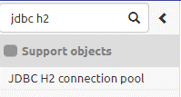
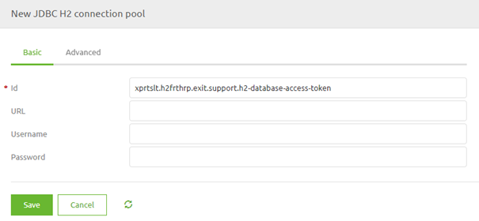
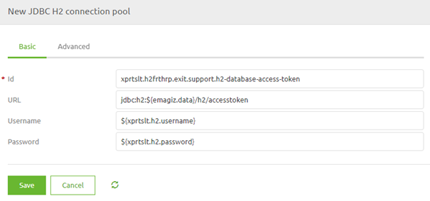
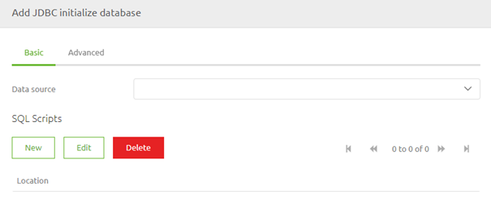
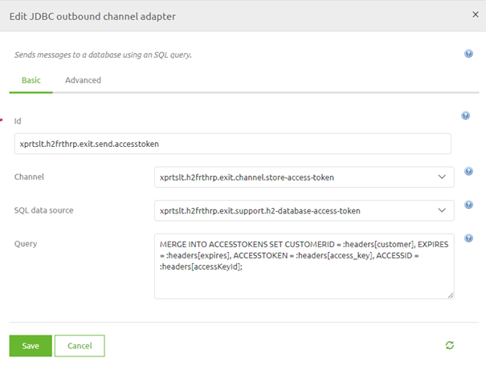

    

        <main class="micro-learning">
        <ul class="doc-nav">
            <li class="doc-nav__item"><a href="../../docs/microlearning/expert-solution-architecture-index" class="doc-nav__link">Home</a></li>
            <li class="doc-nav__item"><a href="#intro" class="doc-nav__link">Intro</a></li>
            <li class="doc-nav__item"><a href="#theory" class="doc-nav__link">Theory</a></li>
            <li class="doc-nav__item"><a href="#practice" class="doc-nav__link">Practice</a></li>
            <li class="doc-nav__item"><a href="#solution" class="doc-nav__link">Solution</a></li>
        </ul>

##### Intro

# H2 Database for other applications

In this microlearning, we will focus on how you can use the H2 database to store information temporarily so you can use it at another time or maybe even in another process.
As you know the H2 database within eMagiz is used to store messages to ensure guaranteed delivery between the entry and the onramp in messaging.

However, there are also other use cases in which an H2 database of your own making will be beneficial:
- Storing tokens because of rate-limiting of an external API
- Remembering where eMagiz stopped the last time when a process was executed (eMagiz remembers this to create deltas)
- Enriching your message with data from the H2 database

Should you have any questions, please contact academy@emagiz.com.

- Last update: April 1th 2021
- Required reading time: 8 minutes

## 1. Prerequisites
- Advanced knowledge of the eMagiz platform

## 2. Key concepts
This microlearning centers around how you can use the H2 database to store information temporarily so you can use it at another time or maybe even in another process.
With the H2 database, we mean: A component in eMagiz that can easily create a simple database on runtime level that you can access from your flow

As you know the H2 database within eMagiz is used to store messages to ensure guaranteed delivery between the entry and the onramp in messaging.

However, there are also other use cases in which an H2 database of your own making will be beneficial:
- Storing tokens because of rate-limiting of an external API
- Remembering where eMagiz stopped the last time when a process was executed (eMagiz remembers this to create deltas)
- Enriching your message with data from the H2 database

##### Theory

## 3. H2 Database for other applications

As you know the H2 database within eMagiz is used to store messages to ensure guaranteed delivery between the entry and the onramp in messaging.

However, there are also other use cases in which an H2 database of your own making will be beneficial:
- Storing tokens because of rate-limiting of an external API
- Remembering where eMagiz stopped the last time when a process was executed (eMagiz remembers this to create deltas)
- Enriching your message with data from the H2 database

Be sure to validate with others whether using the H2 database is the only option available to store this data. Consider other patterns and other approaches that might provide a better and more robust solution.

### 3.1 Setting up the table within the H2 database

Regardless of which use case you have you need to implement several steps to make it work in eMagiz. The first part is setting up your table within the H2 database and ensure that eMagiz will create an H2 database for you. To do so you need the following:

- A SQL resource that defines the table structure
- The support object called JDBC H2 Connection Pool
- The support object called JDBC initialize database

A simple SQL statement that defines a table that holds the access token could look something like this.

CREATE TABLE IF NOT EXISTS ACCESSTOKENS
(
    CUSTOMERID varchar(255) PRIMARY KEY,
    EXPIRES varchar(255),
    ACCESSTOKEN varchar(255),
    ACCESSID varchar(255)
);
INSERT INTO ACCESSTOKENS
SELECT 'NEW', '0', 'NEW', 'NEW'
WHERE NOT EXISTS (SELECT * FROM ACCESSTOKENS);

After you are satisfied with your SQL statement you can save the file with the .sql extension and upload it to eMagiz and link it to your flow.

The next step will be to add the support object called JDBC H2 Connection Pool to the flow

When you open the component you will see that you need to fill in three variables

The URL should look similar to the one shown in the help text. The only distinction is that the actual name (the part after h2/) needs to be changed to indicate that this H2 database is only meant to store something related to your use case. You can determine the username and password yourselves. A best practice is to refer to these values via a property in this component.

The third and final step to set up the table within the H2 database is to add the support object called JDBC initialize database.

There are two things we need to do to configure the component correctly. First, we need to link this component to the support object we have just created. Second, we need to refer to the SQL script that we have uploaded to our flow. To do so press New and fill in the Location. Remember the location starts with resources/ and should hold the unique reference number given by eMagiz and the extension of the resource.

If you fail to do so eMagiz will not be able to locate the resource. Having done these things should result in something like this:

### 3.3 Write data to the table

At some point in your process, based on your use case, you will need to write new data to the table to either update an existing row or to create a new row. To do so you can use a JDBC outbound channel adapter.

For the component to properly function we need to refer to our data source and we need a SQL query that can be executed on this table. See below for an example of such an SQL Query

MERGE INTO ACCESSTOKENS SET CUSTOMERID = :headers[customer], EXPIRES = :headers[expires], ACCESSTOKEN = :headers[access_key], ACCESSID = :headers[accessKeyId];

When you have correctly filled in the details of the component it should look similar to below

### 3.4 Read data from table

Now that we have created a table in the database and we have written data to that table we now need to think about a way in which we can retrieve the data from the table in question. As you can imagine the next time you need the information from the table you will have to retrieve the information. One way of doing that is to use the XSLT Extension Gateway functionality. For more information on how to apply that you can take a look at the following microlearning: [XSLT Extension Gateway](advanced-data-handling-xslt-extension-gateway.md)

##### Practice

## 4. Assignment

Build an exit or entry flow in which you incorporate the logic that you have just learned
This assignment can be completed with the help of the (Academy) project that you have created/used in the previous assignment.

## 5. Key takeaways

- As you know the H2 database within eMagiz is used to store messages to ensure guaranteed delivery between the entry and the onramp in messaging.
- However, there are also other use cases in which an H2 database of your own making will be beneficial:
    - Storing tokens because of rate-limiting of an external API
    - Remembering where eMagiz stopped the last time when a process was executed (eMagiz remembers this to create deltas)
    - Enriching your message with data from the H2 database
- In the flow designer you need to ensure that the database and table are created, that you can write and read data

##### Solution

## 6. Suggested Additional Readings

If you are interested in this topic and want more information on it please read the help text provided by eMagiz.

## 7. Silent demonstration video

There is no demonstration video for this microlearning. We believe that the implementation of this is too specific based on the used case that a video would not be beneficial.

</main>

