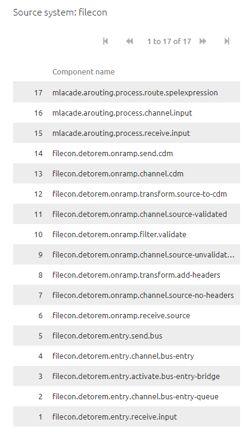
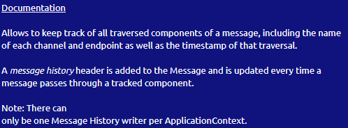
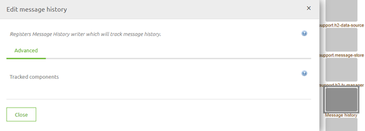
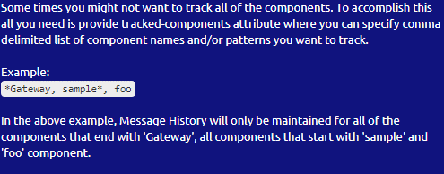

	

		<main class="micro-learning">
		<ul class="doc-nav">
			<li class="doc-nav__item"><a href="../../docs/microlearning/expert-solution-architecture-index" class="doc-nav__link">Home</a></li>
			<li class="doc-nav__item"><a href="#intro" class="doc-nav__link">Intro</a></li>
			<li class="doc-nav__item"><a href="#theory" class="doc-nav__link">Theory</a></li>
			<li class="doc-nav__item"><a href="#practice" class="doc-nav__link">Practice</a></li>
			<li class="doc-nav__item"><a href="#solution" class="doc-nav__link">Solution</a></li>
		</ul>

##### Intro

# Impact Message History on Message Size

In this microlearning, we will focus on the impact the message history can have on the message size in some specific situations.
Sometimes you are building complex integrations with a lot of steps and maybe even recurring steps. 
In those situations, it is crucial to know what the impact of the message history is on the message size.

Should you have any questions, please contact academy@emagiz.com.

- Last update: March 5th, 2021
- Required reading time: 6 minutes

## 1. Prerequisites
- Advanced knowledge of the eMagiz platform

## 2. Key concepts
This microlearning centers around the impact the message history can have on the message size in some specific situations.
With message history, we mean: The series of channels that a message has passed between entering eMagiz and exiting eMagiz

- On default, the Message History functionality of eMagiz will register all channels a message has passed from entering the first channel to exiting the last channel
- On default, the amount of channels constitutes a fraction of the total message size as the number of channels is limited
- In a situation where the number of channels used to functionally do what is needed you can reduce what eMagiz will log as message history to reduce the message size

##### Theory

## 3. Impact Message History on Message Size

In eMagiz, you have a functionality called the Message History. 
This functionality tracks on a message level which channels a message that has passed between entering an eMagiz project and exiting an eMagiz project.

### 3.1 Why Message History
The message history functionality is very useful in determining where a message stranded in case of error and through which channel the message had passed before resulting in an error.

To ensure that eMagiz can display this information a header is kept on the message called message history. See the below help text for more information:

As the help text indicates this functionality is done on a per ApplicationContext basis. 
In the context of eMagiz, this means that every flow has its unique support object (that is generated by default) to support this functionality.

### 3.2 Standard Implemenation

The default setting for this component is to track all channels within a flow. 

This is fine in 99% of the cases. However, in this case with recurring steps and therefore huge amounts of channels it could hurt you.

### 3.1 Complex Implemenation

In some flows, you have steps that are recurring in nature (i.e. steps that happen more often than once) you can imagine that the number of channels that are kept in the message history can become astronomical.
We have even seen cases where the message channel had more than 11000 channels. 
As the headers are also part of the data packet that needs to be sent across eMagiz you can imagine that having a header that is so large will directly impact the amount of data that needs to be processed by eMagiz.

In the most extreme cases, it could even lead to an out-of-memory or significant performance loss of your eMagiz environment. 
To safeguard yourself against this scenario you can override the default settings of the message history component

You can do this by specifying specific channels for which you want the message history to be stored or you can set it up more dynamically by using wildcard notations as is depicted above.

So to conclude this microlearning the important thing to remember is that when you create a flow that will let the message travel over a huge number of channels please consider changing the default behavior of what is stored in the Message History.
This way you can safeguard yourself against future problems.

##### Practice

## 4. Assignment

Navigate to a flow within your (Academy) project and change the default message history to only log channels that end with the word entry.
This assignment can be completed with the help of the (Academy) project that you have created/used in the previous assignment.

## 5. Key takeaways

- On default, the Message History functionality of eMagiz will register all channels a message has passed from entering the first channel to exiting the last channel
- On default, the amount of channels constitutes a fraction of the total message size as the number of channels is limited
- In a situation where the number of channels used to functionally do what is needed you can reduce what eMagiz will log as message history to reduce the message size
	- Changing this will safeguard you against future problems

##### Solution

## 6. Suggested Additional Readings

If you are interested in this topic and want more information on it please read the help text provided by eMagiz.

## 7. Silent demonstration video

This video demonstrates how you could have handled the assignment and gives you some context on what you have just learned.

<iframe width="1280" height="720" src="../../vid/microlearning/expert-solution-architecture-impact-message-history-on-message-size.mp4" frameborder="0" allow="accelerometer; autoplay; clipboard-write; encrypted-media; gyroscope; picture-in-picture" allowfullscreen></iframe>

</main>

