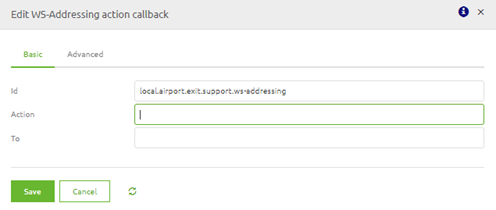
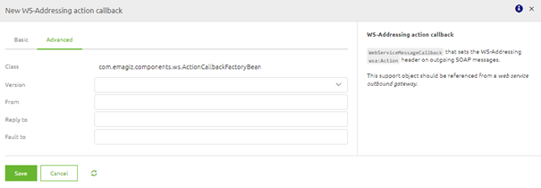
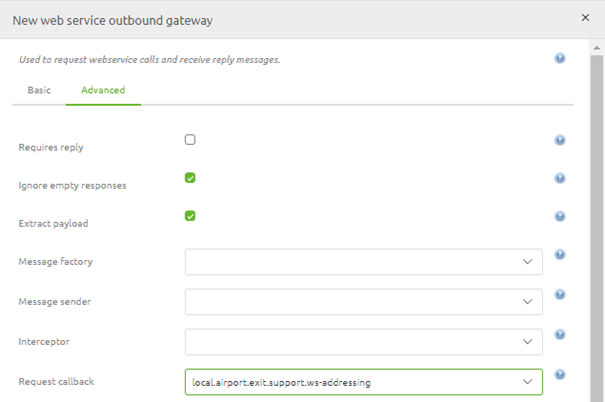

    

        <main class="micro-learning">
        <ul class="doc-nav">
            <li class="doc-nav__item"><a href="../../docs/microlearning/expert-webservice-security-index" class="doc-nav__link">Home</a></li>
            <li class="doc-nav__item"><a href="#intro" class="doc-nav__link">Intro</a></li>
            <li class="doc-nav__item"><a href="#theory" class="doc-nav__link">Theory</a></li>
            <li class="doc-nav__item"><a href="#practice" class="doc-nav__link">Practice</a></li>
            <li class="doc-nav__item"><a href="#solution" class="doc-nav__link">Solution</a></li>
        </ul>

##### Intro

# WS-Addressing

Within eMagiz, there are multiple ways of handling security concerning SOAP Webservices. One of these methods is WS-Addressing. In this microlearning, we will look at WS-Addressing from the following viewpoints:

- What is WS-Addressing
- Calling an external SOAP Webservice that requires WS-Addressing

Should you have any questions, please get in touch with academy@emagiz.com.

- Last update: March 1st, 2021
- Required reading time: 6 minutes

## 1. Prerequisites
- Advanced knowledge of the eMagiz platform
- Errors in the log that can be analyzed

## 2. Key concepts
WS-Addressing is a standardized way of including message routing data within SOAP headers.
For example, a WS-Addressing message may contain its dispatch metadata in a standardized SOAP header instead of relying on network-level transport to convey routing information.

To correctly configure WS-addressing on an outbound call, you need:
- Message destination URI
- Source endpoint
- Reply endpoint
- Fault endpoint
- Action

##### Theory
  
## 3. WS-Addressing

Within eMagiz, there are multiple ways of handling security concerning SOAP Webservices. One of these methods is WS-Addressing. In this microlearning, we will look at WS-Addressing from the following viewpoints:

- What is WS-Addressing
- Calling an external SOAP Webservice that requires WS-Addressing

### 3.1 What is WS-Addressing

WS-Addressing is a standardized way of including message routing data within SOAP headers. 
For example, a WS-Addressing message may contain its dispatch metadata in a standardized SOAP header instead of relying on network-level transport to convey routing information.

This can be achieved by sending (a set of) WS-Addressing SOAP Headers along with the SOAP body. Examples of these headers are:

Relationship to previous messages (A pair of URIs)
- Message destination URI
- Source endpoint
- Reply endpoint
- Fault endpoint
- Action

What an external system exactly requires in terms of WS-Addressing headers depends on the requirements made by that system.

### 3.2 Calling an external SOAP Webservice that requires WS-Addressing

To ensure that eMagiz creates the required SOAP headers on top of your SOAP message, you must add one support object to the flow where you want to call the external web service (predominantly the exit). 
This support object is:

- WS-Addressing action callback

Within this component, you can set the following headers as well as choose the version of WS-Addressing that is required:

- Action (required)
- To
- From
- Reply To
- Fault To

When you are satisfied with your configuration, you can link this support object to the web service outbound gateway as follows:

After doing all this, you can test the flow to verify that the WS-Addressing is correctly configured, allowing you to call the external web service.

##### Practice

## 4. Assignment

Define the correct configuration of calling an external web service from an exit flow in eMagiz that requires WS-addressing to be sent along with the call. You can execute this assignment on the model you have used for the previous lessons.

## 5. Key takeaways

- WS-Addressing is a standardized way of including message routing data within SOAP headers
- These information elements can be added via a specific component in eMagiz
- Which information elements are needed is determined by the external party

##### Solution

## 6. Suggested Additional Readings

No suggested additional readings for this microlearning.

## 7. Silent demonstration video

This video demonstrates a working solution and how you can validate whether you have completed the assignment.

<iframe width="1280" height="720" src="../../vid/microlearning/expert-webservice-security-ws-addressing.mp4" frameborder="0" allow="accelerometer; autoplay; clipboard-write; encrypted-media; gyroscope; picture-in-picture" allowfullscreen></iframe>

</main>

