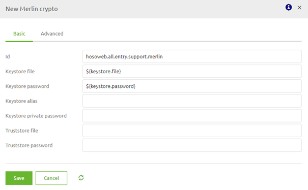
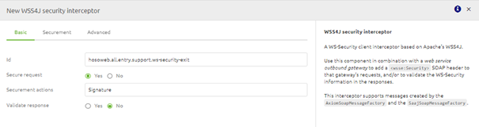
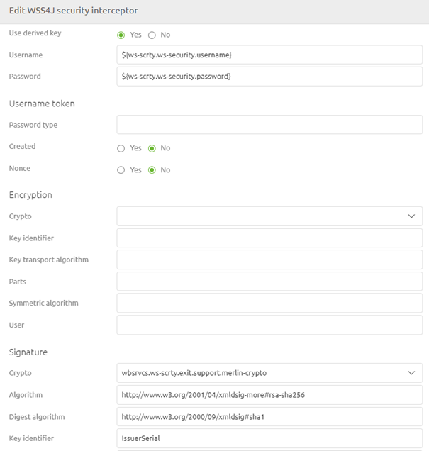
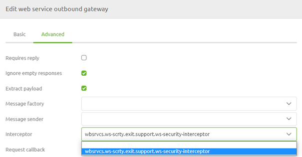
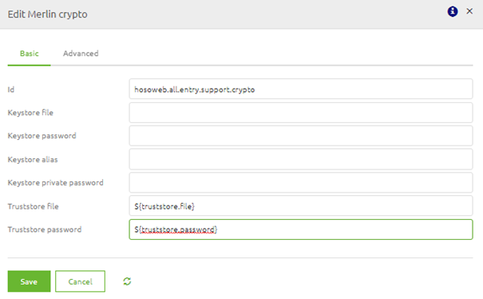
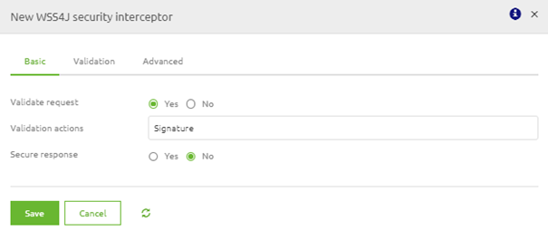
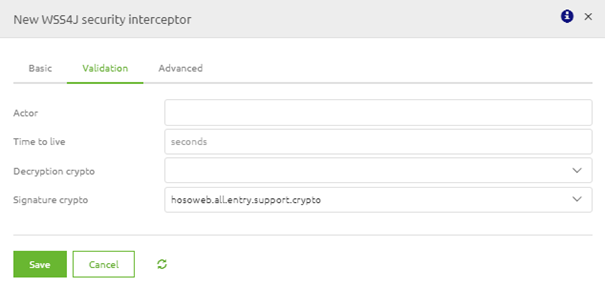
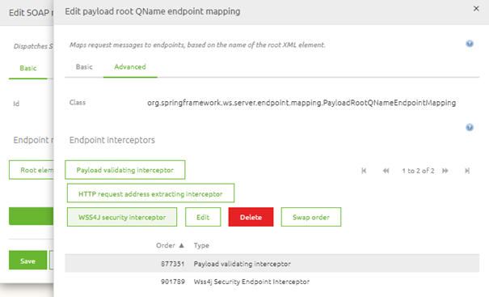

    

        <main class="micro-learning">
        <ul class="doc-nav">
            <li class="doc-nav__item"><a href="../../docs/microlearning/expert-webservice-security-index" class="doc-nav__link">Home</a></li>
            <li class="doc-nav__item"><a href="#intro" class="doc-nav__link">Intro</a></li>
            <li class="doc-nav__item"><a href="#theory" class="doc-nav__link">Theory</a></li>
            <li class="doc-nav__item"><a href="#practice" class="doc-nav__link">Practice</a></li>
            <li class="doc-nav__item"><a href="#solution" class="doc-nav__link">Solution</a></li>
        </ul>

##### Intro

# WS-Security

Within eMagiz, there are multiple ways of handling security concerning SOAP Webservices. One of these methods is WS-Security. In this guide, we will look at WS-Security from the following viewpoints:

- What is WS-Security
- Calling an external SOAP Webservice that has secured their web service via WS-Security
- Securing an eMagiz SOAP Webservice with the help of WS-Security

Should you have any questions, please get in touch with academy@emagiz.com.

- Last update: March 1st, 2021
- Required reading time: 8 minutes

## 1. Prerequisites
- Advanced knowledge of the eMagiz platform
- Errors in the log that can be analyzed

## 2. Key concepts
Web Services Security (WS Security) is a specification that defines how security measures are implemented in web services to protect them from external attacks.
This is done via a set of protocols that ensure the principles of confidentiality, integrity, and authentication via security for SOAP-based messages.

These aims can be implemented by sending (a set of) WS-Security SOAP Headers along with the SOAP body. Examples of these headers are:
- UsernameToken
- Timestamp
- Encrypt
- Signature
- NoSecurity

##### Theory
  
## 3. WS-Security

Within eMagiz, there are multiple ways of handling security concerning SOAP Webservices. One of these methods is WS-Security. In this guide, we will look at WS-Security from the following viewpoints:

- What is WS-Security
- Calling an external SOAP Webservice that has secured their web service via WS-Security
- Securing an eMagiz SOAP Webservice with the help of WS-Security

### 3.1 What is WS-Security

Web Services Security (WS Security) is a specification that defines how security measures are implemented in web services to protect them from external attacks.
This is done via a set of protocols that ensure the principles of confidentiality, integrity, and authentication via security for SOAP-based messages.

WS-Security aims to ensure that communication between two parties is not interrupted or interpreted by an unauthorized third party. 
The receiver needs to be assured that the sender indeed sent the message, and the sender should be guaranteed that the receiver cannot deny receiving the message. 
Finally, an unauthorized source should not alter the data sent during communication.

These aims can be implemented by sending (a set of) WS-Security SOAP Headers along with the SOAP body. Examples of these headers are:
- UsernameToken
- Timestamp
- Encrypt
- Signature
- NoSecurity 

For eMagiz hosted SOAP Webservice, we require the Signature option. What an external system needs depends on the requirements made by that system.

### 3.2 Calling an external SOAP Webservice that has secured its web service via WS-Security

To ensure that eMagiz creates the required SOAP headers on top of your SOAP message, you must add two support objects to the flow where you want to call the external web service (predominantly the exit). 
These support objects are:

- Merlin crypto
- WSS4J security interceptor

In the merlin crypto support object, you need to reference the Keystore you need to authenticate yourself with the external party. This Keystore should hold the correct key to access the web service.

The WSS4J support object should be filled based on the specifications delivered by the external party. Below you will find a standard implementation of WS-Security for an external SOAP web service. You need to fill in details on the basic and securement level for this to work.

To make sure that the actual headers are sent as part of the SOAP web service call eMagiz will execute, you must link the WSS4J security interceptor as interceptor on your web service outbound gateway.
If you have done so, your configuration of WS-Security will be correct.

You can test the setup by sending a message via eMagiz towards this SOAP web service to see if you correctly implement the requirements of the external party.

### 3.3 Securing an eMagiz SOAP Webservice with the help of WS-Security

To ensure that eMagiz can validate the incoming requests for the validity of the correct WS-Security SOAP headers, you need to add one support object and add a wss4j security validating interceptor to the message dispatcher component.

The support object you need to link to the entry is:

- Merlin crypto

In the merlin crypto support object, you need to reference the truststore where you store the public certificate against which the external needs to authenticate themselves.

Next to adding the support object, you must open the message dispatcher support object. Within this component, you select the payload root QName endpoint mapping for which you want to add the WS-Security settings and press Edit.
In the following pop-up, you can navigate to the Advanced tab, select the WSS4J security interceptor and configure this component as follows.

If you have configured this correctly, you will have something like this.

When you are done with the configuration, you can deploy the flow via Releases or straight from the flow if you have a Test environment and ask the external party to send a message towards your endpoint so you can validate the result.

##### Practice

## 4. Assignment

Define the correct configuration of calling an external web service from an exit flow in eMagiz that requires WS-security to be sent along with the call. You can execute this assignment on the model you have used for the previous lessons.

## 5. Key takeaways

- Web Services Security (WS Security) is a specification that defines how security measures are implemented in web services to protect them from external attacks.
- These information elements can be added via specific components in eMagiz
- Which information elements are needed is determined by the external party

##### Solution

## 6. Suggested Additional Readings

No suggested additional readings for this microlearning.

## 7. Silent demonstration video

This video demonstrates a working solution and how you can validate whether you have completed the assignment.

<iframe width="1280" height="720" src="../../vid/microlearning/expert-webservice-security-ws-security.mp4" frameborder="0" allow="accelerometer; autoplay; clipboard-write; encrypted-media; gyroscope; picture-in-picture" allowfullscreen></iframe>

</main>

