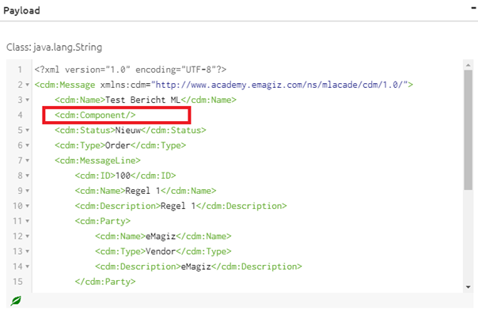
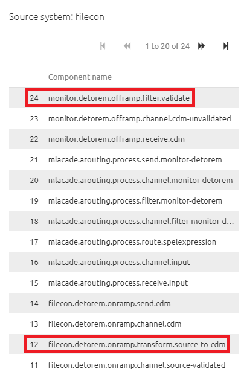
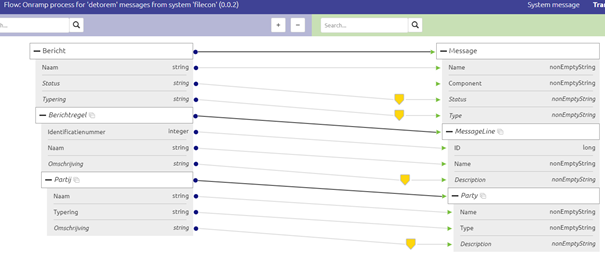
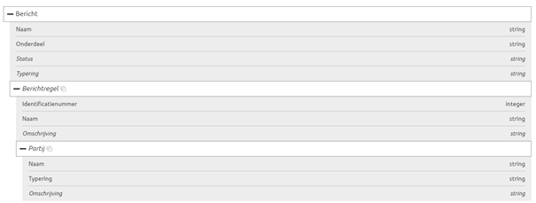
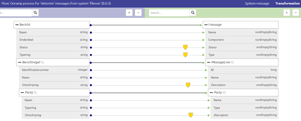

    

        <main class="micro-learning">
        <ul class="doc-nav">
            <li class="doc-nav__item"><a href="../../docs/microlearning/intermediate-active-monitoring-index" class="doc-nav__link">Home</a></li>
            <li class="doc-nav__item"><a href="#intro" class="doc-nav__link">Intro</a></li>
            <li class="doc-nav__item"><a href="#theory" class="doc-nav__link">Theory</a></li>
            <li class="doc-nav__item"><a href="#practice" class="doc-nav__link">Practice</a></li>
            <li class="doc-nav__item"><a href="#solution" class="doc-nav__link">Solution</a></li>
        </ul>

##### Intro

# Determining cause of error message

In previous microlearning, we learned about determining the origin of error messages. In that microlearning, we learned that we can use the Dashboard in Manage to see on flow and component level exactly where a message is stranded. In this microlearning, we will build upon that knowledge and see if we can reason what problem caused the error. The component that causes the error could be different from the one that raises the error. Important when analyzing the cause is an interpretation of the error message. Based on that interpretation you can verify your interpretation by changing and testing again. More on that part in the next microlearning. 

Being able to quickly and correctly analyze what is going wrong within a certain flow is a critical tool within your toolbox as an eMagiz developer and/or support engineer.

Should you have any questions, please contact academy@emagiz.com.

- Last update: July 22th, 2021
- Required reading time: 6 minutes

## 1. Prerequisites
- Basic knowledge of the eMagiz platform
- Understanding of Monitoring concept
- One or more error messages were raised in the last two weeks within the context of your (Academy) project

## 2. Key concepts
This microlearning centers around determining the cause of error messages
By determining the cause, we mean: Figuring out what it was that was responsible for the generation of an error.

- The component that raises the error could differ from the component that causes the error
- Validation errors are in most cases caused by an error within the transformation
- A list of typical errors is available in the documentation portal

##### Theory

## 3. Determining the cause of the error message

In previous microlearning, we learned about determining the origin of error messages. In that microlearning, we learned that we can use the Dashboard in Manage to see on flow and component level exactly where a message is stranded. In this microlearning, we will build upon that knowledge and see if we can reason what problem caused the error. The component that causes the error could be different from the one that raises the error. Important when analyzing the cause is an interpretation of the error message. Based on that interpretation you can verify your interpretation by changing and testing again. More on that part in the next microlearning. 

Being able to quickly and correctly analyze what is going wrong within a certain flow is a critical tool within your toolbox as an eMagiz developer and/or support engineer.

Key aspects to consider are:
- The component that raises the error could differ from the component that causes the error
- Validation errors are in most cases caused by an error within the transformation
- A list of typical errors is available in the documentation portal

To determine the cause of an error we need to start our journey in the Manage phase. In this phase, you have an overview of your messaging landscape in the Dashboard. Here you can quickly determine the origin of the error message as we learned previously. However, this dashboard is also very useful when determining the cause of the error message. By clicking on a flow in the Dashboard you open the details page. On this page, you see per error message the relevant information (headers, payload, history, and the exception). In this case, we are interested in the exception. The exception can tell us more about what kind of error we are dealing with. An example of such an exception is:

In this exception the keyword is validation. eMagiz tried to validate a certain message but concluded that the message that is supplied is not valid according to a predefined definition. When we continue to read we see that the problem seems to be related to the attribute called cdm:Component. Based on the given exception I would say that the attribute cdm:Component is present within the message but it is empty. When we check out the payload we can verify if this interpretation is correct. As you can see below the interpretation is correct.

Now that we arrive here you might wonder why eMagiz would be bothered by this. The reason is the fact that within eMagiz data models the best practice is to state that attributes are of the data type called nonEmptyString. As the name suggests the validation checks whether a nonEmptyString is present as a value for certain attributes. If not it raises the error.

After we have concluded what the exact problem is the next time is to determine what caused the error. As we always validate (as a best practice) after a transformation logic dictates we should turn our attention to the transformation that happened last before the validation occurred. With the help of the history section, we can determine what the last transformation action was and in which flow that action is located.

In this case, the history tells us that we need to go to the detorem onramp related to the filecon system for further inspection of the transformation. To do so navigate to the Create phase of eMagiz and open that flow in the flow designer. In the "flow designer" navigate to the transformation option. In the transformation option, we directly see that no input has been selected for the Component attribute. This is causing our issue and needs to be fixed.

Now that we know our cause we need to figure out how to fix it. At the moment the Component attribute is defined as "set as mapped" but no input is given. A logical step would be to verify whether there might be a relevant input field available that could supply the relevant information to the Component attribute. To do so open the System message view and check whether there is indeed a suitable attribute that could serve as input. In this case, there is such a field available and it is called Onderdeel.

This means we could go back to Design to properly draw the line (or still opt for a static input on Component level). In this case, I would rather use the input instead of making up my static value so I change the transformation in Design. See other microlearnings for how you can update your message mapping. As a result of my change, the transformation in Create has changed accordingly.

To verify whether the intended change works we will retest the process to verify that our change worked. How to do that exactly will be discussed in our next microlearning. For now, I want to leave you with a generic table that depicts some other common errors that are encountered a lot during implementations.

|#| **ClassException** | **Last Exception Message**| **Exception** | **Possible cause** |  **Potential solution**|
|--|--|--|--|--|--|
|1|SAXParseException|cvc-type.3.1.3: The value X of element Y is not valid.|cvc-enumeration-valid:Value X is not facet-valid with respect to enumeration Y. It must be a value from the enumeration.|Value Y is unknown in enumeration Y|Add enumeration value X to the transformation|
|2|xxx|xxx|cvc-maxLength-valid: Value X with length = '4' is not facet-valid with respect to maxLength '1' for type Y.|Value can have a maximum length of 1, whilst the actual value is 4|Agree with both parties what should be sent and received|
|3|SAXParseException|cvc-complex-type.2.4.b: The content of element 'X' is not complete. One of Y is expected.|xxx|Element Y can’t be found in the message whilst the message definition expects this element Y as mandatory in the message.|Please consult receiving system to understand if this field Y should be mandatory to receive or not. And how it should be filled properly.|
|4|NoSuchBean DefinitionException|No bean named X is defined|xxx|In the routing process, the message can’t be processed. The message type is not handled in any of the routing management.| To enable proper Routing of the Message, a specific channel should be added to the existing routing flow. Whenever the message shouldn’t be routed, it can be handled by adding a Recipient Router that can manage the routing or deletion of the message. Use the expression: '${Property}' == 'true' for this purpose|
|5|Message RejectedException|Message was rejected due to XML Validation errors|cvc-complex-type.2.4.d: Invalid content was found starting with element X. No child element is expected at this point.|The message contains element X but according to the definition it’s expected on a different location sequence wise|Change the location only when agreed between both systems|
|6|Message DeliveryException |no channel resolved by router and no default output channel defined|xxx|In the routing process, eMagiz can’t put the message to any of the channels, nor is there a default output channel for unhandled messages|Please add a default channel for unmanaged messages in the Routing. The null Channel will result in a silent disappearance of the message.|

##### Practice

## 4. Assignment

Analyze the cause of at least one error message within your (Academy) . Subsequently make the correct changes to the flow to fix the problem.

## 5. Key takeaways

- The component that raises the error could differ from the component that causes the error
- Validation errors are in most cases caused by an error within the transformation
- A list of typical errors is available in the documentation portal
- Try to train yourself in recognizing patterns

##### Solution

## 6. Suggested Additional Readings

There are no suggested additional readings on this topic

## 7. Silent demonstration video

<iframe width="1280" height="720" src="../../vid/microlearning/intermediate-active-monitoring-determining-cause-of-error-message.mp4" frameborder="0" allow="accelerometer; autoplay; clipboard-write; encrypted-media; gyroscope; picture-in-picture" allowfullscreen></iframe>

</main>

