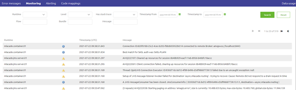
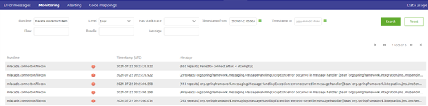
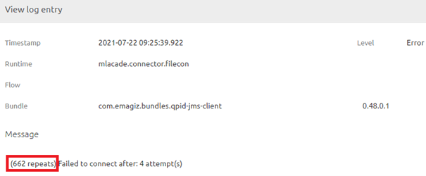

    

        <main class="micro-learning">
        <ul class="doc-nav">
            <li class="doc-nav__item"><a href="../../docs/microlearning/intermediate-active-monitoring-index" class="doc-nav__link">Home</a></li>
            <li class="doc-nav__item"><a href="#intro" class="doc-nav__link">Intro</a></li>
            <li class="doc-nav__item"><a href="#theory" class="doc-nav__link">Theory</a></li>
            <li class="doc-nav__item"><a href="#practice" class="doc-nav__link">Practice</a></li>
            <li class="doc-nav__item"><a href="#solution" class="doc-nav__link">Solution</a></li>
        </ul>

##### Intro

# Determining the origin of log entries

In this microlearning, we will focus on how you can quickly and easily determine the origin of log entries. In other words, what caused the logging.

Should you have any questions, please contact academy@emagiz.com.

- Last update: July 22th, 2021
- Required reading time: 6 minutes

## 1. Prerequisites
- Basic knowledge of the eMagiz platform
- Understanding of Monitoring concept
- One or more log entries raised in the last two weeks within the context of your (Academy) project

## 2. Key concepts
This microlearning centers around determining the origin of log entries.
By origin, in this context, we mean: Identifying which flow wrote an entry to the log that might be in need of analysis.

- Determining in which flow a log entry is raised can be done with the help of the Manage phase in eMagiz. 
    - In the Manage phase you have an option called Monitoring. In this overview, you will see all logging that is relevant without your project.
- This overview allows you to filter on various elements, such as runtime, type, and timestamp. This way you can conduct a more focused search.
- Double-clicking on a log entry provides you with the relevant details
- Note that log entries are not shown in full when they exceed a certain size so takes this into account when logging
- When you know the flow and the details you have determined the origin of the log entry

##### Theory

## 3. Determining the origin of log entries

You can determine the origin of a log entry with a two-step approach:
1. Search in the Monitoring overview for log entries
2. Select a specific log entry for further analysis

### 3.1 Monitoring overview Manage

To see and analyze the log entries you need to navigate to Manage -> Monitoring. This overview shows all log entries within your project that have been written to the log in the last fourteen days (assuming you did adhere to the fair use policy). Within this overview, you have the ability to search on various options such as runtime, type, and timestamp. 

### 3.2 Select a specific log entry for further analysis

After you have filtered the log entries to your liking you can select a specific log entry by double-clicking on the log entry. By doing so a pop-up will be presented in which the details of the log entry are written. On this details page, the flow and message are the most relevant from a user perspective.

Note that some log entries are grouped as they appeared in short proximity after each other and have to do with the same logging.

##### Practice

## 4. Assignment

Determine the origin of at least five log entries that have been raised within your (Academy) project in the last two weeks. If your project has no log entries be creative in messing up stuff to create a log entry for which you can then determine the origin.

## 5. Key takeaways

- Determining in which flow a log entry is raised can be done with the help of the Manage phase in eMagiz. 
    - In the Manage phase you have an option called Monitoring. In this overview, you will see all logging that is relevant without your project.
- This overview allows you to filter on various elements, such as runtime, type, and timestamp. This way you can conduct a more focused search.
- Double-clicking on a log entry provides you with the relevant details
- Note that log entries are not shown in full when they exceed a certain size so takes this into account when logging
- When you know the flow and the details you have determined the origin of the log entry

##### Solution

## 6. Suggested Additional Readings

If you are interested in this topic and want more information on it please read the help text provided by eMagiz when executing these actions.

## 7. Silent demonstration video

This video demonstrates how you could have handled the assignment and gives you some context on what you have just learned.

<iframe width="1280" height="720" src="../../vid/microlearning/intermediate-active-monitoring-determining-origin-of-log-entry.mp4" frameborder="0" allow="accelerometer; autoplay; clipboard-write; encrypted-media; gyroscope; picture-in-picture" allowfullscreen></iframe>

</main>

