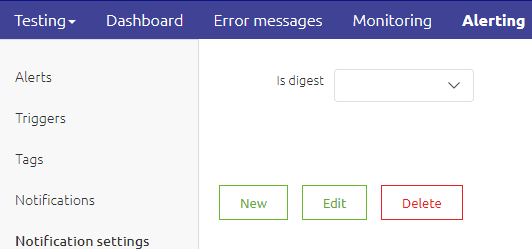
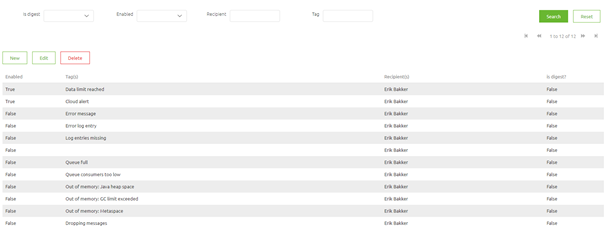
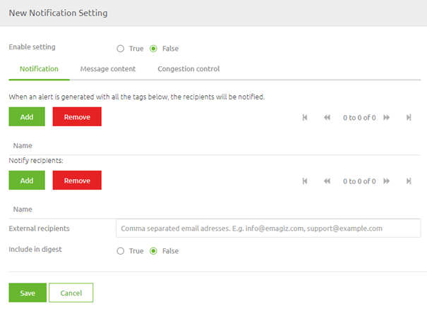
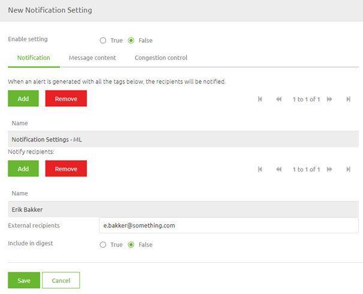
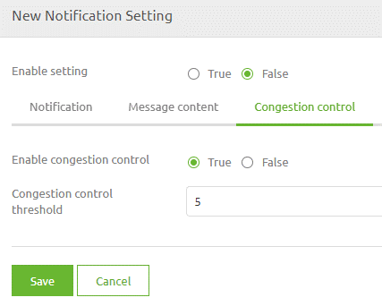
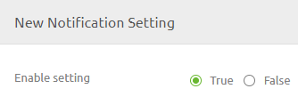

    

        <main class="micro-learning">
        <ul class="doc-nav">
            <li class="doc-nav__item"><a href="../../docs/microlearning/intermediate-alerting-index" class="doc-nav__link">Home</a></li>
            <li class="doc-nav__item"><a href="#intro" class="doc-nav__link">Intro</a></li>
            <li class="doc-nav__item"><a href="#theory" class="doc-nav__link">Theory</a></li>
            <li class="doc-nav__item"><a href="#practice" class="doc-nav__link">Practice</a></li>
            <li class="doc-nav__item"><a href="#solution" class="doc-nav__link">Solution</a></li>
        </ul>

##### Intro

# Setting up Notifications

In this microlearning, we will focus on how you can set up your notification setting to ensure the proper people will receive notifications in case an alert is triggered. Properly setting your notifications ensures that the right people are notified in case something goes wrong. Therefore they can take direct action if needed.

Should you have any questions, please contact academy@emagiz.com.

- Last update: July 22th 2021
- Required reading time: 5 minutes

## 1. Prerequisites
- Basic knowledge of the eMagiz platform

## 2. Key concepts
This microlearning centers around setting up notifications.
With notifications, we mean: Emails that notify specific persons when a certain alert is triggered

- Both eMagiz users as external actors can receive alerts
- When combining tags in the notification setting a notification will only be triggered when both alerts are triggered simultaneously
- There is an option called congestion control that will limit the number of emails on the same object

##### Theory

## 3. Setting up Notifications

In previous microlearnings, we discussed setting up the tags and triggers that form the basis of our alerting system. In this microlearning, we will focus on how you can set up your notification setting to ensure the proper people will receive notifications in case an alert is triggered. Properly setting your notifications ensures that the right people are notified in case something goes wrong. Therefore they can take direct action if needed.

- Both eMagiz users as external actors can receive alerts
- When combining tags in the notification setting a notification will only be triggered when both alerts are triggered simultaneously
- There is an option called congestion control that will limit the number of emails on the same object

To configure the notification settings we navigate to Manage -> Alerting. In here we have a menu item called Notification settings

When selecting this menu item you will see an overview of all notification settings. Note that eMagiz will automatically generate notification settings for the standard alerts.

You can add a new notification setting by pressing the New button. You can edit a notification setting by selecting one and pressing Edit. You can delete a notification setting by selecting one and pressing Delete. When you add a new notification setting you will the following.

Here we first need to select for which tag(s) this notification will apply. Furthermore, we have to specify which eMagiz (and external users) need to be notified. Having done so will result in something like this.

On the second tab, you could use the message content. However mostly this is not relevant as the defaults are fine. On the third tab, you need to determine whether you want to activate congestion control. Congestion control means that when several similar alerts are triggered eMagiz will at some point (based on the number you provide) stop sending separate emails and will group them in one notification to you. This setting is very handy for alerts that check generic parts of eMagiz (i.e. queues, runtimes, logging) but less ideal when it comes to error messages for example. In this case, we will leave the congestion control on.

When you are happy you can activate your notification setting by selecting True for the setting called Enable setting. After you have done so you can press Save and you have correctly configured your notifications.

##### Practice

## 4. Assignment

Create a new notification setting for a tag and send the notification to yourself.
This assignment can be completed with the help of the (Academy) project that you have created/used in the previous assignment.

## 5. Key takeaways

- Both eMagiz users as external actors can receive alerts
- When combining tags in the notification setting a notification will only be triggered when both alerts are triggered simultaneously
- There is an option called congestion control that will limit the number of emails on the same object

##### Solution

## 6. Suggested Additional Readings

If you are interested in this topic and want more information on it please read the help text provided by eMagiz.

## 7. Silent demonstration video

This video demonstrates how you could have handled the assignment and gives you some context on what you have just learned. 

<iframe width="1280" height="720" src="../../vid/microlearning/intermediate-alerting-linking-setting-up-notifications.mp4" frameborder="0" allow="accelerometer; autoplay; clipboard-write; encrypted-media; gyroscope; picture-in-picture" allowfullscreen></iframe>   

</main>

