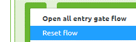
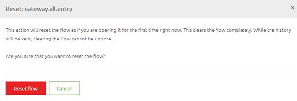

    

        <main class="micro-learning">
        <ul class="doc-nav">
            <li class="doc-nav__item"><a href="../../docs/microlearning/intermediate-api-management-index" class="doc-nav__link">Home</a></li>
            <li class="doc-nav__item"><a href="#intro" class="doc-nav__link">Intro</a></li>
            <li class="doc-nav__item"><a href="#theory" class="doc-nav__link">Theory</a></li>
            <li class="doc-nav__item"><a href="#practice" class="doc-nav__link">Practice</a></li>
            <li class="doc-nav__item"><a href="#solution" class="doc-nav__link">Solution</a></li>
        </ul>

##### Intro

# Updating your API Gateway Operations
 
In our crash course on the API Gateway pattern, we have learned about setting up the API Gateway. However, we did not yet delve into the specifics of how to update your existing API Gateway solution. In this microlearning, we will focus on updating the Design phase of your API Gateway (and the subsequent steps) and we will focus on updating the Create phase of your API Gateway (and the subsequent steps). This to learn the impact of updates and to learn how we can achieve this.

Should you have any questions, please contact academy@emagiz.com.

- Last update: June 28th, 2021
- Required reading time: 7 minutes

## 1. Prerequisites
- Basic knowledge of the eMagiz platform

## 2. Key concepts
This microlearning centers around updating your API Gateway.

By updating, we mean: Changing existing software to reflect new insights or ideas that have come up during development and/or testing

- Updating can happen from Design
- Updating can happen from Create
- Both situations have a different impact

##### Theory
  
## 3. Updating your API Gateway Operations

In our crash course on the API Gateway pattern, we have learned about setting up the API Gateway. However, we did not yet delve into the specifics of how to update your existing API Gateway solution. In this microlearning, we will focus on updating the Design phase of your API Gateway (and the subsequent steps) and we will focus on updating the Create phase of your API Gateway (and the subsequent steps). This to learn the impact of updates and to learn how we can achieve this.

- Updating can happen from Design
- Updating can happen from Create
- Both situations have a different impact

In the remainder of this microlearning, we will discuss both scenarios. This to get clarity on what the impact is of both scenarios.

### 3.1 Updating from Design

After you have already added an integration to Create you might want to change the error handling, the structure of the request and/or response message, the parameters, etc. In all these scenarios you need to change something in the Design phase of eMagiz. The actual changing of these parts of the API Gateway solutions is specified in earlier microlearnings. However, what to do after you have made those changes is not yet discussed. In this microlearning, we will discuss that process within eMagiz. Note that this process **only** applies when the operation already exists in Create. If it does not yet exist in Create eMagiz will simply add the configuration to the existing flow without changing the remainder of the all-entry.

As you might know from our offering on the messaging pattern and how to update in those scenarios you can imagine that (parts of) the API Gateway flows need to be updated to reflect your changes. Depending on the exact change the effect will be seen in the 'all entry' or in one of the exit gates that is specific to an operation. The division can be made as follows:

- When you change something to the configuration of the API Gateway itself (i.e security, error handling, parameters) the change will **only** impact the all-entry
- When you change something to the configuration of the backend operation (i.e. endpoint, parameter, system request/response) the change will **only** impact the specific exit gate
- When you change the gateway request/response message (with transformation) the change will impact **both** the all-entry and the specific exit gate

In all cases, you need a version bump of the flow to which you can relate the change. For exit gates, this process is identical to when you do a version bump of any messaging flow after updating for example a CDM message or message mapping. However, when you update something on the all-entry level this becomes less simple. Because eMagiz does not only pre-configure the resources for you in Create but the complete all-entry flow you **need** a reset of the all-entry to reflect these changes. To reset a flow simply access the context menu on flow level in Create (via a right-mouse click) and press Reset flow.

After you press this option eMagiz will present you with a confirmation pop-up to ensure that you are 100% sure that this is the correct flow that you want to reset. This because resetting a flow means returning to the original state.

After you reset your all-entry eMagiz will update the following:

- Swagger UI that is shown to clients via the Swagger documentation page
- Parameter references
- Error Handling
- Many more

This all depends on which changes you **made** on the Design level.

### 3.2 Updating from Create

Apart from updating your API Gateway solution in Create, you can only update parts of the API Gateway solution in Create. Here we mainly talk about changing the gateway messages. Any other changes on the 'exit gate' level have no special impact compared to changing parts of other flows. We discern two parts of updating a (gateway) message that you can execute in the Create phase:

- Changing the dataType (i.e. from dateTime to date)
- Adding valid enum values

In both cases, eMagiz will automatically update your Swagger definition and all-entry flow by recreating the swagger definition to reflect these changes and executing a version bump of the all-entry.

As is the case with all new versions in Create the changes will only be effectuated when you deploy your solution via the Deploy phase of eMagiz.

##### Practice

## 4. Assignment

Think of three changes you want to apply to an API Gateway solution and see if you can determine which flow in Create needs an update.
This assignment can be completed with the help of the (Academy) project that you have created/used in the previous assignment.

## 5. Key takeaways

- Updating can happen from Design
- Updating can happen from Create
- Both situations have a different impact
- Adding a new operation to an existing solution does not involve a reset
- Updating from Create does not involve a reset
- Updating from Design involves a reset

##### Solution

## 6. Suggested Additional Readings

If you are interested in this topic and want more information on it please read the help text provided by eMagiz.

## 7. Silent demonstration video

As this is a more theoretical microlearning we did not provide a video for this one.

</main>

