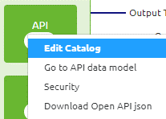
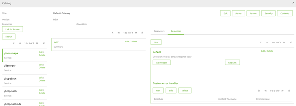
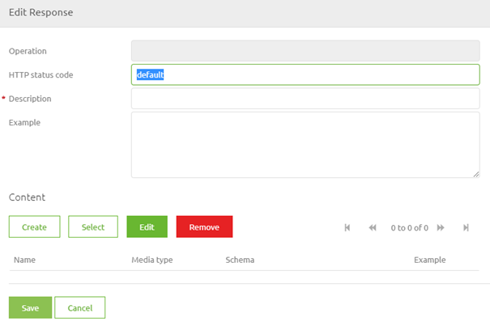
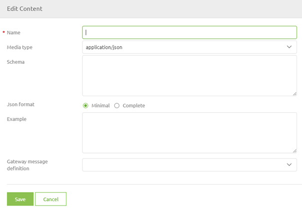
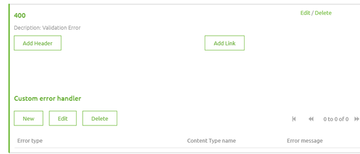
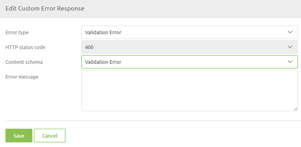

    

        <main class="micro-learning">
        <ul class="doc-nav">
            <li class="doc-nav__item"><a href="../../docs/microlearning/intermediate-api-management-index" class="doc-nav__link">Home</a></li>
            <li class="doc-nav__item"><a href="#intro" class="doc-nav__link">Intro</a></li>
            <li class="doc-nav__item"><a href="#theory" class="doc-nav__link">Theory</a></li>
            <li class="doc-nav__item"><a href="#practice" class="doc-nav__link">Practice</a></li>
            <li class="doc-nav__item"><a href="#solution" class="doc-nav__link">Solution</a></li>
        </ul>

##### Intro

# Constructing Error Handling API Gateway
 
As we learned from our crash course on API Gateway we can influence the error handling within the API Gateway solution. Having a clear and consistent manner in which you communicate to the clients that are calling your API Gateway is crucial, especially when dealing with error handling. In this microlearning, we will delve deeper into the various options that are given to you when constructing the error handling. 

Should you have any questions, please contact academy@emagiz.com.

- Last update: June 28th, 2021
- Required reading time: 7 minutes

## 1. Prerequisites
- Basic knowledge of the eMagiz platform

## 2. Key concepts
This microlearning centers around constructing an error-handling API Gateway.

By error handling, we mean: Communicating to the client to the best of your knowledge what went wrong, both in status code as in body.

- Three default options that can be configured with the help of eMagiz are:
    - Validation Error
    - Endpoint Timeout
    - Default Error

##### Theory
  
## 3. Constructing Error Handling API Gateway

As we learned from our crash course on API Gateway we can influence the error handling within the API Gateway solution. Having a clear and consistent manner in which you communicate to the clients that are calling your API Gateway is crucial, especially when dealing with error handling. In this microlearning, we will delve deeper into the various options that are given to you when constructing the error handling.

- Three default options that can be configured with the help of eMagiz are:
    - Validation Error
    - Endpoint Timeout
    - Default Error

This is basically where we stopped our microlearning last time. Let us pick up that trail again and continue our exploration of the subject. As defined in that microlearning you can define your error handling yourself in the API Gateway catalog by opening the response tab of an operation. There are two parts of error handling that you need to define. First, we take a look at the HTTP Status Codes. After that, we take a look at how to define the response body.

### 3.1 Defining the HTTP status code

As we learned from our earlier microlearning on this subject as part of the crash course the following HTTP status ranges are most frequently seen

The eMagiz API Gateway will always give back HTTP Response codes along the following lines:

- 100-level (Informational) — Server acknowledges a request
- 200-level (Success) — Server completed the request as expected
- 300-level (Redirection) — The client needs to perform further actions to complete the request
- 400-level (Client error) — The client sent an invalid request
- 500-level (Server error) — Server failed to fulfill a valid request due to an error with the server

Of these levels, the 200-level for Success calls and the 400-level and 500-level for Unsuccessful calls are most frequently used within the context of eMagiz.
Each request executed by the client can return a Success or a Failure. 

Because we are now dealing with error handling the focus will be on the 400-level and 500-level HTTP Status Codes concerning the three default options that eMagiz offers you. Each default option should be assigned an HTTP status code. We advise the following division:

- Validation Error -> 400
- Endpoint Timeout -> 504
- Default Error -> 500

This way you adhere to the best practices when building a RESTful API Gateway.

To correctly define the HTTP status code on your response you navigate to the Catalog via the context menu in Design.

When you have entered the catalog you select the operation of your choice and open the response tab (located on the right side of your pop-up).

As you can see in the screenshot above on default this is what eMagiz provides you with. You can expand on this by adding the various potential responses. To add one please press New.

In this pop-up, we define the HTTP Status Code and the Description. When you are done with the HTTP Status Code and the Description we need to define the content of the response. To do so press the button Create Content. This leads you to the following pop-up:

In this pop-up, you need to define the name (I would suggest keeping it the same as your description) and you could define an example (something such as -> {"error":"Invalid Content Found for ID, expected Description"}). This concludes the first part of your configuration. Let us now continue with defining the response body.

### 3.2 Defining the response body

When you are done with the first part you can select the response you have just defined by clicking on this. After you have done so it will highlight the selected response by making it green.

As you can see in the screenshot above you can add Custom Error Handling to a specific HTTP status code. This is where the standard options of eMagiz come into play. By pressing New you will see another pop-up. Here you can select one of them. As we have defined a 400 response we need to define which default error fits. In this case, we would need to select the Validation Error from the drop-down menu and select the Content.

After you have defined these the last step of our configuration is to define the Error message. You can either fill in a static value (i.e. '+A validation error has occurred+') for your SpEL expression or you could enter a more complex SpEL expression (i.e. '+#xpath(payload,'(//*[local-name()="message"])[1]').replace("\","\\").replace("""","\""")+'). Note that when you want to do a more complex SpEL expression you need to base your SpEL expression based on the error XML structure within eMagiz as the message will be an error XML when traveling through the eMagiz error handling.

As you can see this can be quite complex so ensure that you know what you are doing before changing this. When you are satisfied with your configuration you can save the custom error handler and update your API Gateway. To learn about how to update your API Gateway solution please continue with the next microlearning.

##### Practice

## 4. Assignment

Set up a custom error handler to correctly handle validation errors in eMagiz for your API Gateway solution.
This assignment can be completed with the help of the (Academy) project that you have created/used in the previous assignment.

## 5. Key takeaways

- Three default options that can be configured with the help of eMagiz are:
    - Validation Error
    - Endpoint Timeout
    - Default Error
- You can use SpEL expressions to dynamically define what you can send back to the client (or use a static response)

##### Solution

## 6. Suggested Additional Readings

If you are interested in this topic and want more information on it please read the help text provided by eMagiz.

## 7. Silent demonstration video

<iframe width="1280" height="720" src="../../vid/microlearning/intermediate-api-management-constructing-error-handling-api-gateway.mp4" frameborder="0" allow="accelerometer; autoplay; clipboard-write; encrypted-media; gyroscope; picture-in-picture" allowfullscreen></iframe>

</main>

