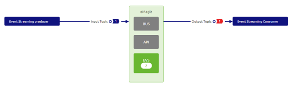
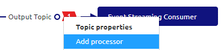
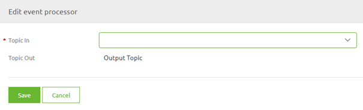
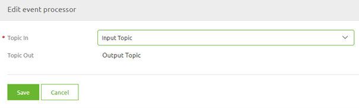

	

		<main class="micro-learning">
		<ul class="doc-nav">
			<li class="doc-nav__item"><a href="../../docs/microlearning/novice-mendix-connectivity-index" class="doc-nav__link">Home</a></li>
			<li class="doc-nav__item"><a href="#intro" class="doc-nav__link">Intro</a></li>
			<li class="doc-nav__item"><a href="#theory" class="doc-nav__link">Theory</a></li>
			<li class="doc-nav__item"><a href="#practice" class="doc-nav__link">Practice</a></li>
			<li class="doc-nav__item"><a href="#solution" class="doc-nav__link">Solution</a></li>
		</ul>

##### Intro

# Design an Event Processor

In this microlearning, we will focus on the event processor in eMagiz. Particularly the part of designing an event processor 
With the help of this event processor, you can easily transport, filter, and transform data between two topics.

Should you have any questions, please contact academy@emagiz.com.

- Last update: January 27th, 2021
- Required reading time: 4 minutes

## 1. Prerequisites
- Intermediate knowledge of the eMagiz platform
- An Event Streaming License
- Knowledge of the Event Streaming Pattern
- Followed the crash course on Event Streaming

## 2. Key concepts
This microlearning centers around designing an event processor
By event processor we mean: A flow within eMagiz that consumes data from one topic and transports the data to another topic. In between, you have the option to filter or transform the data (i.e. event)

To create an event processor we need the following:

- An input topic designed in eMagiz
- An output topic designed in eMagiz

##### Theory

## 3. Design an Event Processor

An Event processor is a flow within eMagiz that retrieves data from one topic (the so-called input topic) and transports the data to another topic (the so-called output topic).
During the transport of the data, you can transform the event or filter out events that don't fit your criteria.

In this microlearning, we will learn how you can design your event processor. In the microlearnings that will follow we will build on this knowledge.

### 3.1 Input and Output Topic
The first step of setting up your event processor is determining which topics you want to transport the data to.
An Event processor needs an input and an output topic to function correctly. 
When you have established what the input and output topic is you can determine whether these topics are already designed in eMagiz.
For this microlearning, we assume that the topics already exists

Since we already have the input and output topics we can move to the Design phase of eMagiz. In this phase, you can design the event processor.

### 3.2 Link Input to Output via an Event Processor
As you can see in this picture (and probably remember from one of our earlier microlearnings) there are no systems that produce data on the Output topic.
This is where eMagiz comes in. Via the event processor, you can configure that all data from the Input topic will be transported towards the output topic.
In other words, eMagiz will become the producer of data on the Output topic.

To design an event processor you simply navigate to one of the lines drawn that represent the input and the output topic and access the context menu via a right-mouse click.

When you select the option called Add processor you will see a pop-up similar to the one shown below. 
Do notice that depending via which line you access the context menu what can be altered changes. When you select the line that has a consuming system you can select the input topic.
When you select the line that has a producing system you can select the output topic.

Select the correct topic and press Save.

As a result, your Design overview will change to reflect the choices that you have made

You have now successfully designed an event processor that is capable of transporting data from the Input Topic to the Output Topic.

##### Practice

## 4. Assignment

Create an Event processor between an input and output topic within your (Academy) project.
This assignment can be completed with the help of the (Academy) project that you have created/used in the previous assignment.

## 5. Key takeaways

- An event processor transports data between an input and an output topic
- In eMagiz, you can easily design an event processor by clicking on a line representing a topic in Design

##### Solution

## 6. Suggested Additional Readings

If you are interested in this topic and want more information on it please read the release notes provided by eMagiz that accompany the eMagiz Mendix Connector version you have selected.

## 7. Silent demonstration video

This video demonstrates how you could have handled the assignment and gives you some context on what you have just learned. Disclaimer, you only see the eMagiz part but if you follow the above steps you are good to go!

<iframe width="1280" height="720" src="../../vid/microlearning/intermediate-configuring-emagiz-event-streaming-design-an-event-processor.mp4" frameborder="0" allow="accelerometer; autoplay; clipboard-write; encrypted-media; gyroscope; picture-in-picture" allowfullscreen></iframe>

</main>

