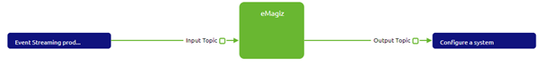
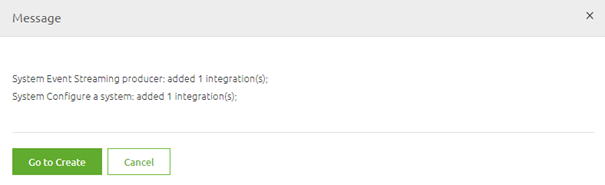
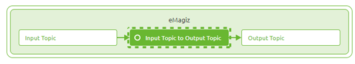
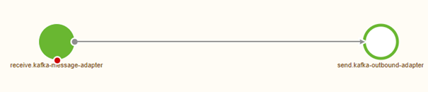

	

		<main class="micro-learning">
		<ul class="doc-nav">
			<li class="doc-nav__item"><a href="../../docs/microlearning/novice-mendix-connectivity-index" class="doc-nav__link">Home</a></li>
			<li class="doc-nav__item"><a href="#intro" class="doc-nav__link">Intro</a></li>
			<li class="doc-nav__item"><a href="#theory" class="doc-nav__link">Theory</a></li>
			<li class="doc-nav__item"><a href="#practice" class="doc-nav__link">Practice</a></li>
			<li class="doc-nav__item"><a href="#solution" class="doc-nav__link">Solution</a></li>
		</ul>

##### Intro

# Creating a passthrough event processor

In this microlearning, we will focus on creating the event processor in eMagiz for what we call a passthrough case.
With the help of such an event processor, you can easily transport, filter, and transform data between two topics.

Should you have any questions, please contact academy@emagiz.com.

- Last update: March 18th, 2021
- Required reading time: 6 minutes

## 1. Prerequisites
- Intermediate knowledge of the eMagiz platform
- An Event Streaming License
- Knowledge of the Event Streaming Pattern
- Followed the crash course on Event Streaming

## 2. Key concepts
This microlearning centers around designing an event processor
By event processor we mean: A flow within eMagiz that consumes data from one topic and transports the data to another topic. In between, you have the option to filter or transform the data (i.e. event)
By passthrough we mean: Transport data from point A to point B without a need to manipulate (transform and/or filter) data

To create a passthrough event processor we need to have designed an event processor. Lucky for us we just did that in the previous microlearning.

##### Theory

## 3. Creating a passthrough event processor

An Event processor is a flow within eMagiz that retrieves data from one topic (the so-called input topic) and transports the data to another topic (the so-called output topic).
During the transport of the data, you can transform the event or filter out events that don't fit your criteria.
In a pass-through scenario, however, there is no need to transform and/or filter events.

In this microlearning, we will learn how you can create your passthrough event processor. In the microlearnings that will follow we will build on this knowledge.

### 3.1 Determine Event Processor Design
The first step of creating your event processor is determining whether you have already designed an event processor.
When you have established which event processor that you have designed needs to be transferred to the Create phase you can continue.
For this microlearning, we assume that the event processor is already designed.

### 3.2 Add integrations
The first step is to add the integration to the Create phase of eMagiz. This process is the same for each pattern (Messaging, API Gateway, Event Streaming).
So simply navigate to the Create phase and select the button Add integrations (located in the left bottom of the screen).

In here you select at least one of the topics to go to Create. eMagiz is smart enough to automatically transfer the other as well. You can always select them both, that will work also.
After you have pressed Save Selection and everything went to plan you will see a pop-up similar to the one that is shown below

Press the button called Go to Create to get back to the Create overview.

### 3.3 The Create overview
In the overview of the Stream pattern that is presented, you can zoom in on the event processor to see what the input and output topic of the event processor is.

### 3.4 Event streaming flow
From here we can navigate to the flow by double-clicking on the event processor or via the context menu (accessible via a right mouse click).
When you open the flow eMagiz will present you with something as depicted below. A simple flow with an input and an output component. 
The only thing this flow does is consume data from the input topic and produce the data on the output topic.

The only thing left for you to do is to press Stop Editing as eMagiz has already created the complete flow for you.

You have now successfully created an event processor that is capable of transporting data from the Input Topic to the Output Topic.

##### Practice

## 4. Assignment

Create an Event processor between an input and output topic within your (Academy) project.
This assignment can be completed with the help of the (Academy) project that you have created/used in the previous assignment.

## 5. Key takeaways

- An event processor transports data between an input and an output topic
- In eMagiz, you can easily create an event processor by using the Add integrations functionality to transfer the event processor from Design to Create
- eMagiz autogenerates the flow. The only user action that is needed is a Stop Editing action after you have added the event processor to Create

##### Solution

## 6. Suggested Additional Readings

If you are interested in this topic and want more information on it please read the release notes provided by eMagiz that accompany the eMagiz Mendix Connector version you have selected.

## 7. Silent demonstration video

This video demonstrates how you could have handled the assignment and gives you some context on what you have just learned. Disclaimer, you only see the eMagiz part but if you follow the above steps you are good to go!

<iframe width="1280" height="720" src="../../vid/microlearning/intermediate-configuring-emagiz-event-streaming-creating-a-passthrough-event-processor.mp4" frameborder="0" allow="accelerometer; autoplay; clipboard-write; encrypted-media; gyroscope; picture-in-picture" allowfullscreen></iframe>

</main>

