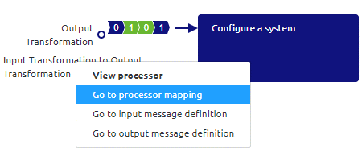
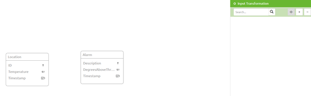
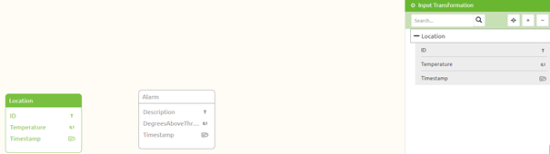
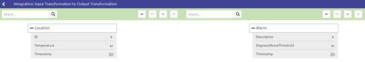
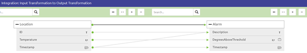

	

		<main class="micro-learning">
		<ul class="doc-nav">
			<li class="doc-nav__item"><a href="../../docs/microlearning/intermediate-configuring-event-streaming-index" class="doc-nav__link">Home</a></li>
			<li class="doc-nav__item"><a href="#intro" class="doc-nav__link">Intro</a></li>
			<li class="doc-nav__item"><a href="#theory" class="doc-nav__link">Theory</a></li>
			<li class="doc-nav__item"><a href="#practice" class="doc-nav__link">Practice</a></li>
			<li class="doc-nav__item"><a href="#solution" class="doc-nav__link">Solution</a></li>
		</ul>

##### Intro

# Event Processor Transformation

In this microlearning, we will focus on learning about how you can set up the transformation for an event processor.
As with every integration pattern eMagiz gives you the option to create a transformation to transform data in one format to another format. 

For Event Streaming the transformation represents how you want to ensure that two message structures can be linked together between topics.

Should you have any questions, please contact academy@emagiz.com.

- Last update: March 19th, 2021
- Required reading time: 6 minutes

## 1. Prerequisites
- Intermediate knowledge of the eMagiz platform
- An Event Streaming License
- Knowledge of the Event Streaming Pattern
- Followed the crash course on Event Streaming

## 2. Key concepts
This microlearning centers around transforming data within the event processor.
By event processor we mean: A flow within eMagiz that consumes data from one topic and transports the data to another topic. In between, you have the option to filter or transform the data (i.e. event)
With a transformation we mean: A method to ensure that the data structure of the input can be changed towards a specific output data structure

The transformation consists of the following:
- Visual description of how certain entities and attributes are transformed from A to B

And has as a goal to ensure that data flowing from one topic to another is placed on the output topic in the correct data structure.

##### Theory

## 3. Event Processor Transformation

As with every integration pattern eMagiz gives you the option to use the transformation functionality of eMagiz. 
This transformation functionality gives you the option to ensure that when the data structures between input (topic) and output (topic) differ you can transform the data in such a way that what
is placed on the output topic is in the expected data structure.

For Event Streaming the transformation represents how you want to ensure that two message structures can be linked together between topics.

You can access the transformation of an event processor in the Design phase of eMagiz. 
To do so you have to navigate to Design and open the context menu on your event processor.

### 3.1 Defining your message definitions
However, before we can design our transformation we should first define the input and output message definitions.

To do so select the options called Go to input message definition and Go to output message definition.
These options will lead you to an overview that shows the current message definition. 
If this is the first time the overview will show the event streaming data model and will indicate that no structure has been defined yet.

With the help of this canvas, you can select which entities and attributes are part of your (input) message definition. Same functionality as with messaging and API Gateway. 
Before you can do so, you need to enter "Start Editing" mode.

So for example your (input) message definition could look like this after you have selected entities and attributes for the message definition.

When you are satisfied with your work you can press "Stop Editing" and move to the output message definition.

### 3.1 Drawing lines for the transformation

After you are done with editing both message definitions you can open the transformation for the event processor via the context menu.

In the overview that will be opened, you will see your message mapping.

With the help of this canvas, you can draw lines to indicate how the input message should be transformed into the output message. Before you can do so, you need to enter "Start Editing" mode.

A finished message mapping (transformation) will look like below:

Congratulations you have successfully created a transformation that will ensure that the input data is outputted in the correct format.

##### Practice

## 4. Assignment

Create a transformation for an event processor with the help of the Design phase in eMagiz.
This assignment can be completed with the help of an associated Mendix project linked to the (Academy) project that you have created/used in the previous assignment.

## 5. Key takeaways

- For Event Streaming the transformation represents how you want to ensure that two message structures can be linked together between topics.
- You can create a transformation between two message definitions by drawing lines
- The transformation process is uniform across all patterns.

##### Solution

## 6. Suggested Additional Readings

If you are interested in this topic and want more information on it please read the help text provided by eMagiz.

## 7. Silent demonstration video

This video demonstrates how you could have handled the assignment and gives you some context on what you have just learned. Disclaimer, you only see the eMagiz part but if you follow the above steps you are good to go!

<iframe width="1280" height="720" src="../../vid/microlearning/intermediate-configuring-emagiz-event-streaming-event-processor-transformation.mp4" frameborder="0" allow="accelerometer; autoplay; clipboard-write; encrypted-media; gyroscope; picture-in-picture" allowfullscreen></iframe>

</main>

