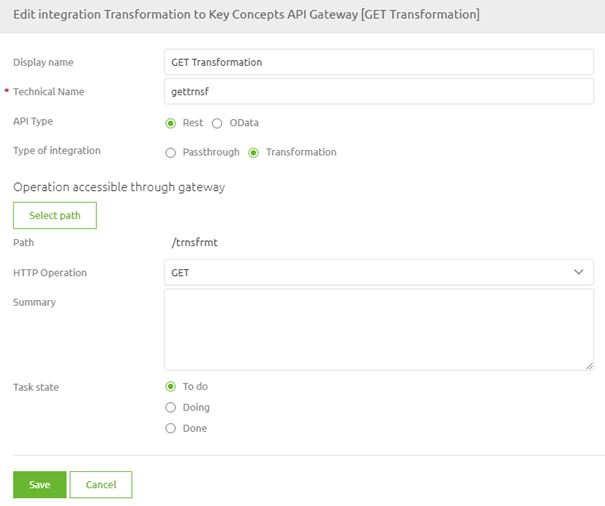

    

        <main class="micro-learning">
        <ul class="doc-nav">
            <li class="doc-nav__item"><a href="../../docs/microlearning/intermediate-configuring-the-api-gateway-index" class="doc-nav__link">Home</a></li>
            <li class="doc-nav__item"><a href="#intro" class="doc-nav__link">Intro</a></li>
            <li class="doc-nav__item"><a href="#theory" class="doc-nav__link">Theory</a></li>
            <li class="doc-nav__item"><a href="#practice" class="doc-nav__link">Practice</a></li>
            <li class="doc-nav__item"><a href="#solution" class="doc-nav__link">Solution</a></li>
        </ul>

##### Intro

# Transforming messages
 
In the crash course on API Gateway, we learned the basics of the API Gateway pattern. Then, we focused on what we call passthrough cases. Now, we will focus on transforming messages between the front end and the backend of the API Gateway. We will see that the functionality is similar compared to what we see within other patterns.

Should you have any questions, please get in touch with academy@emagiz.com.

- Last update: August 20th, 2021
- Required reading time: 5 minutes

## 1. Prerequisites
- Intermediate knowledge of the eMagiz platform
- Basic knowledge of the API Gateway pattern

## 2. Key concepts
This microlearning is about transforming messages within the API Gateway pattern.

By transforming messages, we mean: Changing the structure of the data from what you receive to what you want to send to the backend operation.

Interesting points to consider are:

- The transformation process works similarly across patterns
- The benefit of having the transformation capability is that it expands the capabilities of the API Gateway. This fact makes it more attractive to use the eMagiz API Gateway
- You can transform from JSON to JSON and from JSON to XML with the standard transformation functionality (for the API Gateway)

##### Theory
  
## 3. Transforming messages

In the crash course on API Gateway, we learned the basics of the API Gateway pattern. Then, we focused on what we call passthrough cases. Now, we will focus on transforming messages between the front end and the backend of the API Gateway. We will see that the functionality is similar compared to what we see within other patterns.

Interesting points to consider are:

- The transformation process works similarly across patterns
- The benefit of having the transformation capability is that it expands the capabilities of the API Gateway. This fact makes it more attractive to use the eMagiz API Gateway
- You can transform from JSON to JSON and from JSON to XML with the standard transformation functionality (for the API Gateway)

As the transformation process works the same across patterns, it is pointless to discuss the message mapping again in this microlearning. If you would like to learn more about message mapping, please check out the [Crash Course Platform Module](crashcourse-platform-index.md). To enable the transformation capabilities of the API Gateway, you can determine on operation level which type of integration you want (passthrough or transformation).

As you have probably noticed, you do not have to select a backend operation if you choose the transformation option. The backend can now also represent a SOAP web service, a database, or something else that gives back a response after the message is delivered to it.

After you have moved the operation to Create, you can edit the Create transformation in the same manner as you are used to within other patterns, and all possibilities will be the same.

##### Practice

## 4. Assignment

Design an API Gateway operation in which you perform a transformation between the frontend and the backend of the API Gateway.
This assignment can be completed with the help of the (Academy) project that you have created/used in the previous assignment.

## 5. Key takeaways

- The transformation process works similarly across patterns
- The benefit of having the transformation capability is that it expands the capabilities of the API Gateway. This fact makes it more attractive to use the eMagiz API Gateway
- You can transform from JSON to JSON and from JSON to XML with the standard transformation functionality (for the API Gateway)
- To activate the transformation capabilities, you should select the Transformation option on the operation level in the Design phase.

##### Solution

## 6. Suggested Additional Readings

If you are interested in this topic and want more information on it, please read the release notes provided by eMagiz

## 7. Silent demonstration video

This video demonstrates how you could have handled the assignment and gives you some context on what you have just learned. 

<iframe width="1280" height="720" src="../../vid/microlearning/intermediate-configuring-the-api-gateway-transforming-messages.mp4" frameborder="0" allow="accelerometer; autoplay; clipboard-write; encrypted-media; gyroscope; picture-in-picture" allowfullscreen></iframe>

</main>

