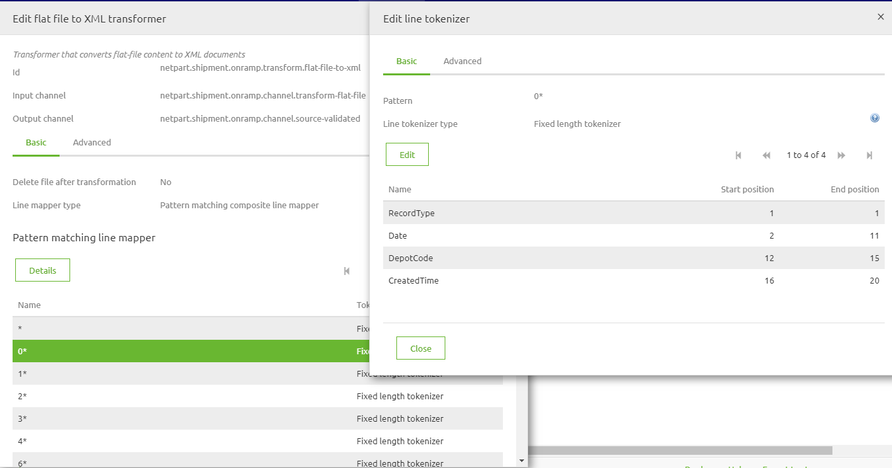

	

		<main class="micro-learning">
		<ul class="doc-nav">
			<li class="doc-nav__item"><a href="../../docs/microlearning/intermediate-create-your-transformations-index" class="doc-nav__link">Home</a></li>
			<li class="doc-nav__item"><a href="#intro" class="doc-nav__link">Intro</a></li>
			<li class="doc-nav__item"><a href="#theory" class="doc-nav__link">Theory</a></li>
			<li class="doc-nav__item"><a href="#practice" class="doc-nav__link">Practice</a></li>
			<li class="doc-nav__item"><a href="#solution" class="doc-nav__link">Solution</a></li>
		</ul>

##### Intro

# Flat file transformations XML to Flat File

In this microlearning, we will explain how to transform XML files to Flat files.

Should you have any questions, please contact academy@emagiz.com.

- Last update: April 22nd, 2021
- Required reading time: 8 minutes

## 1. Prerequisites
- Basic knowledge of the eMagiz platform

## 2. Key concepts
This microlearning discusses the approach to transform a Flat File to an XML file. Once transformed, that XML file can be used to validate and transform in next steps inside eMagiz.

As the name suggest this standard component gives you, the user, the possibility to transform an flat file (text, csv or EDIFACT) to an xml message and vice versa. In the following chapters we will work out two examples . The first example will always be the simpler case, which you will encounter more often. The second example will be the advanced case. BE AWARE! In case of transforming an EDIFACT messages this can generaly be done easier via the special components eMagiz provides you with. Keep this in mind when designing your message solution. 

##### Theory

## 3. Flat file to XML transformation

### 3.1	Simple scenario step by step
Follow these steps carefully in order to acquire the desired result. If a step is unclear or you are not able to follow it, please contact CAPE Academy.

Step 1: Adding the correct component
The first step is adding the correct component to your flow. In this case you will need a blue rectangular shape component of the transformer family. The component is called: flat file to xml transformer. It is wise to name it according to its function. This way it is clear for all to see what the function of the component is within the context of the flow. See below for an example of such naming convention.

Step 2: Choosing the correct line mapper type
In most cases the flat file you are working with is separated by a delimiter. This delimiter is often a comma or a semicolon. In these cases setting up the component correctly is not that hard.
In this step you need to select Default line mapper as the option for line mapper type. This is the standard that assumes that every line in the file has the exact same format. 

Step 3: Choosing the correct line tokenizer type
The next step will be to select the line tokenizer type. In this case choose the Delimited line tokenizer. With this option you are telling the component that each column is separated by a delimiter. The other option eMagiz provides you with is that each element within each line has a fixed length on the basis of which eMagiz can transform the message (this option is not discussed further in this how to).

Step 4: Definining the columns
The fourth step would be to define the columns you are expecting in the source file. This can be done in two different ways. One way is to manually create them. So for each column in the source file you will create a new entry here. Or you will use a CSV (comma separated) in which you specified all the columns that are present in the source file. The result will be something like this

Step 5: Definining the root and record element

Step 5 of the process will make you define the root and record element of your output xml. This setting can be altered under the Advanced tab in the pop up you are currentrly working in. Often we see that a Records / Record structure is used or as we see in the example below, Employees/Employee.

Step 6: Setting the delimiter (optional)

If the delimiter in your source file deviates from the standard (comma) you can specify this under the Advanced tab. The option is called Delimiter and can be found under Line Tokenizer Type. In this field you could place a semicolon, inverted question marks or exclamation marks.  

Step 7: Skipping the (first) line (optional)
On the Advanced tab you also have the option to skip lines. Most often this will come into use when you are confronted with a flat file for which the first line consists of headers instead of data. In rare cases you might even want to skip more lines than one. This is possible. Be aware that you can only skip lines from the top, so not somewhere in the middle or at the end of the file.

Step 8: Seeing the result
As a result of this transformation you will end up with a flat xml structure consisting of a root element with under it a list of record elements. See below for an example. In general you will need to transform this structure to a more layered xml message that you have defined in your CDM. This can, of course, be done via the standard transformation tooling of eMagiz.

### 3.2	Complex scenario step by step
Follow these steps carefully in order to acquire the desired result. If a step is unclear or you are not able to follow it, please contact CAPE Academy.

Step 1: Adding the correct component
The first step is adding the correct component to your flow. In this case you will need a blue rectangular shape component of the transformer family. The component is called: flat file to xml transformer. It is wise to name it according to its function. This way it is clear for all to see what the function of the component is within the context of the flow. See below for an example of such naming convention.

Step 2: Choosing the correct line mapper type
In more complex scenario’s you will encounter flat files in which each line has its own structure. 
In dit soort gevallen is het nodig om in hetzelfde standaard component te kiezen voor Pattern matching composite line filter. In this step you need to select Pattern matching composite line filter as the option for line mapper type. This is the option that assumes that every line in the file has an unique format. 

Step 3: Definining the structure of the rows
For each line you now have to specify how this is build up. This can be done in two parts. First by entering a pattern by which eMagiz can tell which line it needs to select. This pattern will almost always be based on the start of a line, i.e. 0*. The * is important. This basically states this pattern is valid for all lines that start with a 0 and have other characters following it.
The second part will be to select the Fixed length tokenizer (this is most common in this combination) and definining an entry for each part of the line and specifying when that part of the line starts and ends. See an example below

BE AWARE, On the Advanced tab of the Edit line tokenizer tab you will have the option to determine whether the pattern you have just defined needs to be maintained strictly or not. If the boolean is turned to yes (default) this means that the line in question always looks like the pattern you have defined, without exception. If you are working with a file for which this does not apply you can set the boolean to false. This way you are more flexible in transforming the data but you will also increase your chances on unexpected results.

Step 4: Definining the root and record element

Step 5 of the process will make you define the root and record element of your output xml. This setting can be altered under the Advanced tab in the pop up you are currentrly working in. Often we see that a Records / Record structure is used or as we see in the example below, Employees/Employee.

Step 6: Skipping the (first) line (optional)
On the Advanced tab you also have the option to skip lines. Most often this will come into use when you are confronted with a flat file for which the first line consists of headers instead of data. In rare cases you might even want to skip more lines than one. This is possible. Be aware that you can only skip lines from the top, so not somewhere in the middle or at the end of the file.

Step 7: Seeing the result
As a result of this transformation you will end up with a flat xml structure consisting of a root element with under it a list of record elements. See below for an example. In general you will need to transform this structure to a more layered xml message that you have defined in your CDM. This can, of course, be done via the standard transformation tooling of eMagiz.

##### Practice

## 4. Assignment

Build an entry that retrieves files from an external source and ensures that the data is delivered on the onramp queue. 
This assignment can be completed with the help of your (Academy) project you have created/used in the previous assignment.

## 5. Key takeaways

Key considerations when picking up files are:
	- What are the determining criteria to define when a file is "ready" to be picked up (age, pattern, size, etc.)
	- With what frequency is eMagiz going to check for new files
	- Has eMagiz the appropriate rights to read from the directory where the messages are to be retrieved from
	- What is the format (i.e. XML, JSON, EDI, TXT, CSV, etc.) of the files that eMagiz needs to retrieve

##### Solution
	
## 6. Suggested Additional Readings

If you are interested in this topic and want more information on it please read the help text provided by eMagiz.

## 7. Silent demonstration video

This video demonstrates how you could have handled the assignment and gives you some context on what you have just learned.

<iframe width="1280" height="720" src="../../vid/microlearning/intermediate-create-your-transformation-flatfile2xml.mp4" frameborder="0" allow="accelerometer; autoplay; clipboard-write; encrypted-media; gyroscope; picture-in-picture" allowfullscreen></iframe>

</main>

