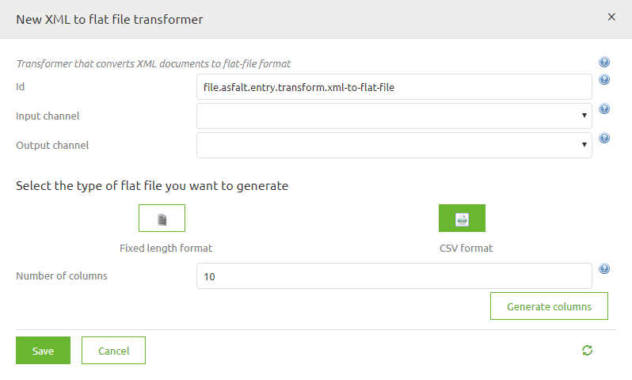
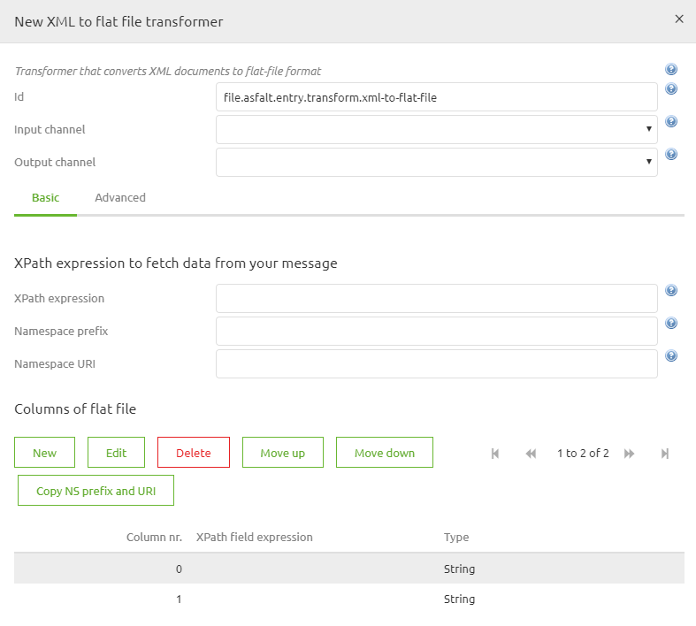

	

		<main class="micro-learning">
		<ul class="doc-nav">
			<li class="doc-nav__item"><a href="../../docs/microlearning/intermediate-create-your-transformations-index" class="doc-nav__link">Home</a></li>
			<li class="doc-nav__item"><a href="#intro" class="doc-nav__link">Intro</a></li>
			<li class="doc-nav__item"><a href="#theory" class="doc-nav__link">Theory</a></li>
			<li class="doc-nav__item"><a href="#practice" class="doc-nav__link">Practice</a></li>
			<li class="doc-nav__item"><a href="#solution" class="doc-nav__link">Solution</a></li>
		</ul>

##### Intro

# XML to Flat file transformations

In this microlearning, we will explain how to transform flat files delivered to XML that can be used fo further validation.

Should you have any questions, please contact academy@emagiz.com.

- Last update: April 22nd, 2021
- Required reading time: 8 minutes

## 1. Prerequisites
- Basic knowledge of the eMagiz platform

## 2. Key concepts
This microlearning discusses the approach to transform an XML to a Flat File. Once transformed, that flat file can be used by a target system for further consumption.

As the name suggest this standard component gives you, the user, the possibility to transform an flat file (text, csv or EDIFACT) to an xml message and vice versa. In the following chapters we will work out two examples . The first example will always be the simpler case, which you will encounter more often. The second example will be the advanced case. BE AWARE! In case of transforming an EDIFACT messages this can generaly be done easier via the special components eMagiz provides you with. Keep this in mind when designing your message solution. 

##### Theory

## 3. XML to Flat file transformation

### 3.1	Simple scenario step by step
Follow these steps carefully in order to acquire the desired result. If a step is unclear or you are not able to follow it, please contact CAPE Academy.

Step 1: Setting up the xml
It is beneficial, when working with this component to prepare your xml message to make this transformation much easier. This can be done to create a structure in which you have a root under which you have one list of records containing all relevant information (i.e Records/Record structure)

Step 2: Adding the correct component
The first step is adding the correct component to your flow. In this case you will need a blue rectangular shape component of the transformer family. The component is called: xml to flat file transformer. It is wise to name it according to its function. This way it is clear for all to see what the function of the component is within the context of the flow. See below for an example of such naming convention.

Step 3: Select the type of flat file you want to generate
In most cases you will want to generate a csv file. So you can select that option and already state how many columns you want in your output. This number should correspond to the number of attributes in your input xml. After you have executing both actions you only need to press generate columns.

Input:

Output:

Step 4: Definining the xpath to create the lines
The first thing we need to set up within the component is the xpath expression we are using to split the incoming xml messages to separate lines we are transforming to lines within the flat file. Standard we often see an xpath like: /Records/Record. In the example below we choose /*:Employees/*:Employee. Alternatively you can determine the namespace prefix and the namespace itself, just as you can in the support object called Xpath expression.

Step 5: Filling in the correct xpath expression per column
For each column you have just generated you now have to define the xpath expression. Because you were smart in step 1 of this how-to this step just has become a lot easier. Due to the nature of the xml message that will form the input the xpaths you need to set will mimic the name of the attribute they correspond with. See below for an example

 
BE AWARE, when the input xml has a namespace you need to take this into account when writing your xpath expression to make this work. Just as you would need to take that into account when using the standard transformation tooling.

Step 6: Setting the delimiter (optional)

If the delimiter in your output file deviates from the standard (comma) you can specify this under the Advanced tab. The option is called Delimiter. In this field you could place a semicolon, inverted question marks or exclamation marks.  

Step 7: Setting the Line separator (optional)
On the Advanced tab you also have the determine the line separator. Most often this will come into use when working with different operating systems. The default “Linux” enter (\u000A) differs from the default “Windows” enter (\u000D\u000A). So when the customer asks you to use an CarriageReturn and LineFeed as Line separator go for the Windows option.

Step 8: Setting the charset (optional)
In some cases you need to deviate from the standard UTF-8 charset when formatting the lines. If this is the case you can determine the charset in this component in order for the connected system to handle the input correctly. Examples of different charsets are:
•	windows-1252
•	US-ASCII
•	x-UTF-8-BOM

### 3.2	Complex scenario step by step
Follow these steps carefully in order to acquire the desired result. If a step is unclear or you are not able to follow it, please contact CAPE Academy.

Step 1: Setting up the xml
It is beneficial, when working with this component to prepare your xml message to make this transformation much easier. In this complex case this will be done by using a custom xslt to already format the xml in such a way that it will become easier to split and use this component. In the custom xslt you can create a record in which you define two parts of the line that have a certain structure (i.e recordtype and recordvalue).
If you need held setting up such an xml please feel free to contact the CAPE Academy or the eMagiz Competence Center.

Step 2: Adding the correct component
The first step is adding the correct component to your flow. In this case you will need a blue rectangular shape component of the transformer family. The component is called: xml to flat file transformer. It is wise to name it according to its function. This way it is clear for all to see what the function of the component is within the context of the flow. See below for an example of such naming convention.

Step 3: Select the type of flat file you want to generate
In these cases you will want to opt for the fixed length format option and in this example we need two columns
Input:

Output:

Step 4: Definining the XPath to create the lines
The first thing we need to set up within the component is the xpath expression we are using to split the incoming xml messages to separate lines we are transforming to lines within the flat file. The expression is completly depended on how you have built your xml in step 1

Step 5: Filling in the correct xpath expression per column
For each column you have just generated you now have to define the xpath expression. Because you were smart in step 1 of this how-to this step just has become a lot easier. Due to the nature of the xml message that will form the input the xpaths you need to set will mimic the name of the attribute or entity they correspond with. See below for an example

 
BE AWARE, when the input xml has a namespace you need to take this into account when writing your xpath expression to make this work. Just as you would need to take that into account when using the standard transformation tooling.

Step 6: Setting the Line separator (optional)
On the Advanced tab you also have the determine the line separator. Most often this will come into use when working with different operating systems. The default “Linux” enter (\u000A) differs from the default “Windows” enter (\u000D\u000A). So when the customer asks you to use an CarriageReturn and LineFeed as Line separator go for the Windows option.

Step 7: Setting the charset (optional)
In some cases you need to deviate from the standard UTF-8 charset when formatting the lines. If this is the case you can determine the charset in this component in order for the connected system to handle the input correctly. Examples of different charsets are:
•	windows-1252
•	US-ASCII
•	x-UTF-8-BOM

##### Practice

## 4. Assignment

Build an entry that retrieves files from an external source and ensures that the data is delivered on the onramp queue. 
This assignment can be completed with the help of your (Academy) project you have created/used in the previous assignment.

## 5. Key takeaways

Key considerations when picking up files are:
- What are the determining criteria to define when a file is "ready" to be picked up (age, pattern, size, etc.)
- With what frequency is eMagiz going to check for new files
- Has eMagiz the appropriate rights to read from the directory where the messages are to be retrieved from
- What is the format (i.e. XML, JSON, EDI, TXT, CSV, etc.) of the files that eMagiz needs to retrieve

##### Solution
	
## 6. Suggested Additional Readings

If you are interested in this topic and want more information on it please read the help text provided by eMagiz.

## 7. Silent demonstration video

This video demonstrates how you could have handled the assignment and gives you some context on what you have just learned.

<iframe width="1280" height="720" src="../../vid/microlearning/intermediate-create-your-transformation-xml2flatfile.mp4" frameborder="0" allow="accelerometer; autoplay; clipboard-write; encrypted-media; gyroscope; picture-in-picture" allowfullscreen></iframe>

</main>

