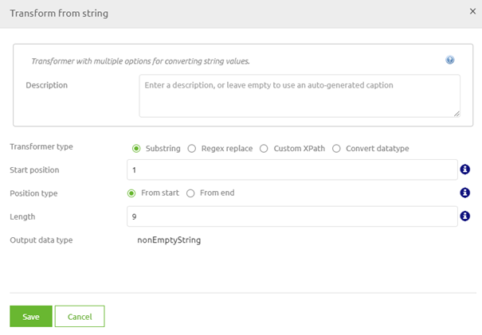

    

        <main class="micro-learning">
        <ul class="doc-nav">
            <li class="doc-nav__item"><a href="../../docs/microlearning/intermediate-create-your-transformations-index" class="doc-nav__link">Home</a></li>
            <li class="doc-nav__item"><a href="#intro" class="doc-nav__link">Intro</a></li>
            <li class="doc-nav__item"><a href="#theory" class="doc-nav__link">Theory</a></li>
            <li class="doc-nav__item"><a href="#practice" class="doc-nav__link">Practice</a></li>
            <li class="doc-nav__item"><a href="#solution" class="doc-nav__link">Solution</a></li>
        </ul>

##### Intro

# Transformation - XPath Intermediate

Within the crash course, we already explained XPath conceptually. In that same microlearning, we also looked at some more uncomplicated cases of using XPath within your transformation. If you need to brush up on that knowledge, please check out this [microlearning](crashcourse-platform-create-transformation-XPath-basic). In this microlearning, we will build upon that knowledge and look at some concrete, practical examples that we see are used a lot across projects.

Should you have any questions, please get in touch with academy@emagiz.com.

- Last update: August 23th, 2021
- Required reading time: 6 minutes

## 1. Prerequisites
- Basic knowledge of the eMagiz platform

## 2. Key concepts
This microlearning focuses on XPath Intermediate in the context of transformations.

With XPath Intermediate, we mean Learning which XPath options are widely used and could benefit you in your daily work.

Some of the more widely used XPath options are:
- if then else
- concat
- exists check
- empty check
- normalize-space
- substring

##### Theory

## 3. Transformation - XPath Intermediate

Within the crash course, we already explained XPath conceptually. In that same microlearning, we also looked at some more straightforward cases of using XPath within your transformation. If you need to brush up on that knowledge, please check out this [microlearning](crashcourse-platform-create-transformation-xpath-basic). In this microlearning, we will build upon that knowledge and look at some concrete, practical examples that we see are used a lot across projects.

Some of the more widely used XPath options are:
- if then else
- concat
- exists check
- empty check
- normalize-space
- substring

### 3.1 If then else

One of the most used XPath constructions is the if then else construction. With the help of this construction, you define a condition (the if), you define what happens if the condition returns true (the then), and you define what happens when the condition returns false (the else). When written in XPath this results in the following notation: **if(SomeAttribute='One') then SomeOtherAttribute else 'two'**.

Note that you can verify what your input is in each of the three parts of the XPath. So I could also have replaced SomeOtherAttribute with a static value, for example. Or I could have used a parameter. Or any of the other options available.

### 3.2 Concat

The concat option is a variation on the string-join we saw in the [XPath Basic microlearning](crashcourse-platform-create-transformation-XPath-basic). The significant difference between the concat and the string-join is that with the concat, you do not define one single separator between the various elements. With the concat, you define per step how certain parts should be linked together. So, for example, **concat(SomeAttribute,' ', SomeOtherAttribute,'-', AThirdAttribute, AFourthAttribute)** uses different separators between the various elements we want to join together in a new string.

### 3.3 Exists check

When you have a standard filter in the transformation tooling of eMagiz, it will perform a check to determine whether the input attribute exists within the input message. You can use the same logic when writing a custom XPath (as part of a custom snippet, for example). The notation is straightforward. The exists check is written as **exists(SomeAttribute)**. Note that when you only do an exists check, and the input attribute is a string, this check is no guarantee that the attribute is filled with a relevant value. This means that when your following definition expects a **nonEmptyString**, only doing a exists check is not sufficient.

### 3.4 Empty check

For those scenarios, we have what we call the empty check. With the empty check (which is frequently used in combination with the exists check), you also check whether the attribute is filled with something. The empty check is written as **SomeAttribute !=''**. Combined with the empty check, it is an important defense against validation errors on nonEmptyString attributes.

### 3.5 Normalize-space

The normalize-space function strips leading and trailing white-space from a string replaces sequences of white-space characters by a single space and return the resulting string. So, in essence, if my input attribute called SomeAttribute contains the value -> 'This  is a test '. The result of the normalize-space action would then be -> 'This is a test'. Note that the '.' in both examples is placed there to illustrate the input and output string. The notation of the normalize-space function is **normalize-space(SomeAttribute)**.

### 3.6 Substring

Sometimes you need to get part of a string in your output. The default transformation tooling of eMagiz provides you with a friendly UI for this option in which you only have to define the start position and the length of the string you want as your output. 

Translating that into an XPath would yield the following result: **substring(SomeAttribute,1,9)**.

With this, we have learned about some frequently used XPaths in (custom) transformations that we see are being used within the eMagiz platform. We will pick up the subject of XPath later on once more to delve even deeper into the world of XPath.

##### Practice

## 4. Assignment

Check out which of the XPaths we have discussed today can be found within your project.
This assignment can be completed within the (Academy) project you created/used in the previous assignment.

## 5. Key takeaways

Some of the more widely used XPath options are:
- if then else
- concat
- exists check
- empty check
- normalize-space
- substring

##### Solution

## 6. Suggested Additional Readings

If you are interested in this topic and want more information on it, please read the help text provided by eMagiz and read more information on the following link:
- https://www.w3schools.com/xml/xpath_intro.asp

## 7. Silent demonstration video

As this is more of theoretical microlearning, there is no video accompanying the microlearning.

</main>

