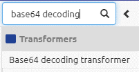

    

        <main class="micro-learning">
        <ul class="doc-nav">
            <li class="doc-nav__item"><a href="../../docs/microlearning/intermediate-data-handling-index" class="doc-nav__link">Home</a></li>
            <li class="doc-nav__item"><a href="#intro" class="doc-nav__link">Intro</a></li>
            <li class="doc-nav__item"><a href="#theory" class="doc-nav__link">Theory</a></li>
            <li class="doc-nav__item"><a href="#practice" class="doc-nav__link">Practice</a></li>
            <li class="doc-nav__item"><a href="#solution" class="doc-nav__link">Solution</a></li>
        </ul>

##### Intro

# Base64 decoding

Most of the time, you can use the standard tooling of eMagiz to manipulate the data so that it makes sense for the (external) party that receives the data. However, sometimes there are cases in which you need a little bit of extra complexity. This microlearning will explain one of those more complex scenarios. In this microlearning, we will learn how to use base64 decoding on your (input) message. This functionality is beneficial when the message is encoded, but you need to manipulate part of the data.

Should you have any questions, please get in touch with academy@emagiz.com.

- Last update: August 26th, 2021
- Required reading time: 5 minutes

## 1. Prerequisites
- Basic knowledge of the eMagiz platform

## 2. Key concepts
This microlearning centers around base64 decoding.
We mean turning the encoded string into a readable format that eMagiz can manipulate further downstream.

Essential characteristics of this functionality are:
- Decoding (and encoding) of base64 strings take up additional memory (up to 33%)
- Separate integration for the base64 strings apart from metadata is advisable
- The component in eMagiz needs a base64 encoded string as input
- Multiple times encoding and decoding in the same integration is **not** advisable

##### Theory

## 3. Base64 decoding

Most of the time, you can use the standard tooling of eMagiz to manipulate the data so that it makes sense for the (external) party that receives the data. However, sometimes there are cases in which you need a little bit of extra complexity. This microlearning will explain one of those more complex scenarios. In this microlearning, we will learn how to use base64 decoding on your (input) message. This functionality is beneficial when the message is encoded, but you need to manipulate part of the data.

Essential characteristics of this functionality are:
- Decoding (and encoding) of base64 strings take up additional memory (up to 33%)
- Separate integration for the base64 strings apart from metadata is advisable
- The component in eMagiz needs a base64 encoded string as input
- Multiple times encoding and decoding in the same integration is **not** advisable

The Base64 decode algorithm converts plain text into original data. Technically, it can be said that it converts six-bit bytes into eight-bit bytes. So when you have the base64 string of QUJD, you could manually convert this to a readable format. You can find an excellent explanation of how it works [here](https://base64.guru/learn/base64-algorithm/decode). Luckily for us, eMagiz will do all the heavy lifting, and we do not have to take out pen and paper.

In the remainder of this microlearning, we will look at how you could implement this logic within the eMagiz tooling.

### 3.1 Implementation

To implement this logic, we need to add a separate component to our flow at the point where we want to decode the base64 string. This is generally part of your processing. The most logical place would be a flow associated with processing (i.e., onramp, exit gate, event processor).  

First, we need to navigate to the Create phase of eMagiz and open the flow in which we want to add this logic. Once you have opened your flow, you need to enter "Start editing" mode. This mode allows you to change the flow in question and add the logic to the transformation within the flow. When you have done so, it becomes time to add the base64 decode component to the flow.

At the component level, you need to define the input and output channel. Afterward, you need to determine if your output will be bytes or string (on the Advanced tab). If you want to transform the content of the base64 encoded string via the tooling, the string option will make more sense. However, that option also uses up more memory. So depending on your use case, you should consider the whole dynamic when making your choice.

### 3.2 Use cases

Now that we know how to implement it, we can quickly look at possible use cases for this logic. We see this logic popping up mainly when dealing with attachments/files (i.e., pictures, pdf) within XML messages.

##### Practice

## 4. Assignment

Look for places where you could use this logic to aid your integration process within your (Academy) project. 
This assignment can be completed with the help of your (Academy) project you have created/used in the previous assignment.

## 5. Key takeaways

Essential characteristics of this functionality are:
- Decoding (and encoding) of base64 strings take up additional memory (up to 33%)
- Separate integration for the base64 strings apart from metadata is advisable
- The component in eMagiz needs a base64 encoded string as input
- Multiple times encoding and decoding in the same integration is **not** advisable

##### Solution

## 6. Suggested Additional Readings

If you are interested in this topic and want more information, please read the help text provided by eMagiz and the following links:
- https://base64.guru/learn/base64-algorithm/decode
- https://www.base64decode.org/

## 7. Silent demonstration video

This video demonstrates how you could have handled the assignment and gives you some context on what you have just learned.

<iframe width="1280" height="720" src="../../vid/microlearning/intermediate-data-handling-base64-decode.mp4" frameborder="0" allow="accelerometer; autoplay; clipboard-write; encrypted-media; gyroscope; picture-in-picture" allowfullscreen></iframe>

</main>

