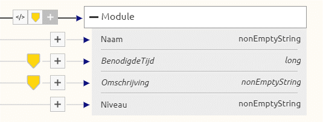
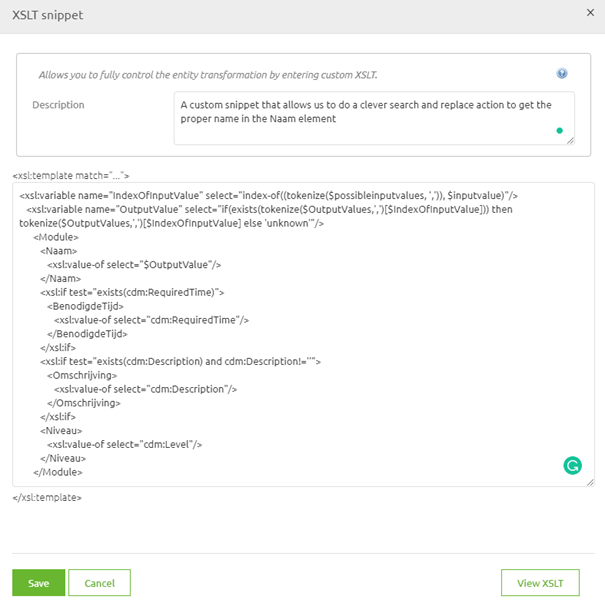
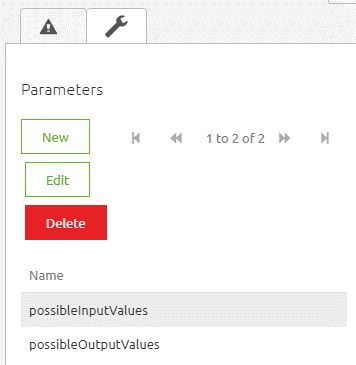
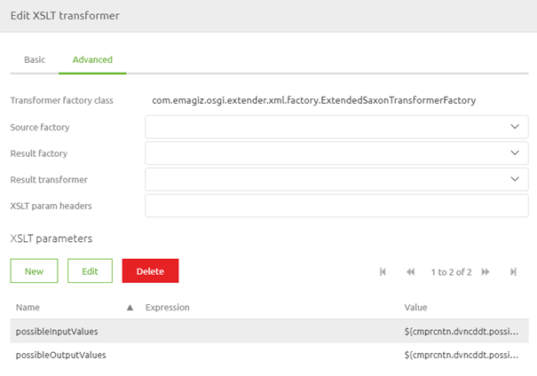

    

        <main class="micro-learning">
        <ul class="doc-nav">
            <li class="doc-nav__item"><a href="../../docs/microlearning/intermediate-data-handling-index" class="doc-nav__link">Home</a></li>
            <li class="doc-nav__item"><a href="#intro" class="doc-nav__link">Intro</a></li>
            <li class="doc-nav__item"><a href="#theory" class="doc-nav__link">Theory</a></li>
            <li class="doc-nav__item"><a href="#practice" class="doc-nav__link">Practice</a></li>
            <li class="doc-nav__item"><a href="#solution" class="doc-nav__link">Solution</a></li>
        </ul>

##### Intro

# Compare content to the property list

Most of the time, you can use the standard tooling of eMagiz to manipulate the data so that it makes sense for the (external) party that receives the data. However, sometimes there are cases in which you need a little bit of extra complexity. This microlearning will explain one of those more complex scenarios. In this microlearning, we will learn how to use two property lists to alter the input value to the desired output value. This functionality is beneficial when the list you are working with is not entirely static and is too long to be captured as an enum list.

Should you have any questions, please get in touch with academy@emagiz.com.

- Last update: August 23th, 2021
- Required reading time: 7 minutes

## 1. Prerequisites
- Basic knowledge of the eMagiz platform

## 2. Key concepts
This microlearning centers around comparing content to the property list.
By comparing, we mean Searching for the value in the list to get its position.

Essential characteristics of this functionality are:
- There is an input and an output list. Both are equal in length
- The logic searches for the position of the content in the input list
- The logic returns the corresponding value in the output list that holds the same position in the list

##### Theory

## 3. Compare content to the property list

Most of the time, you can use the standard tooling of eMagiz to manipulate the data so that it makes sense for the (external) party that receives the data. However, sometimes there are cases in which you need a little bit of extra complexity. This microlearning will explain one of those more complex scenarios. In this microlearning, we will learn how to use two property lists to alter the input value to the desired output value. This functionality is beneficial when the list you are working with is not entirely static and is too long to be captured as an enum list.

Essential characteristics of this functionality are:
- There is an input and an output list. Both are equal in length
- The logic searches for the position of the content in the input list
- The logic returns the corresponding value in the output list that holds the same position in the list

Before we take a look at the implementation in eMagiz lets us first explain the concept at hand. To make this work you need two seperate properties. Each of these properties should contain a comma seperated list of values. Something along these lines:

- Input list: one,two,three,four,five
- Output list: één,twee,drie,vier,vijf

Note that the key is that both lists have the same number of (unique) values within them. If there is a mismatch, or the ordering is wrong, the output will not be the desirable output. Furthermore you should always think of how you want your logic to react the moment it cannot find the corresponding value. Should it throw an error? Should it return to some default? That is up to you.

The moment a message arrives part of the message will be compared to the values in the input list. If the value can be found in the input list the position within the list is returned. So for example when the input message contains the value two the logic will return position 2 as a result. When the position is returned the next step of the logic will retrieve the value at position 2 in our output list. In this case that would be twee.

In the remainder of this microlearning, we will look at how you could implement this logic within the eMagiz tooling.

### 3.1 Implementation

To implement this piece of logic we need a custom snippet in our transformation that does the work for us. Note that whenever you use a custom snippet you should not forget to include references to other elements in case the output structure demands those. In the example that will follow we have a very simple output message and therefore the shown solution should not be implemented one on one in your project as that would most likely break your transformation.

First we need to navigate to the Create phase of eMagiz and open the flow in which we want to add this logic. Once you have opened your flow, you need to enter "Start editing" mode. This mode allows you to change the flow in question and add the logic to the transformation within the flow. When you have done so, it becomes time to navigate to the transformation part of your flow. In here you can add a custom snippet to your transformation. You can do so by clicking on the code icon.

Within the custom snippet we need the following logic:
- Logic that determines what the position in the input list is of the supplied content (value)
- Logic that determines what the correspoding value, based on that position, in the output list is
- Logic that supplies this value to the correct output field

Creating this logic in this simple example will mean we end up with the following custom snippet:

<xsl:variable name="indexOfInputValue" select="index-of((tokenize($possibleInputValues, ',')), //*:Name)"/>
   <xsl:variable name="outputValue" select="if(exists(tokenize($possibleOutputValues,',')[$indexOfInputValue])) then tokenize($possibleOutputValues,',')[$indexOfInputValue] else 'unknown'"/>
      <Module>
         <Naam>
            <xsl:value-of select="$outputValue"/>
         </Naam>
         <xsl:if test="exists(cdm:RequiredTime)">
            <BenodigdeTijd>
               <xsl:value-of select="cdm:RequiredTime"/>
            </BenodigdeTijd>
         </xsl:if>
         <xsl:if test="exists(cdm:Description) and cdm:Description!=''">
            <Omschrijving>
               <xsl:value-of select="cdm:Description"/>
            </Omschrijving>
         </xsl:if>
         <Niveau>
            <xsl:value-of select="cdm:Level"/>
         </Niveau>
      </Module>

As you can see we have added two variables to the snippet that will determine the index and the corresponding output value. Subsequently we make sure that the output element called Naam will be filled with the output value. In eMagiz you will see this when you add the custom snippet.

Finishing this is only half the battle. We still need to feed our property lists into the transformation. To do so we need parameters. For more information on parameters in transformation please check out this [microlearning](novice-create-your-transformations-xslt-parameters.md). In this case we need two parameters:

- possibleInputValues
- possibleOutputValues

After that we need to tell the component itself how these parameters (which are still empty shells) need to be filled. To do so navigate back to the flow canvas and open the XSLT transformer component. On the advanced tab you can define the relevant values for each of our parameters. In this case you need two seperate properties as input values.

With this configuration done your logic is complete. Do note that the logic is case sensitive. So when you receive Three instead of three the logic will default to unknown. If the other party cannot guarantee that data is always delivered exactly the same you should take additional measures to guarantee that.

### 3.2 Use cases

Now that we now how to implement it we can take a quick look at some possible use cases for this logic. We see this logic popping up mainly when both of the lists are static enough to be captured as property but change enough to make it impractical to use enumerations. A further complication of the use of enumerations, especially on CDM level is that certain elements might be reused across integrations and changing the enum list for one of them automatically means that you change them for all of them.

##### Practice

## 4. Assignment

Look for places where you could use this logic to aid your integration process within your (Academy) project. 
This assignment can be completed with the help of your (Academy) project you have created/used in the previous assignment.

## 5. Key takeaways

Essential characteristics of this functionality are:
- There is an input and an output list. Both are equal in length
- The logic searches for the position of the content in the input list
- The logic returns the corresponding value in the output list that holds the same position in the list

##### Solution

## 6. Suggested Additional Readings

If you are interested in this topic and want more information, please read the help text provided by eMagiz.

## 7. Silent demonstration video

This video demonstrates how you could have handled the assignment and gives you some context on what you have just learned.

<iframe width="1280" height="720" src="../../vid/microlearning/intermediate-data-handling-compare-content-to-propertylist.mp4" frameborder="0" allow="accelerometer; autoplay; clipboard-write; encrypted-media; gyroscope; picture-in-picture" allowfullscreen></iframe>

</main>

