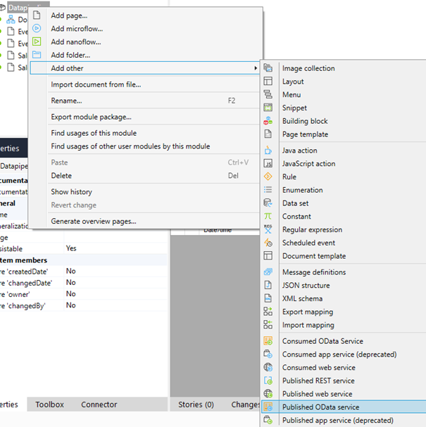
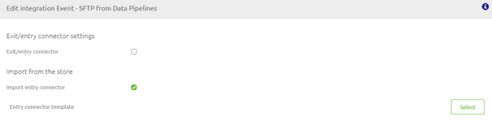
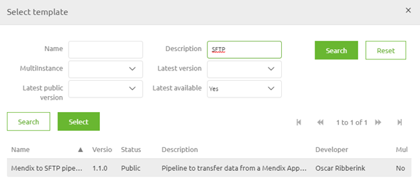
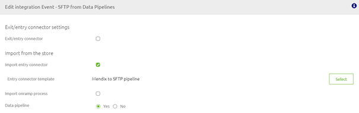
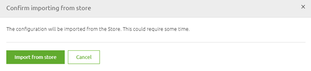
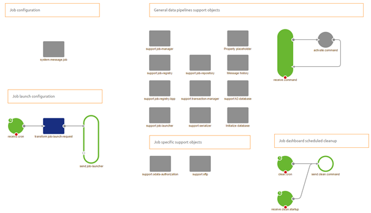
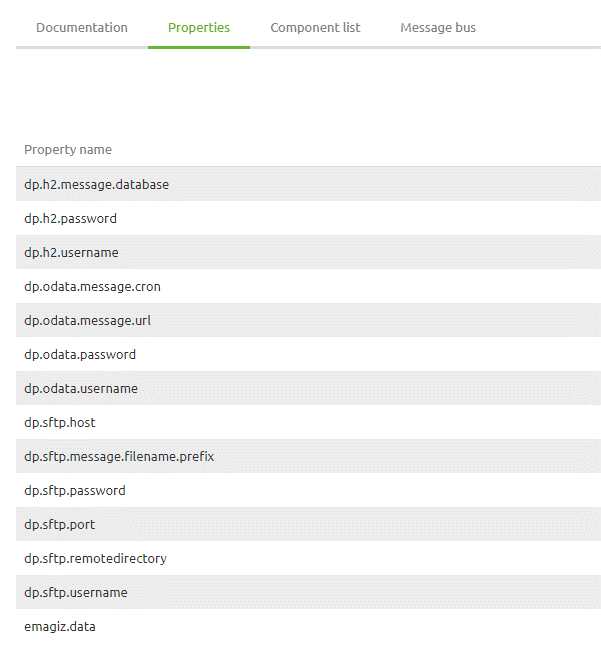

    

        <main class="micro-learning">
        <ul class="doc-nav">
            <li class="doc-nav__item"><a href="../../docs/microlearning/intermediate-data-pipelines-index" class="doc-nav__link">Home</a></li>
            <li class="doc-nav__item"><a href="#intro" class="doc-nav__link">Intro</a></li>
            <li class="doc-nav__item"><a href="#theory" class="doc-nav__link">Theory</a></li>
            <li class="doc-nav__item"><a href="#practice" class="doc-nav__link">Practice</a></li>
            <li class="doc-nav__item"><a href="#solution" class="doc-nav__link">Solution</a></li>
        </ul>

##### Intro

# Data pipeline - Mendix to SFTP

In this microlearning, we will learn how you can set up a data pipeline between Mendix and a random SFTP with the help of eMagiz. 
With the help of such a data pipeline, you can transfer large volumes of data between Mendix and the SFTP for data warehousing / BI analytics purposes.

Should you have any questions, please contact academy@emagiz.com.

- Last update: April 1th 2021
- Required reading time: 7 minutes

## 1. Prerequisites
- Basic knowledge of the eMagiz platform
- Basic knowledge of the Mendix platform

## 2. Key concepts
This microlearning centers around configuring a data pipeline that will transfer large volumes of data between Mendix and a random SFTP.

With data pipeline we mean: A integration pattern that can transfer large volumes of data between a specific set of source and sink systems
With SFTP we mean: A file protocol for transferring large files over the web in a secure manner

In this microlearning, we will learn how we can easily transport large quantities of data between Mendix and an SFTP

##### Theory

## 3. Data pipeline - Mendix to SFTP

Imagine you have a Mendix application that is used for communication with customers. An order management system for example. If you want to do trend analysis on the large amounts of data or if you want the large amounts of data to be separately stored on a different location for audit purposes you could transport this data from Mendix to an SFTP with the help of the data pipeline pattern in eMagiz.

As a data pipeline always transfers data from source to sink system we will start at the source of this data pipeline. 
Afterward, we will continue with the transfer part and we will finish at the sink system.

### 3.1 Setting up Mendix

To let the data pipeline retrieve data from your Mendix application you need to publish your data via a Published OData service.

 

The result of this action should look similar to this

To add resources to this OData service you can press the Add icon on this screen or navigate to the domain model to add the relevant resources.
Regardless of the option that you choose, the end result should be something like this:

Now we have successfully published the relevant data that we need to answer our question.

### 3.2 Setting up eMagiz
Now that we have made the relevant information available we need to make sure we can retrieve the information via an eMagiz data pipeline. 
Because we have two tables (Sales and Events) we need two data pipelines.

#### 3.2.1 Design

Selecting the correct data pipeline can be done in Design. This way eMagiz will do all the heavy lifting for you. 
Double click on the integration that you want to edit and select Import Entry Connector

The next step would be to select the correct entry connector that you want to import from the store. In this case the Mendix Redshift one.

To finish up our Design phase set the option Data pipeline to Yes. This will ensure that you only need to deploy the entry and not the onramp when you are in Deploy.
The result should look as follows.

Don't forget to do the same for the other data pipeline that you need to configure

#### 3.2.1 Create

After you have transferred the data pipelines to Create you can edit the entry flows. 
eMagiz will tell you that the information will be retrieved from the store.

Select Import from Store and let eMagiz do all the heavy lifting. The result of this action will be a flow that looks as follows:

As you can see the complete setup is already created for you and the various parts have been nicely organized and separated. Let us do a quick walkthrough:
- Starting at the top left corner we have the Job configuration. 
    - This configuration specifies the source system (Item reader), transformation (Item processor), and the sink system (Item writer). All of them are pre-filled for you
- Next to that you have all the support objects needed to run the flow.
- One down we have the job launch configuration. 
    - This configuration makes sure that the job, with certain parameters, is launched at a certain point in time. It is up to the user what this point of time is.
- In the bottom center we have some specific support objects that are relevant for this particular data pipeline implementation
- Last but not least, on the right-hand bottom corner we have the functionality that automatically cleans up the job dashboard.

The only thing you need to do is to rename the properties where it says message to the technical name of the integration that you have just added (i.e. sale, event). In this data pipeline there are four properties that you need to rename:

- dp.h2.message.database (Located in the component called support.h2-database)
- dp.sftp.message.filename.prefix (Located in the component called transform.job-launch-request)
- dp.odata.message.cron (Located in the component called receive.cron)
- dp.odata.message.url (Located in the step within the component called system.message.job)

#### 3.2.2 Deploy

Although you don't need to build this flow by yourself you still need to fill in various property values to make sure that you retrieve the correct data from Mendix and send it to the correct SFTP. 
A complete list of these properties can be found on the flow level (under Other -> Properties).

Because the SFTP is managed by an external party we don't need to do any configuration beyond this point.

##### Practice

## 4. Assignment

The assignment is complex this time and comes with a lot of requirements as this talks about a complete integration. 
So only proceed with this assignment if you have access to Mendix in addition to eMagiz and on top of that have an SFTP to which you can write data.

If so, the assignment is to successfully load Event data onto an external SFTP.

This assignment can be completed with the help of an associated Mendix project linked to the (Academy) project that you have created/used in the previous assignment.

## 5. Key takeaways

- A data pipeline is useful when transferring large volumes of data without the need for transformation
- Data pipelines are a standardized piece of software in eMagiz that can be implemented with ease
- The sink system, in this case, the SFTP, can be used for further analysis of data

##### Solution

## 6. Suggested Additional Readings

If you are interested in this topic and want more information on it please read the help text provided by eMagiz.

## 7. Silent demonstration video

There is no demonstration video for this microlearning. We believe that when you follow the steps detailed above the solution will work for your specific use case.

</main>

