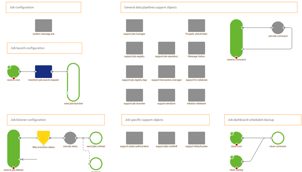

    

        <main class="micro-learning">
        <ul class="doc-nav">
            <li class="doc-nav__item"><a href="../../docs/microlearning/intermediate-data-pipelines-index" class="doc-nav__link">Home</a></li>
            <li class="doc-nav__item"><a href="#intro" class="doc-nav__link">Intro</a></li>
            <li class="doc-nav__item"><a href="#theory" class="doc-nav__link">Theory</a></li>
            <li class="doc-nav__item"><a href="#practice" class="doc-nav__link">Practice</a></li>
            <li class="doc-nav__item"><a href="#solution" class="doc-nav__link">Solution</a></li>
        </ul>

##### Intro

# Understanding Data Pipelines

In this microlearning, we will introduce the data pipeline pattern to you. After this microlearning, you should be able to identify situations in which a data pipeline solution is the best choice for you.
With the help of such a data pipeline, you can transfer large volumes of data between a source and a sink.

Should you have any questions, please contact academy@emagiz.com.

- Last update: April 1th 2021
- Required reading time: 5 minutes

## 1. Prerequisites
- Basic knowledge of the eMagiz platform

## 2. Key concepts
This microlearning centers around the introduction of the data pipeline pattern. After this microlearning, you should be able to identify situations in which a data pipeline solution is the best choice for you.

With data pipeline we mean: A integration pattern that can transfer large volumes of data between a specific set of source and sink systems.

In this microlearning, we will explain a bit about what the data pipeline pattern in eMagiz means and see which choices you have for source and sink systems.

##### Theory

## 3. Understanding Data Pipelines

Imagine you are a global event organizer and want to track which events were hits and misses during the year.
To analyze that business question you need a lot of data that tells you something about these events. In other words, you need large amounts of data points to say something meaningful about this. This is where the data pipeline pattern of eMagiz comes in. With the data pipeline pattern in eMagiz, you can transfer large volumes of data between a specific set of source and sink systems. 

In this microlearning, we will explain a bit about what the data pipeline pattern in eMagiz means and see which choices you have for source and sink systems.

### 3.1 What is a data pipeline?

A data pipeline in eMagiz is a flow containing a specified set of components that extract data from a source system, do a very minimal transformation if any, and load it into a sink system. As the set of components is the same for each combination of source and sink system that eMagiz can link together we have made several eMagiz store items that you can use to accelerate the development of your data pipelines.

A data pipeline always connects a specific source with a specific sink system. Therefore there is no option to combine data while processing data that is coming from multiple sources. If multiple sources can provide the data you will need a specific data pipeline per source that loads the data in the sink systems.

In the flow designer of eMagiz a data pipeline looks similar to the picture shown below:

 

### 3.2 Source Systems
A source system is a system from which you can extract data that you want to load in your sink system. In eMagiz we support the following source systems when it comes to the data pipeline pattern:

- Mendix
- Local Directory containing a flat-file (CSV)

### 3.3 Sink Systems
A sink system is a system to which you can load data that you have extracted from your sink system. In eMagiz we support the following sink systems when it comes to the data pipeline pattern:

- Amazon Redshift
- Azure Event Hub
- Database
- Remote directory (FTP or SFTP) in flat-file (CSV) format

##### Practice

## 4. Assignment

Browse the public store of eMagiz to see which combinations of source and sink systems are used frequently and are therefore standardized.
This assignment can be completed with the help of the (Academy) project that you have created/used in the previous assignment.

## 5. Key takeaways

- A data pipeline is useful when transferring large volumes of data without the need for transformation
- Data pipelines are a standardized piece of software in eMagiz that can be implemented with ease
- eMagiz offers a limited number of source and sink options when you use the data pipeline pattern.

##### Solution

## 6. Suggested Additional Readings

If you are interested in this topic and want more information on it please read the help text provided by eMagiz.
## 7. Silent demonstration video

This video demonstrates a working solution and how you can validate whether the refresh has worked in AWS Redshift.

<iframe width="1280" height="720" src="../../vid/microlearning/intermediate-datapipelines-understanding-data-pipelines.mp4" frameborder="0" allow="accelerometer; autoplay; clipboard-write; encrypted-media; gyroscope; picture-in-picture" allowfullscreen></iframe>

</main>

