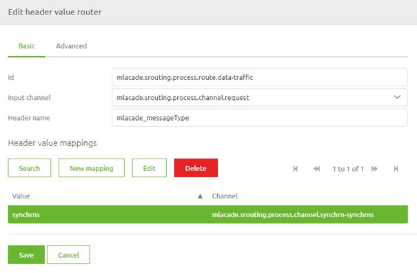
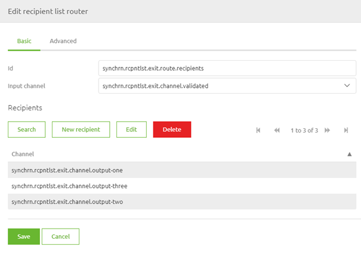
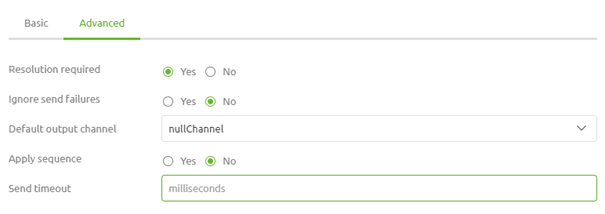

    

        <main class="micro-learning">
        <ul class="doc-nav">
            <li class="doc-nav__item"><a href="../../docs/microlearning/intermediate-data-traffic-routing-index" class="doc-nav__link">Home</a></li>
            <li class="doc-nav__item"><a href="#intro" class="doc-nav__link">Intro</a></li>
            <li class="doc-nav__item"><a href="#theory" class="doc-nav__link">Theory</a></li>
            <li class="doc-nav__item"><a href="#practice" class="doc-nav__link">Practice</a></li>
            <li class="doc-nav__item"><a href="#solution" class="doc-nav__link">Solution</a></li>
        </ul>

##### Intro

# Implementation of routing decisions

This microlearning will explain two implementation options for routing messages. We will first look at the header value router, and subsequently, we will take a look at the recipient list router. Both are frequently used within the platform to route data traffic.

Should you have any questions, please get in touch with academy@emagiz.com.

- Last update: August 23th, 2021
- Required reading time: 7 minutes

## 1. Prerequisites
- Basic knowledge of the eMagiz platform

## 2. Key concepts
This microlearning centers around the implementation of routing decisions.
By routing decisions, we mean The act of determining to which output channel(s) a message should be sent by the flow.

Essential characteristics of the header value router:
- Based on the value of one header, the routing decision is made
- Each header value can only be linked to one output channel
- The component expects that the message is sent to an output channel. If not, it throws an error.

Essential characteristics of the recipient list router:
- Each output channel that is added becomes a new recipient
- Can multiply a single message infinitely
- Each recipient can receive a message always or only based on a specific condition
- The component expects that the message is sent to an output channel. If not, it throws an error.

##### Theory

## 3. Implementation of routing decisions

This microlearning will explain two implementation options for routing messages. We will first look at the header value router, and subsequently, we will take a look at the recipient list router. Both are frequently used within the platform to route data traffic.

Essential characteristics of the header value router:
- Based on the value of one header, the routing decision is made
- Each header value can only be linked to one output channel
- The component expects that the message is sent to an output channel. If not, it throws an error.

Essential characteristics of the recipient list router:
- Each output channel that is added becomes a new recipient
- Can multiply a single message infinitely
- Each recipient can receive a message always or only based on a specific condition
- The component expects that the message is sent to an output channel. If not, it throws an error.

In the remainder of this microlearning, we will first look at implementing the header value router. Afterward, we will see how to implement a recipient list router. To close the microlearning off, we will look at error handling within these components and which options are available to tweak the error handling to your liking.

### 3.1 Header value router

To implement the header value router, you need to navigate to the Create phase of your integration data model and open the flow you want to make the routing decisions. A typical flow in which the header value router is of use is synchronous routing. For more information on the synchronous routing, please check out this [microlearning](intermediate-data-traffic-routing-synchronous-routing.md). 

Once you have opened your flow, you need to enter "Start editing" mode. This mode allows you to change the flow in question and add the header to the flow. When you have done so, it becomes time to configure the header value router. In the header value router component, this will look as follows:

In this simple case, we only have one channel as a result because all routings start simple. 
The moment you add new offramps to your project, you need to add the latest entry to this list.
Doing so is easy when you are in Start Editing Mode. Open the router component and select the button New Mapping.

Here, you fill in the correct message type and select the channel to route the message.
When you are satisfied, you can press Save, and eMagiz will register the new entry.

Don't forget to make a new version and deploy it to actualize your changes.

### 3.2 Recipient list router

Another possible component to use to route messages is called the recipient list router. The big difference between this component and the other router components is that, in essence, it will send multiple messages (for each recipient, one message). Whereas the header value router we learned about before will send the message to one of the possible output channels based on the header value, the recipient list router will send the message to each recipient in the list. This functionality is beneficial when you need to process multiple messages slightly differently, but all those messages need to be sent to the same system.

If you want to multiple a message only when certain conditions are met, you can do this within the recipient list router component. To do so, you need to edit a recipient and open the advanced tab. On this tab, you can define a selector expression. The goal of the selector expression is only to allow messages that adhere to specific criteria. This way, you can limit whether one particular message traverses that channel.

Note that you can use any valid SpEL expression to act as your selector expression.

### 3.4 Error handling

The default configuration means that an error is thrown when eMagiz cannot send the input message to at least one channel. However, on the advanced tab of both components, there are ways to change this behavior. You should explicitly define where the message should go if none of the specified channels are resolved correctly to change the behavior. You can do this by selecting a default output channel. If the messages should not continue, the default output channel should be the null channel. When eMagiz cannot resolve any criteria, but the message should continue, you need to select one of the channels as the default output channel.

Note that when you use the null channel, the message will be silently dropped by eMagiz.

##### Practice

## 4. Assignment

Look for places where you could use one of these routing components to aid your integration process within your (Academy) project. 
This assignment can be completed with the help of your (Academy) project you have created/used in the previous assignment.

## 5. Key takeaways

Essential characteristics of the header value router:
- Based on the value of one header, the routing decision is made
- Each header value can only be linked to one output channel
- The component expects that the message is sent to an output channel. If not, it throws an error.

Essential characteristics of the recipient list router:
- Each output channel that is added becomes a new recipient
- Can multiply a single message infinitely
- Each recipient can receive a message always or only based on a specific condition
- The component expects that the message is sent to an output channel. If not, it throws an error.

##### Solution

## 6. Suggested Additional Readings

If you are interested in this topic and want more information, please read the help text provided by eMagiz.

## 7. Silent demonstration video

This video demonstrates how you could have handled the assignment and gives you some context on what you have just learned.

<iframe width="1280" height="720" src="../../vid/microlearning/intermediate-data-traffic-routing-implementation-of-routing-decisions.mp4" frameborder="0" allow="accelerometer; autoplay; clipboard-write; encrypted-media; gyroscope; picture-in-picture" allowfullscreen></iframe>

</main>

