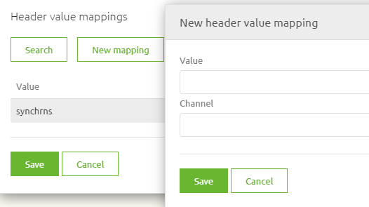
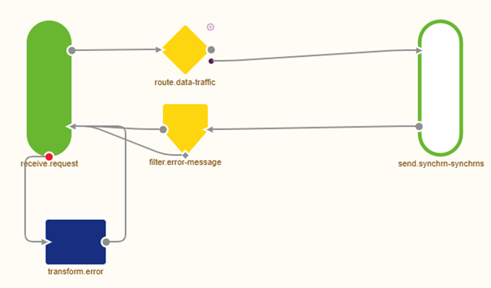

    

        <main class="micro-learning">
        <ul class="doc-nav">
            <li class="doc-nav__item"><a href="../../docs/microlearning/intermediate-data-traffic-routing-index" class="doc-nav__link">Home</a></li>
            <li class="doc-nav__item"><a href="#intro" class="doc-nav__link">Intro</a></li>
            <li class="doc-nav__item"><a href="#theory" class="doc-nav__link">Theory</a></li>
            <li class="doc-nav__item"><a href="#practice" class="doc-nav__link">Practice</a></li>
            <li class="doc-nav__item"><a href="#solution" class="doc-nav__link">Solution</a></li>
        </ul>

##### Intro

# Synchronous Routing

This microlearning will explain the basics of synchronous routing within the messaging pattern, which plays a vital role in synchronously handling messages within the five-layer messaging model.

Should you have any questions, please get in touch with academy@emagiz.com.

- Last update: August 23th, 2021
- Required reading time: 6 minutes

## 1. Prerequisites
- Basic knowledge of the eMagiz platform

## 2. Key concepts
This microlearning centers around synchronous routing for messaging flows in eMagiz.
By synchronous routing, we mean The process that routes messages that it receives to the correct outbound queue based on some metadata and waits for a response that needs to be sent back to the original process that delivered the message.

The synchronous routing has four relevant parts:
- All synchronous onramps send their data to the routing
- Based on a decision made within the routing, the message is routed to one of the available offramp queues
- You need to deploy the complete five layers at once to prevent timeouts while deploying half of your solution
- In contrast with asynchronous routing the synchronous routing only has one output tied to an input (instead of a possible one towards many)

##### Theory

## 3. Synchronous routing

Synchronous routing plays a crucial role in distributing messages from one onramp to a specific offramp and waiting for the result to be passed back to the onramp again. 

The asynchronous routing has four relevant parts:
- All synchronous onramps send their data to the routing
- Based on a decision made within the routing, the message is routed to one of the available offramp queues
- You need to deploy the complete five layers at once to prevent timeouts while deploying half of your solution
- In contrast with asynchronous routing the synchronous routing only has one output tied to an input (instead of a possible one towards many)

If you want to learn more about asynchronous routing instead of synchronous routing, please check out this [microlearning](crashcourse-messaging-asynchronous-routing.md). In synchronous routing, you not only route messages towards a certain offramp. On top of that, the routing waits for a response. Subsequently, it will route the message back to the correct onramp from which the message originated. This process happens based on a header value that is automatically determined and set by eMagiz.

### 3.1 Make a decision

In synchronous routing, you can build your decision model on which the routing needs to decide.

The best practice for setting up your synchronous routing process is to use the value of one of the two standard headers automatically generated in each onramp in eMagiz within the messaging pattern. The header in question is called {technicalnameofproject}_messageType. You can use this header for your routing decision. This logic means you will need a header value router as the decision point of your synchronous routing.

In the header value router component this will look as follows:

In this simple case, we only have one channel as a result because all routings start simple. 
The moment you add new offramps to your project, you need to add the latest entry to this list.
Doing so is easy when you are in Start Editing Mode. Open the router component and select the button New Mapping.

Here, you fill in the correct message type and select the channel you want to route the message.
When you are satisfied, you can press Save, and eMagiz will register the new entry.

Don't forget to make a new version and deploy it to actualize your changes.

### 3.2 Control output

In contrast to asynchronous routing, you cannot deploy half your solution beforehand, leading to timeouts within the process. To control the output of synchronous routing flows, you should temporarily halt traffic by stopping your flows and communicating a moment of downtime. Afterward, you deploy the last part of your solution (i.e., the exit) first and from there work your way back to the entry. When you deploy your solution like this, you will ensure that the chances of timeouts resulting from deployments are significantly reduced. 

### 3.4 Step by step guide

Furthermore, as a best practice, we give you a short guide to add to your synchronous routing as annotations to ensure that you always know what you need to do to make this a reality.

Steps to follow when adding an integration to the routing:

1. In the routing, a header value router should be used as the first building block after receiving the input.
2. In this header value router, a header name has to be defined **once**. The correct notation is {technicalnameofproject}_messageType
3. For every unique value, there is a channel to which the messages need to be sent to
4. eMagiz will deliver the response of your message on the correct queue

### 3.3 The result

The result of setting up your synchronous routing in this manner is that you have one single point of entry, one single piece of decision logic, and a way to control the output per specific output channel.

##### Practice

## 4. Assignment

Build your synchronous routing based on the best practice for one of the offramps available within your (Academy) project. 
This assignment can be completed with the help of your (Academy) project you have created/used in the previous assignment.

## 5. Key takeaways

- Use one component that decides to route messages to a specific channel
- Control the output by cleverly deploying your solution
- Use the annotations to write down the step by step guide within your synchronous routing

##### Solution

## 6. Suggested Additional Readings

If you are interested in this topic and want more information, please read the help text provided by eMagiz.

## 7. Silent demonstration video

This video demonstrates how you could have handled the assignment and gives you some context on what you have just learned.

<iframe width="1280" height="720" src="../../vid/microlearning/intermediate-data-traffic-routing-synchronous-routing.mp4" frameborder="0" allow="accelerometer; autoplay; clipboard-write; encrypted-media; gyroscope; picture-in-picture" allowfullscreen></iframe>

</main>

