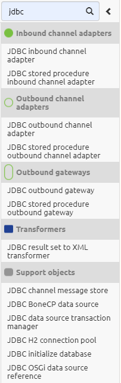
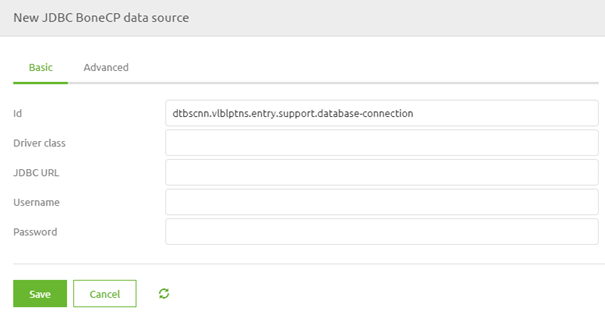

    

        <main class="micro-learning">
        <ul class="doc-nav">
            <li class="doc-nav__item"><a href="../../docs/microlearning/intermediate-database-connectivity-index" class="doc-nav__link">Home</a></li>
            <li class="doc-nav__item"><a href="#intro" class="doc-nav__link">Intro</a></li>
            <li class="doc-nav__item"><a href="#theory" class="doc-nav__link">Theory</a></li>
            <li class="doc-nav__item"><a href="#practice" class="doc-nav__link">Practice</a></li>
            <li class="doc-nav__item"><a href="#solution" class="doc-nav__link">Solution</a></li>
        </ul>

##### Intro

# Available options
 
In this microlearning, we will introduce database connectivity and look at the various options available to connect the eMagiz platform to multiple databases.

Should you have any questions, please get in touch with academy@emagiz.com.

- Last update: September 7th, 2021
- Required reading time: 4 minutes

## 1. Prerequisites
- Basic knowledge of the eMagiz platform

## 2. Key concepts
Via eMagiz you can set up a connection to an external database with the help of several components in eMagiz. The workings of the H2 database in relation to eMagiz is described in other microlearnings and therefore will not be adressed in this microlearning. The support object called JDBC BoneCP data source is needed to set up the initial connection with the external database. Once you have established the connection you can retrieve data from the database and/or write data to the database.

##### Theory
  
## 3. Available options

In this microlearning, we will introduce database connectivity and look at the various options available to connect the eMagiz platform to multiple databases. In a previous microlearning we learned about how the H2 database is used in an entry to act as bridge between the client calling eMagiz and the first queue of eMagiz. Later on we will learn how you could use the H2 databasse for other applications. The specific microlearnings can be found [here](intermediate-solution-architecture-function-of-h2-database.md) and [here](expert-solution-architecture-h2-database-for-other-applications.md).

To determine the available options we have in eMagiz to connect to databases we start our journey in the Create phase of the platform. As you know, in this phase you will construct a set of components in such a way that they provide you with a functional result. In this case the functional result is the connection with the database. As the underlying framework has its roots in Java we want to search for components that reference JDBC. JDBC stands for Java Database Connectivity. When we execute that search on the components in Create we get the following results:

As you can see from the list there are inbound and outbound components. The inbound components are relevant when you want to retrieve data from the database. The outbound components for when you want to write to the database. Furthermore there is a transformation component and support objects. The transformation component can be used to transform the result of your retrieve action into an XML message. The support objects are needed for setting up the connectivity with the database and for other purposes (such as the creation of a H2 database).

When we zoom in on the support objects we see six different support objects. Of those six there is one support object, the JDBC BoneCP data source object, that you should use if you want to set up a connection with an external database. If we zoom in on this component we see that we need to have a reference to the Driver (more on that later), the database itself and to a set of credentials.

Note that you should get this information from the external party, ideally while capturing the integration in the Capture phase.

##### Practice

## 4. Assignment

See if you can find any database implementation within the projects you can access. This assignment can be completed with the help of the (Academy) project that you have created/used in the previous assignment.

## 5. Key takeaways

- Via eMagiz you can set up a connection to an external database with the help of several components in eMagiz
- Support object called JDBC BoneCP data source is needed to set up the initial connection
- Once you have established the connection you can retrieve data from the database and/or write data to the database

##### Solution

If you are interested in this topic and want more information on it, please read the help text provided by eMagiz.

## 7. Silent demonstration video

As this is more of theoretical microlearning, there is no video accompanying the microlearning.

</main>

