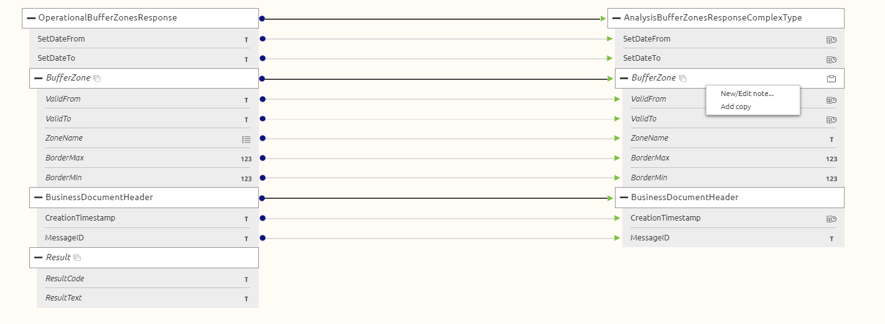
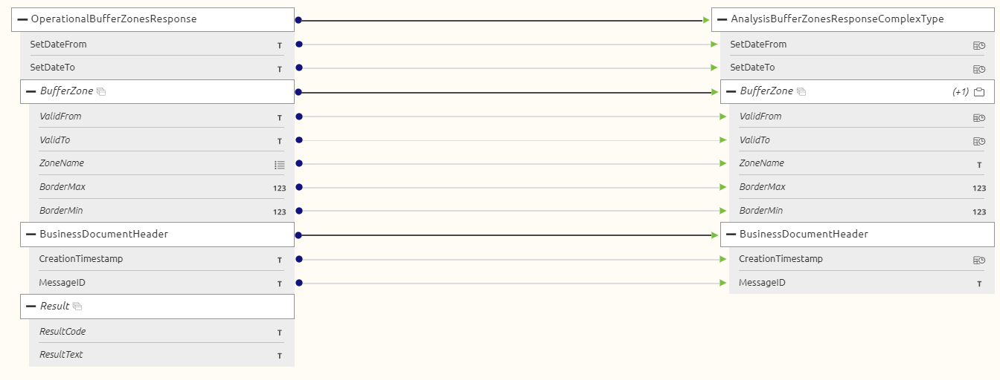
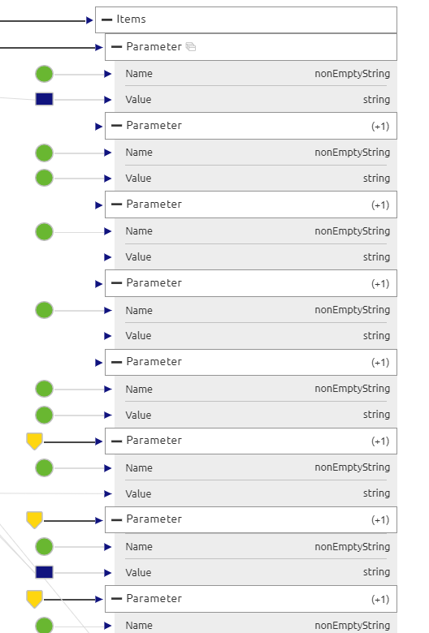

    

        <main class="micro-learning">
        <ul class="doc-nav">
            <li class="doc-nav__item"><a href="../../docs/microlearning/intermediate-database-connectivity-index" class="doc-nav__link">Home</a></li>
            <li class="doc-nav__item"><a href="#intro" class="doc-nav__link">Intro</a></li>
            <li class="doc-nav__item"><a href="#theory" class="doc-nav__link">Theory</a></li>
            <li class="doc-nav__item"><a href="#practice" class="doc-nav__link">Practice</a></li>
            <li class="doc-nav__item"><a href="#solution" class="doc-nav__link">Solution</a></li>
        </ul>

##### Intro

# Copy entities in your design mapping
 
In this microlearning, we will focus on duplicating specific elements of a target defintion. 

Should you have any questions, please get in touch with academy@emagiz.com.

- Last update: August 24th, 2021
- Required reading time: 5 minutes

## 1. Prerequisites
- Basic knowledge of the eMagiz platform

## 2. Key concepts
Copying entities in the Design phase can help to overcome specific situations where conditional mapping to fill list entities is required. For instance based on a value in the source entity, the target entity is filled differently based on source value. For instance when the target message definition requires a repeating entity that is duplicated as many times as required and is filled with different values from the source definition (parameter entity repeated with as many parameters as required).

##### Theory
  
## 3. Copy entities in the transformation

Navigate in the Design phase to the specific message mapping, topic mapping, request or response mapping. In the edit modus, you can right click on the specific target entity and press Copy. 

Once that option is clicked, the following view appears. There is a (+1) added to the entity level field, which indicates that there is one copy of this entity avalilable for specific transformation requirements. Pressing the Copy option once more indicates that there are 2 extra copies of that entity available. The mapping of source and target remains (and needs to be) exactly the same.

The net result in the Create phase transformation is that there are as many additional entities available as configured in the Design phase. Which makes it possible to make specific transformations that allows to make conditional mapping possible of the attributes in that entity. For instance, based on the value of an attribute another attribute is giving different values.

##### Practice

## 4. Assignment

Follow the instructions as above to ensure the way to use the interface is clear. Than see the net effect in the Create transformation, and see if you have an example available. This assignment can be completed with the help of the (Academy) project that you have created/used in the previous assignment.

## 5. Key takeaways

- Copying entities is indicated in the Design phase whilst editing the design transformation
- Adding notes is key to ensure the reasons why are document
- Copy entities should be peer reviewed to ensure the right solution is implemented

##### Solution

## 6. Suggested Additional Readings

None

## 7. Silent demonstration video

None

</main>

