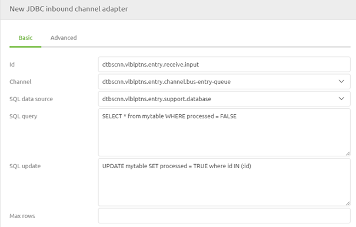

    

        <main class="micro-learning">
        <ul class="doc-nav">
            <li class="doc-nav__item"><a href="../../docs/microlearning/intermediate-database-connectivity-index" class="doc-nav__link">Home</a></li>
            <li class="doc-nav__item"><a href="#intro" class="doc-nav__link">Intro</a></li>
            <li class="doc-nav__item"><a href="#theory" class="doc-nav__link">Theory</a></li>
            <li class="doc-nav__item"><a href="#practice" class="doc-nav__link">Practice</a></li>
            <li class="doc-nav__item"><a href="#solution" class="doc-nav__link">Solution</a></li>
        </ul>

##### Intro

# Update database after retrieval
 
In the previous [microlearning](intermediate-database-connectivity-sql-query.md) we discussed the fundamentals of SQL queries. In this microlearning, we will learn how you could update the record(s) in the database the moment after you have read the information from the database. This functionality can help you update a status field to ensure you won't keep reading the same record(s) repeatedly.

Should you have any questions, please get in touch with academy@emagiz.com.

- Last update: September 7th, 2021
- Required reading time: 4 minutes

## 1. Prerequisites
- Basic knowledge of the eMagiz platform

## 2. Key concepts
eMagiz offers the option to execute an update statement right after a select statement. In the database, this can be useful when tracking the status.

##### Theory
  
## 3. Update database after retrieval

In the previous [microlearning](intermediate-database-connectivity-sql-query.md) we discussed the fundamentals of SQL queries. In this microlearning, we will learn how you could update the record(s) in the database the moment after you have read the information from the database. This functionality can help you update a status field to ensure you won't keep reading the same record(s) repeatedly.

To update the records we just read from the table, we need a slightly different update statement. As you probably remember the update statement in the previous example was written as follows UPDATE mytable SET changeddate = :headers[timestamp] where id = :headers[id]. However, with this functionality, the update statement should look like this UPDATE mytable SET processed = TRUE where id IN (:id).

As you can see, there are some subtle differences in the SQL query you need to achieve the proper result—most notable, the where statement is written differently. In the update statement, we need here; we need to define our input (IN) columns and values. Based on the input values that were returned via our SELECT statement, the update action is triggered. Within eMagiz, this is configured as follows.

In this example, we search for all rows within the table for which the value in the column processed is equal to false. If so, the select statement will return each row. After the query returns all rows, the update query will ensure that all these rows will be updated by changing the value in the column processed to true. This way, you ensure these records won't be retrieved the next time we execute the select statement.

##### Practice

## 4. Assignment

See if you can find any database implementation within the projects you can access. This assignment can be completed with the help of the (Academy) project that you have created/used in the previous assignment.

## 5. Key takeaways

- eMagiz offers the option to execute an update statement right after a select statement
- In the database, this can be useful when tracking the status.
- The update statement will update all rows returned via the select statement, assuming they pass the where clause

##### Solution

If you are interested in this topic and want more information, please read the help text provided by eMagiz and read more information on the following link:
- https://www.w3schools.com/sql/default.Asp

## 7. Silent demonstration video

This video demonstrates how you could have handled the assignment and gives you some context on what you have just learned.

<iframe width="1280" height="720" src="../../vid/microlearning/intermediate-database-connectivity-update-database-after-retrieval.mp4" frameborder="0" allow="accelerometer; autoplay; clipboard-write; encrypted-media; gyroscope; picture-in-picture" allowfullscreen></iframe>

</main>

