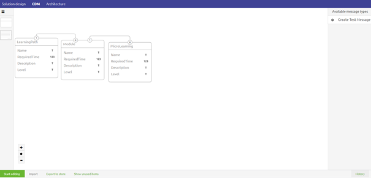
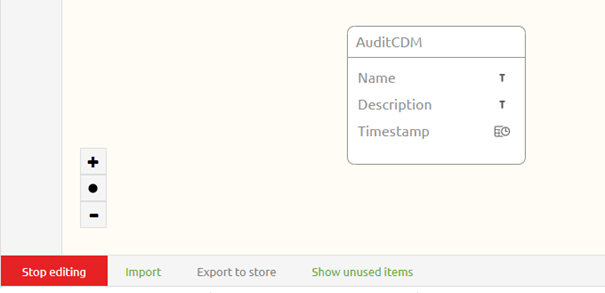
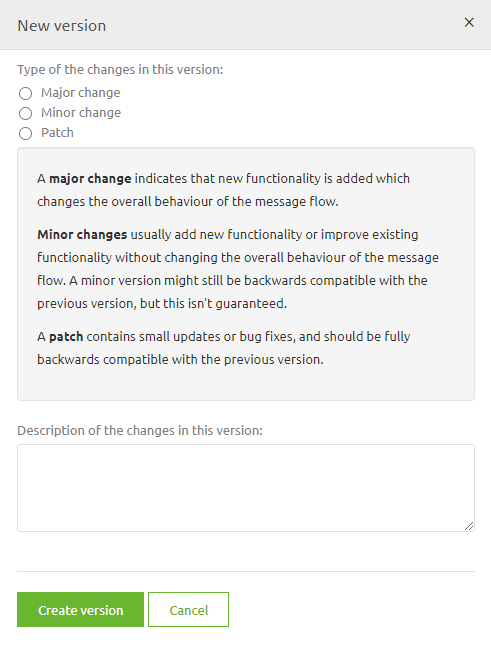

# Audit CDM

In this microlearning we will focus on how you can audit the CDM within your project to see which changed have taken place and what you should do when changing something in the CDM to make it auditable.

Should you have any questions, please contact academy@emagiz.com.

Last update: December 17th, 2020

Required reading time: 3 minutes

## 1. Prerequisites
- Basic knowledge of the eMagiz platform
- Understanding of CDM concept

## 2. Key concepts
This microlearning centers around auditing your eMagiz project on the CDM level.

By audit we mean: Making it clear who changed the CDM at a certain moment in time.

With CDM we mean: The canonical data model that defines the data structure and relationships between these data structures that are generic, uniform, and representative of how this data is looked upon within our organization.

Auditing the CDM can be done by navigating to the CDM in the Design phase and selecting the button called History located in the bottom bar.

## 3. Audit the CDM

If you want to audit the CDM (look at the history of changes made to the CDM by whom) you can navigate to the Design phase of your project and open the CDM. 
In this CDM view, you have a button on the lower bottom bar called History.

When you click on this button you will see a grid showing you the detailed history of who has done what in the past on the CDM level.

Within this overview, you have the option to search on several indicators such as who made the change or what that person described they changed 

### 3.1 Editing the CDM

Having a view of the history of the CDM adds value if you can register certain changes made on the CDM level. 
To correctly describe these changes made you rely on the person making the change. This is why it is of utmost importance that when you edit the CDM
you specify exactly what you have changed.

To edit the CDM you click on the Start Editing button located in the left bottom corner of your screen. 
The moment you have pressed Start Editing you can add, edit and delete entities and attributes on this canvas.

When you are satisfied with your changes you can press Stop editing. After you have pressed Stop editing you will see a popup.
In this pop-up, you have to define whether you have made a major change, minor change, or patch update to the CDM and describe what you have changed

As you can see what you write down in terms of what you have changed is crucial so others can easily see what exactly has been changed.

## 4. Assignment

Edit the CDM within your (Academy) project and describe what you have changed after you are satisfied with your change. 
After this ask a colleague for a peer review to see if they can determine by looking at the History what has been changed.

## 5. Key takeaways

Having audit functionality on the CDM level provides traceability and accountability for a key aspect of messaging integrations.
To make sure that auditing can be done correctly the person that does the editing must make it clear what has been changed.

## 6. Suggested Additional Readings

-

## 7. Silent demonstration video

<iframe width="1280" height="720" src="../../vid/microlearning/microlearning-audit-cdm.mp4" frameborder="0" allow="accelerometer; autoplay; clipboard-write; encrypted-media; gyroscope; picture-in-picture" allowfullscreen></iframe>