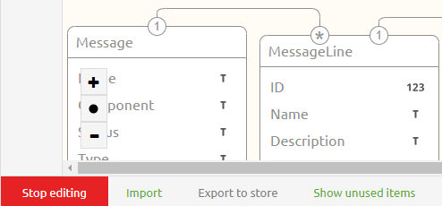
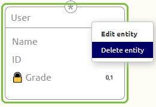
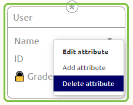
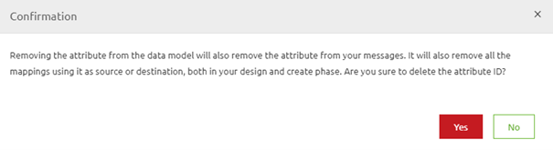

	

		<main class="micro-learning">
		<ul class="doc-nav">
			<li class="doc-nav__item"><a href="../../docs/microlearning/intermediate-defining-your-message-structures-index" class="doc-nav__link">Home</a></li>
			<li class="doc-nav__item"><a href="#intro" class="doc-nav__link">Intro</a></li>
			<li class="doc-nav__item"><a href="#theory" class="doc-nav__link">Theory</a></li>
			<li class="doc-nav__item"><a href="#practice" class="doc-nav__link">Practice</a></li>
			<li class="doc-nav__item"><a href="#solution" class="doc-nav__link">Solution</a></li>
		</ul>

##### Intro

# Cleaning up the CDM

In this microlearning, we will focus on how you can clean up your CDM elements. It is necessary to understand how you can clean up your CDM elements to ensure that your CDM keeps being a good representation of which entities and attributes are actually used within your eMagiz solution. We have kept this part as a separate microlearning as cleaning up the CDM is not a trivial manner and should only be done after careful consideration.

Should you have any questions, please contact academy@emagiz.com.

- Last update: March 29th 2021
- Required reading time: 5 minutes

## 1. Prerequisites
- Basic knowledge of the eMagiz platform

## 2. Key concepts
In this microlearning, we will focus on how you can clean up your CDM elements.
With CDM elements we mean: Entities and attributes that make up the Canonical Data Model
With clean up we mean: Remove the entities and attributes that are not used anymore within the eMagiz solution

It is necessary to understand how you can clean up your CDM elements to ensure that your CDM keeps being a good representation of which entities and attributes are actually used within your eMagiz solution. We have kept this part as a separate microlearning as cleaning up the CDM is not a trivial manner and should only be done after careful consideration.

- Removed on CDM level means removed in Create (for all definitions and transformations)
- Removed on CDM level means removed in all CDM messages in Design
- Removed on CDM level means removed in all message transformations

##### Theory

## 3. Cleaning up the CDM

As we learned in our previous microlearnings there are easy ways to define which entities and attributes on CDM level are not used anymore. As a reminder, there are three separate selection views you can use to control the usage of CDM elements

- Not assigned to any message types
- Not mapped in any message mappings
- Not present in Create phase integrations

In this microlearning we will use these selection views to identify which entities and attributes can be removed from our CDM. It is necessary to understand how you can clean up your CDM elements to ensure that your CDM keeps being a good representation of which entities and attributes are actually used within your eMagiz solution. We have kept this part as a separate microlearning as cleaning up the CDM is not a trivial manner and should only be done after careful consideration.

- Removed on CDM level means removed in Create (for all definitions and transformations)
- Removed on CDM level means removed in all CDM messages in Design
- Removed on CDM level means removed in all message transformations

### 3.1 Removal of entities and attributes

To remove entities and attributes you first need to navigate to the CDM in Design. In this overview you will see your CDM. When you press Start Editing you can start removing entities and attributes.

To do so simply navigate with your mouse to the entity and/or attribute that you want to revome and open the context menu via a right-mouse click. If you right-mouse click above the line you can remove the entity. If you right-click below the line you can delete a specific attribute.

Before you actually press the button ensure that you really want to delete the entity and/or attribute because deleting something on this level, as specified before, comes with grave consequences. To really ensure that the user is aware what he/she is doing you cannot remove anything from the CDM without reading the confirmation pop-up and pressing Yes within this pop-up. Only after you have confirmed your action eMagiz will remove the selected entity or attribute from the CDM.

As a gentle reminder, once more, this also means the following:

- Removed on CDM level means removed in Create (for all definitions and transformations)
- Removed on CDM level means removed in all CDM messages in Design
- Removed on CDM level means removed in all message transformations

##### Practice

## 4. Assignment

Analyze your CDM and based on your analysis of the previous microlearning remove one attribute from your CDM that can be safely deleted.
This assignment can be completed within the Design phase of your (Academy) project that you have created/used in the previous assignment.

## 5. Key takeaways

- It is necessary to understand how you can clean up your CDM elements to ensure that your CDM keeps being a good representation of which entities and attributes are actually used within your eMagiz solution. We  have kept this part as a separate microlearning as cleaning up the CDM is not a trivial manner and should only be done after careful consideration.
    - Removed on CDM level means removed in Create (for all definitions and transformations)
    - Removed on CDM level means removed in all CDM messages in Design
    - Removed on CDM level means removed in all message transformations
- Before removal you need to confirm your action via the conformation pop-up

##### Solution

## 6. Suggested Additional Readings

If you are interested in this topic and want more information on it please read the help text provided by eMagiz.

## 7. Silent demonstration video

This video demonstrates how you could have handled the assignment and gives you some context on what you have just learned.

<iframe width="1280" height="720" src="../../vid/microlearning/intermediate-defining-your-message-structures-cleaning-up-the-cdm.mp4" frameborder="0" allow="accelerometer; autoplay; clipboard-write; encrypted-media; gyroscope; picture-in-picture" allowfullscreen></iframe>

</main>

