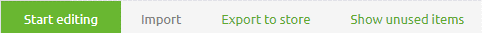
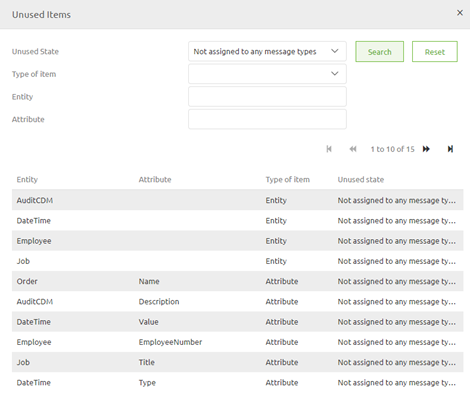
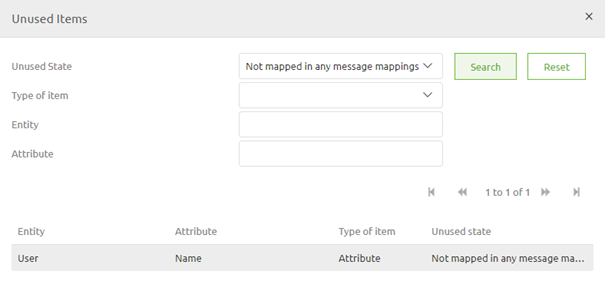
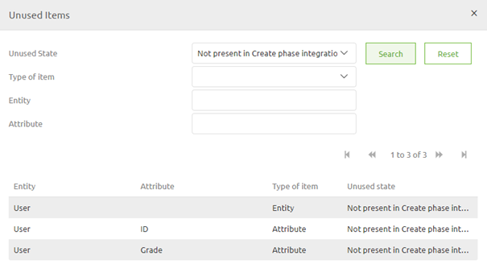

	

		<main class="micro-learning">
		<ul class="doc-nav">
			<li class="doc-nav__item"><a href="../../docs/microlearning/intermediate-defining-your-message-structures-index" class="doc-nav__link">Home</a></li>
			<li class="doc-nav__item"><a href="#intro" class="doc-nav__link">Intro</a></li>
			<li class="doc-nav__item"><a href="#theory" class="doc-nav__link">Theory</a></li>
			<li class="doc-nav__item"><a href="#practice" class="doc-nav__link">Practice</a></li>
			<li class="doc-nav__item"><a href="#solution" class="doc-nav__link">Solution</a></li>
		</ul>

##### Intro

# Control usage of CDM elements

In this microlearning, we will focus on how you can control the usage of CDM elements. It is necessary to understand how you can control the usage of CDM elements to ensure that your CDM keeps being a good representation of which entities and attributes are actually used within your eMagiz solution.

Should you have any questions, please contact academy@emagiz.com.

- Last update: March 26th 2021
- Required reading time: 7 minutes

## 1. Prerequisites
- Basic knowledge of the eMagiz platform

## 2. Key concepts
In this microlearning, we will focus on how you can control the usage of CDM elements.
With CDM elements we mean: Entities and attributes that make up the Canonical Data Model
With usage we mean: Are the entities and attributes still being used within the eMagiz solution

It is necessary to understand how you can control the usage of CDM elements to ensure that your CDM keeps being a good representation of which entities and attributes are actually used within your eMagiz solution.
There are three separate selection views you can use to control the usage of CDM elements

- Not assigned to any message types
- Not mapped in any message mappings
- Not present in Create phase integrations

##### Theory

## 3. Control usage of CDM elements

n this microlearning, we will focus on how you can control the usage of CDM elements. It is necessary to understand how you can control the usage of CDM elements to ensure that your CDM keeps being a good representation of which entities and attributes are actually used within your eMagiz solution.

It is necessary to understand how you can control the usage of CDM elements to ensure that your CDM keeps being a good representation of which entities and attributes are actually used within your eMagiz solution.
There are three separate selection views you can use to control the usage of CDM elements

- Not assigned to any message types
- Not mapped in any message mappings
- Not present in Create phase integrations

To access these views you can navigate to Design -> CDM and select the button Show unused items

After you have selected this button a pop-up will appear. Within this pop-up we can make a cross section of the CDM based on the selection views detailed above

As you can see in this pop-up you will see all unused items within your eMagiz solution. Within this pop-up you can zoom in by opting for a specific selection view.

Below we will specify per view what you can learn from each selection view.

### 3.1 Not assigned to any message types

The first selection view we are going to look at is the selection view called not assigned to any message types.

With this selection view eMagiz will show you all entities and attributes that are part of your Canocical Data Model (CDM) but are not part of any of the CDM message types (accessible via the right panel of your screen). This realization could mean one of two things:
- The entities and attributes are brand new and have yet to be included in a CDM system message
- The entities and attributes have become obsolete after the removal of an integration from eMagiz

When the former is the case no further action is needed. If the latter is the case you should also remove these entities and attributes from your CDM to ensure that your CDM is a good and solid representation of reality.

### 3.2 Not mapped in any message mappings

The second selection view we are going to look at is the selection view called not mapped in any message mappings.

With this selection view eMagiz will show you all entities and attributes that are part of your Canocical Data Model (CDM), are part of at least one of the CDM message types (accessible via the right panel of your screen) but are not mapped between system and CDM message. So in other words no line is drawn between in any of the message mappings in Design for those entities and/or attributes. This realization could mean one of two things:
- The entities and attributes are brand new and have yet to be included in a message mapping
- The entities and attributes have become obsolete after the removal of an integration from eMagiz

When the former is the case no further action is needed. If the latter is the case you should also remove these entities and attributes from your CDM to ensure that your CDM is a good and solid representation of reality.

### 3.3 Not present in Create phase integrations

The third selection view we are going to look at is the selection view called not present in Create phase integrations.

This realization could mean one of two things:
- The entities and attributes are brand new and have yet to be included in an integration in the Create phase
- The entities and attributes have become obsolete after the removal of an integration from the Create phase

When the former is the case no further action is needed. If the latter is the case you should also remove these entities and attributes from your CDM to ensure that your CDM is a good and solid representation of reality.

##### Practice

## 4. Assignment

Analyze your CDM and control per selection view the usage of CDM elements.
This assignment can be completed within the Design phase of your (Academy) project that you have created/used in the previous assignment.

## 5. Key takeaways

- It is necessary to understand how you can control the usage of CDM elements to ensure that your CDM keeps being a good representation of which entities and attributes are actually used within your eMagiz solution.
- There are three separate selection views you can use to control the usage of CDM elements
    - Not assigned to any message types
    - Not mapped in any message mappings
    - Not present in Create phase integrations

##### Solution

## 6. Suggested Additional Readings

If you are interested in this topic and want more information on it please read the help text provided by eMagiz.

## 7. Silent demonstration video

This video demonstrates how you could have handled the assignment and gives you some context on what you have just learned.

<iframe width="1280" height="720" src="../../vid/microlearning/intermediate-defining-your-message-structures-control-usage-of-cdm-elements.mp4" frameborder="0" allow="accelerometer; autoplay; clipboard-write; encrypted-media; gyroscope; picture-in-picture" allowfullscreen></iframe>

</main>

