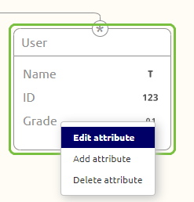
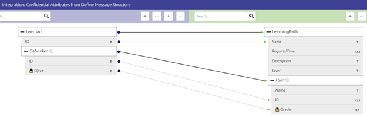

	

		<main class="micro-learning">
		<ul class="doc-nav">
			<li class="doc-nav__item"><a href="../../docs/microlearning/intermediate-defining-your-message-structures-index" class="doc-nav__link">Home</a></li>
			<li class="doc-nav__item"><a href="#intro" class="doc-nav__link">Intro</a></li>
			<li class="doc-nav__item"><a href="#theory" class="doc-nav__link">Theory</a></li>
			<li class="doc-nav__item"><a href="#practice" class="doc-nav__link">Practice</a></li>
			<li class="doc-nav__item"><a href="#solution" class="doc-nav__link">Solution</a></li>
		</ul>

##### Intro

# Data Model - Attribute Confidentiality

In this microlearning, we will focus on identifying which attributes within your data model(s) are deemed confidential and how you can register this in eMagiz.

Should you have any questions, please contact academy@emagiz.com.

- Last update: January 22th 2021
- Required reading time: 5 minutes

## 1. Prerequisites
- Basic knowledge of the eMagiz platform

## 2. Key concepts
This microlearning centers around making attributes confidential
With attributes we mean: A data element within a message (i.e. Name, BSN, EmployeeID)
With confidential we mean: Information that must be only accessible to those that need access to that (part of the) data

Identifying and registering whether an attribute is confidential can be done on all data models known in eMagiz:

- CDM
- API Gateway Data Model
- Event Streaming Data Model
- System messages

##### Theory

## 3. Data Model - Attribute Confidentiality

Within the eMagiz platform you can register whether certain attributes are confidential on all data models that are available in the platform:

- CDM
- API Gateway Data Model
- Event Streaming Data Model
- System messages

Below we give some more details based on an example on CDM level. This example can be applied in the same manner to any other data model in eMagiz

### 3.1 Registering an attribute as confidential

On the data model level (i.e CDM) in eMagiz, you can register whether attributes are confidential or not. 
The default is that no attribute in any of your data models is confidential. 
By navigating to Design and opening your data model you have the option to Edit attributes (while in Start Editing mode) via a right-click to access the context menu

Let's say that I want to give my Users a grade based on the learning path they have completed. 
As you can imagine a grade might not be something that everyone has to know so you could make this attribute confidential.

The result of pressing Save is that a lock icon will appear on the data model level indicating that the attribute in question is deemed confidential within the context of your project.

This icon not only shows on the data model level but is also visible while performing a message mapping. 
This way you can quickly identify while doing a message mapping whether certain attributes are confidential so you can take precautions on it.

##### Practice

## 4. Assignment

Make sure that at least one of the attributes within one of your data models is set to Confidential
This assignment can be completed within the Design phase of your (Academy) project that you have created/used in the previous assignment.

## 5. Key takeaways

- Identifying and registering whether an attribute is confidential can be done on all data models known in eMagiz:
	- CDM
	- API Gateway Data Model
	- Event Streaming Data Model
	- System messages
- Registering an attribute as confidential can be done by switching a boolean
- Confidentially of attributes is seen across Design when looking at data models and message mappings.

##### Solution

## 6. Suggested Additional Readings

If you are interested in this topic and want more information on it please read the help text provided by eMagiz.

## 7. Silent demonstration video

This video demonstrates how you could have handled the assignment and gives you some context on what you have just learned.

<iframe width="1280" height="720" src="../../vid/microlearning/intermediate-defining-your-message-structures-data-model-attribute-confidentiality.mp4" frameborder="0" allow="accelerometer; autoplay; clipboard-write; encrypted-media; gyroscope; picture-in-picture" allowfullscreen></iframe>

</main>

