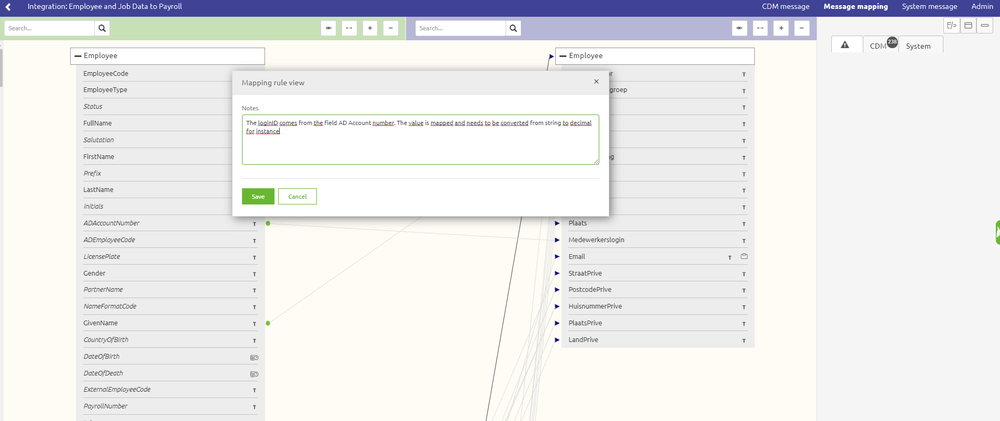

    

        <main class="micro-learning">
        <ul class="doc-nav">
            <li class="doc-nav__item"><a href="../../docs/microlearning/intermediate-design-transformations-index" class="doc-nav__link">Home</a></li>
            <li class="doc-nav__item"><a href="#intro" class="doc-nav__link">Intro</a></li>
            <li class="doc-nav__item"><a href="#theory" class="doc-nav__link">Theory</a></li>
            <li class="doc-nav__item"><a href="#practice" class="doc-nav__link">Practice</a></li>
            <li class="doc-nav__item"><a href="#solution" class="doc-nav__link">Solution</a></li>
        </ul>

##### Intro

# Adding notes to your Design transformation
 
In this microlearning, we will focus on documenting your transformations in the Design phase. Transformations in Design are usually realized during the interaction with business owners or business-like documentation. Therefore, making notes on the decisions made in the transformation are very usefull.  

Should you have any questions, please get in touch with academy@emagiz.com.

- Last update: August 23th, 2021
- Required reading time: 2 minutes

## 1. Prerequisites
- Novice knowledge of the eMagiz platform including transformations

## 2. Key concepts
There are no specific concepts to consider for now that require additional explanation

##### Theory
  
## 3. Adding a note to a transformation

Navigate in the Design phase to the specific message mapping, topic mapping, request or response mapping. In the edit modus, you can right click on the specific target atrribute and press Add notes. This option is only available on the target attributes as that is the most logical to describe the transformation.

##### Practice

## 4. Assignment

Take a look at your most recent transformation created, and add relevant notes where you can. This assignment can be completed with the help of the (Academy) project that you have created/used in the previous assignments.

## 5. Key takeaways

- Adding notes is very useful to describe the transformation decisions made during Design
- It's good to add as many notes as possible to keep the transformation properly documented
- Add notes in this phase is very handy for the Create phase to make the additional transformation steps in that specific phase. Please see the relevant microlearnings for that purpose.

##### Solution

## 6. Suggested Additional Readings

None

## 7. Silent demonstration video

None

</main>

