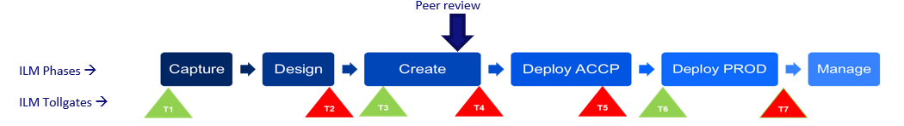

	

		<main class="micro-learning">
		<ul class="doc-nav">
			<li class="doc-nav__item"><a href="../../docs/microlearning/intermediate-devops-perspectives-index" class="doc-nav__link">Home</a></li>
			<li class="doc-nav__item"><a href="#intro" class="doc-nav__link">Intro</a></li>
			<li class="doc-nav__item"><a href="#theory" class="doc-nav__link">Theory</a></li>
			<li class="doc-nav__item"><a href="#practice" class="doc-nav__link">Practice</a></li>
			<li class="doc-nav__item"><a href="#solution" class="doc-nav__link">Solution</a></li>
		</ul>

##### Intro

# Running peer reviews inside eMagiz DevOps team

In this microlearning, we will take a look at peer reviews for eMagiz.

Should you have any questions, please contact academy@emagiz.com.

- Last update: April 22nd, 2021
- Required reading time: 8 minutes

## 1. Prerequisites
- Basic knowledge of the eMagiz platform

## 2. Key concepts
Peer reviews are defined as follows: A disciplined engineering practice for detecting and correcting defects in software artifacts and preventing their leakage into production. Its a well known and working concept with IT organization, and it can definetely applied in DevOps teams that have eMagiz as one of the technology pillars. In tbe context of eMagiz, peer reviews are done usually after the Create phase.

Key benefits of peer reviews
- Improved quality of integrations
- Higher consistency
- Knowledge sharing
- Keeping standards for optimal maintenance
- Architecture challenge and verification
- Find alternative solutions

##### Theory

## 3. Running peer reviews in eMagiz

### 3.1 Considerations for reviewee

Here are some things to keep in mind when presenting the work to peer review.
- Quickly explain the story / task / background
- Quickly show the working result if applicable / practical
- Talk through the solution while showing the models / code
	- Just trying to explain your work to someone else will help spot mistakes
	- Don’t show every single detail but try to highlight the important parts and/or details you’re less sure about. This takes time and experience to get “right” and is different depending on the story, the reviewee, the reviewer, the project, etc.
- Always do a peer review, no exceptions. Making assumptions about the usefulness beforehand defeats the whole purpose.

### 3.2 Considerations for reviewer
Here are some things to keep in mind when peer reviewing the work .
- Ask questions
	- How does this work?
	- Why did you decide to …?
	- Did you think about …?
- Spot (incorrect) assumptions
- Check application of best practices – see next slide
	- Modelling / coding patterns
	- Naming conventions
	- Errors / warnings
- Notice non-standard / unusual / abnormal things
	- Make sure this is documented, mainly for future changes. Annotations are very useful here.

### 3.3 Peer review items per ILM Phase

- Capture
	- 100% filled
	- Connection method clear
	- Authentication method clear
	- Definitions loaded
	- Sizing impact understood and valid
- Design
	- Check solution architecture validity
	- D-esign 100% filled and clear
	- CDM Root entity mapped
	- Set as mapped – avoid line mapping
	- Use annotation where possible
	- Proper flow and system settings
- Create
	- Validate routing
	- Generic error response flows
	- Check naming conventions flows, properties and XSD
	- Split messages in on-ramp – not later
- Deploy
 	- Check properties
	- Avoid too many different flow versions – max. 2
	- Remove test packages that are deployed
- Manage
	- All alerts mapped to Customer Support
	- All messages can be explained
	- Avoid code mappings
	- Enable default alerts
- Architecture
	- Deploy connector close to the source/target system
	- Ensure ACCP and PROD are exact copies
	- Cloud over on-premise
	- No hard-coded variable – use properties

##### Practice

## 4. Assignment

Build an entry that retrieves files from an external source and ensures that the data is delivered on the onramp queue. 
This assignment can be completed with the help of your (Academy) project you have created/used in the previous assignment.

## 5. Key takeaways

Peer reviews are instrumental in any DevOps team. Use the provided list as your team's peer review starting point and tune as you go along.

##### Solution
	
## 6. Suggested Additional Readings

You will find plenty background items available on the Internet.

## 7. Silent demonstration video

Not applicable

</main>

