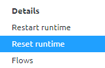
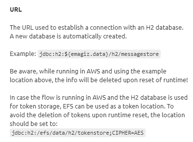

    

        <main class="micro-learning">
        <ul class="doc-nav">
            <li class="doc-nav__item"><a href="../../docs/microlearning/intermediate-emagiz-cloud-management-index" class="doc-nav__link">Home</a></li>
            <li class="doc-nav__item"><a href="#intro" class="doc-nav__link">Intro</a></li>
            <li class="doc-nav__item"><a href="#theory" class="doc-nav__link">Theory</a></li>
            <li class="doc-nav__item"><a href="#practice" class="doc-nav__link">Practice</a></li>
            <li class="doc-nav__item"><a href="#solution" class="doc-nav__link">Solution</a></li>
        </ul>

##### Intro

# Reset runtime

In a previous microlearning, we learned about restarting runtimes. In that microlearning, we learned that restarting the runtime does not affect flows, data, psychical hardware, or otherwise. It is simply jump-starting the runtime or machine once more. In this microlearning, however, we will focus on the action to reset a runtime. A reset on the other hand is the more aggressive approach and does have a significant effect. In other words, the main difference is that with a reset you begin with a clean slate compared to the simple restart.

Having said that there are some cases where it can become beneficial to reset a runtime. For instance when running into memory issues or when doing large bulk build number upgrades.

Should you have any questions, please contact academy@emagiz.com.

- Last update: July 21th, 2021
- Required reading time: 6 minutes

## 1. Prerequisites
- Basic knowledge of the eMagiz platform
- Basic knowledge of cloud management

## 2. Key concepts
This microlearning centers around resetting a runtime
With resetting, we mean: Ensure that we begin with a clean slate and forget about what happened before

- A reset is the more aggressive approach compared to a restart. 
- The reset does the following on cloud level:
    - Stops the runtime service (if running) 
    - Removes data (except Artemis folder + revision info)
    - Removes local repository folder 
    - Starts the runtime service (if stopped at step 1)
- With a reset, you start with a clean slate
    - Flow version could be different based on changes in the release
    - Custom H2 database is emptied

##### Theory

## 3. Reset runtime

In a previous microlearning, we learned about restarting runtimes. In that microlearning, we learned that restarting the runtime does not affect flows, data, psychical hardware, or otherwise. It is simply jump-starting the runtime or machine once more. In this microlearning, however, we will focus on the action to reset a runtime. A reset on the other hand is the more aggressive approach and does have a significant effect. In other words, the main difference is that with a reset you begin with a clean slate compared to the simple restart.

Having said that there are some cases where it can become beneficial to reset a runtime. For instance when running into memory issues or when doing large bulk build number upgrades.

In short, the reset action can be described by the following:

- A reset is the more aggressive approach compared to a restart. 
- The reset does the following on cloud level:
    - Stops the runtime service (if running) 
    - Removes data (except Artemis folder + revision info)
    - Removes local repository folder 
    - Starts the runtime service (if stopped at step 1)
- With a reset, you start with a clean slate
    - Flow version could be different based on changes in the release
    - Custom H2 database is emptied

To execute this action please navigate to Deploy -> Architecture (if you are not there already). After you have done so you can access the context menu of a particular runtime (via a right mouse click), while in "Start Editing" mode, and select the option called reset runtime.

After a grace period please execute the standard checks, i.e checking the logs under Manage -> Log Entries and verify if you can access the runtimes via runtime dashboard.

Note that when you have a custom H2 database on runtime level (i.e. for storing metadata) the H2 database will be deleted as well when you execute the Reset action. To safeguard against this you could store your H2 database on EFS. Please take a look at the help text for the URL field on the JDBC H2 connection pool component for more information.

##### Practice

## 4. Assignment

There is no assignment for this microlearning.

## 5. Key takeaways

- A reset is the more aggressive approach compared to a restart. 
- The reset does the following on cloud level:
    - Stops the runtime service (if running) 
    - Removes data (except Artemis folder + revision info)
    - Removes local repository folder 
    - Starts the runtime service (if stopped at step 1)
- With a reset, you start with a clean slate
    - Flow version could be different based on changes in the release
    - Custom H2 database is emptied

##### Solution

## 6. Suggested Additional Readings

There are no suggested additional readings on this topic

## 7. Silent demonstration video

There is no demonstration video of this functionality. 

</main>

