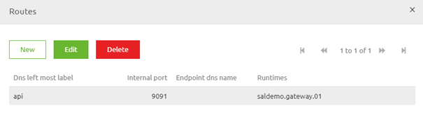
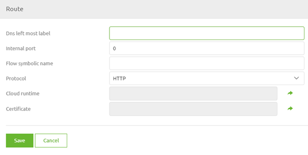
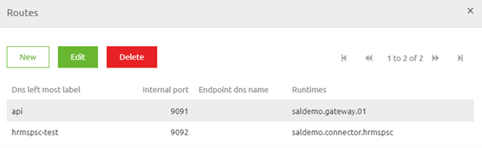

    

        <main class="micro-learning">
        <ul class="doc-nav">
            <li class="doc-nav__item"><a href="../../docs/microlearning/intermediate-emagiz-cloud-management-index" class="doc-nav__link">Home</a></li>
            <li class="doc-nav__item"><a href="#intro" class="doc-nav__link">Intro</a></li>
            <li class="doc-nav__item"><a href="#theory" class="doc-nav__link">Theory</a></li>
            <li class="doc-nav__item"><a href="#practice" class="doc-nav__link">Practice</a></li>
            <li class="doc-nav__item"><a href="#solution" class="doc-nav__link">Solution</a></li>
        </ul>

##### Intro

# Routes

In this microlearning, we will focus on the action to add, edit or delete a route. When hosting an endpoint you need to define a route to properly route the messages to the correct internal endpoint.

Should you have any questions, please contact academy@emagiz.com.

- Last update: July 20th, 2021
- Required reading time: 5 minutes

## 1. Prerequisites
- Basic knowledge of the eMagiz platform
- Basic knowledge of cloud management

## 2. Key concepts
This microlearning centers around routes within the eMagiz Cloud
With routes, we mean: The logical link between the public-facing endpoint and the internal endpoint on the cloud slot level that should process the message

- When adding a route the following will take place within the eMagiz Cloud
    - Updates the carwash to forward to the instance/port of the target runtime, Updates DNS records (Route 53)
- An update action updates the route setting
- A delete action deletes the route setting preventing traffic from entering your eMagiz Cloud solution via that route

##### Theory

## 3. Routes

In this microlearning, we will focus on the action to add, edit or delete a route. When hosting an endpoint you need to define a route to properly route the messages to the correct internal endpoint.

- When adding a route the following will take place within the eMagiz Cloud
    - Updates the carwash to forward to the instance/port of the target runtime, Updates DNS records (Route 53)
- An update action updates the route setting
- A delete action deletes the route setting preventing traffic from entering your eMagiz Cloud solution via that route

A route is a port that can be opened up to accept specific traffic. By coupling a route to a specific endpoint you can use it to host a web service (SOAP / REST) on a specific port. This route is then used to internally route the message from the carwash to the internal eMagiz Cloud endpoint you have configured here. This way you can host several web services in your integration landscape parallel to one another. Configuring routes is relatively simple and can be done via the Deploy Architecture canvas. 

As you by now probably know we first need to enter "Start Editing" mode. After we have done so we can access the context menu on the eMagiz Cloud level by clicking just to the right (or the left) of the representation of your cloud. This will lead you to the following context menu.

Selecting this option in "Start Editing" mode will lead you to an overview that lists all routes that have already been configured in previous iterations. Note that each port number can only appear once per environment per cloud slot. If you re-use the same port number within the context of the same server (in this case the VPC) only one of them will work.

In this overview, we can press the New button to add a new route. Note that you can also select an existing route and press Edit to change values. After you have clicked on the New button a new pop-up will appear that you need to fill in.

The first step in this configuration is to add the DNS left-most label. The best practice is to use the technical name of the runtime in combination with the environment (an example is hrmspsc-test). After you have done so fill in the internal port. Note that the value must match the value for the entry-port you defined on flow level within your Jetty server. This value is mainly indicated via a property reference. The best practice is to vary the start number of the port between Test, Acceptance, and Production. This is to prevent potential trouble. (an example is 9090 on Test, 8090 on Acceptance, and 7090 on Production).

After you have filled this in you can fill in the flow symbolic name. This would be something like hrmspsc.all-entry. After that, we need to link the port to a specific runtime. To do so click on the select icon and select the correct runtime in the pop-up that is shown. After you have filled in all this information the configuration should look similar to this.

When you are happy with your configuration you can press Save to return to the overview. Your entry should be added (or edited) by now.

Note that you can change routes as many times as you like. If you do not press Apply to the environment on this canvas nothing will change. More on the use and inner workings of the Apply to environment button later.

As you probably already gathered you have the option to Edit or Delete the route from the same overview we have shown above.

##### Practice

## 4. Assignment

There is no assignment for this microlearning.

## 5. Key takeaways

- When adding a route the following will take place within the eMagiz Cloud
    - Updates the carwash to forward to the instance/port of the target runtime, Updates DNS records (Route 53)
- An update action updates the route setting
- A delete action deletes the route setting preventing traffic from entering your eMagiz Cloud solution via that route

##### Solution

## 6. Suggested Additional Readings

There are no suggested additional readings on this topic

## 7. Silent demonstration video

There is no demonstration video of this functionality. 

</main>

