

	

		<main class="micro-learning">
		<ul class="doc-nav">
			<li class="doc-nav__item"><a href="../../docs/microlearning/intermediate-event-streaming-connectors-index" class="doc-nav__link">Home</a></li>
			<li class="doc-nav__item"><a href="#intro" class="doc-nav__link">Intro</a></li>
			<li class="doc-nav__item"><a href="#theory" class="doc-nav__link">Theory</a></li>
			<li class="doc-nav__item"><a href="#practice" class="doc-nav__link">Practice</a></li>
			<li class="doc-nav__item"><a href="#solution" class="doc-nav__link">Solution</a></li>
		</ul>

##### Intro

# Using eMagiz as a consumer

In this microlearning, we will focus on how you can utilize eMagiz as a consumer within the context of Event Streaming. In other words, eMagiz will consume data from a specific topic and will process the data retrieved from that topic in a certain way.

Should you have any questions, please contact academy@emagiz.com.

- Last update: March 23th, 2021
- Required reading time: 7 minutes

## 1. Prerequisites
- Basic knowledge of the eMagiz platform
- Kafka cluster you can use to test against.
- Event streaming license activated

## 2. Key concepts
This microlearning centers around using eMagiz as a consumer.
By using, in this context, we mean: Being able to consume data from topics that are managed within an external Kafka Cluster, such as the eMagiz Kafka Cluster.

By knowing how you can easily use eMagiz as a consumer in these situations you can create event processors or create hybrid configurations (i.e. messaging to event streaming combination).

In this microlearning, we will zoom in on which components in eMagiz you would need to consume data from a topic. Note that, as we learned in the previous module, eMagiz will auto-generate these components when you create an event processor. If you want more information on event processors please revisit those microlearnings

##### Theory

## 3. Using eMagiz as a consumer

By knowing how you can easily use eMagiz as a consumer in these situations you can create event processors or create hybrid configurations (i.e. messaging to event streaming combination). In this microlearning, we will zoom in on which components in eMagiz you would need to consume data from a topic. Note that, as we learned in the previous module, eMagiz will auto-generate these components when you create an event processor. If you want more information on event processors please revisit those microlearnings

When integrating several systems it can quickly happen that a subset of those systems can only be reached via traditional messaging patterns whereas others can write and/or read data directly on a topic. In this microlearning, we will focus on the scenario where an external party writes data to a topic. eMagiz will in turn consume data from the topic and distribute it to several legacy systems.

To make this work you need to identify the producing system, the consuming system (eMagiz), and create a messaging onramp that will ensure that the messaging pattern is followed towards the legacy systems. In the picture shown below, we have illustrated this in the Capture phase of eMagiz

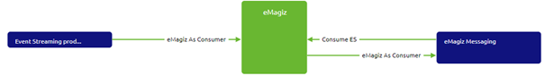

To complete the picture we need to ensure that the data is send towards a legacy system. Something along these lines:

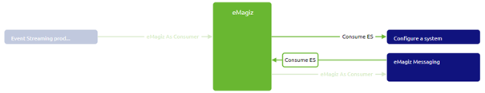

In the Design phase, you can configure your integration as explained in various of our previous microlearnings. So we will, for now, assume that you designed your integration as you had in mind.

### 3.1 View solution in Create

The first step after adding the integrations to Create is to see how this depiction of reality is represented by eMagiz in the Create phase. See below for the result of the Event Streaming part and the Messaging part:

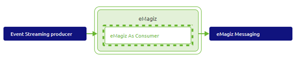

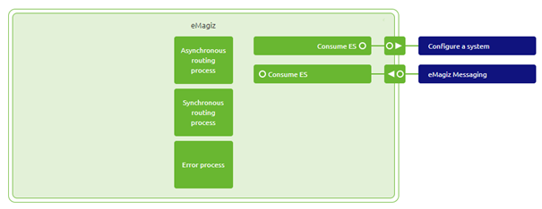

As learned in previous microlearnings the Event Streaming part, in this case, the creation of the topic is done automatically by eMagiz. We will zoom in on how you can set up your messaging entry flow in such a way that it will consume data from the topic that is automatically created by eMagiz.

### 3.2 Consume data

When you open your entry flow you will see that eMagiz has autogenerated some components for you.

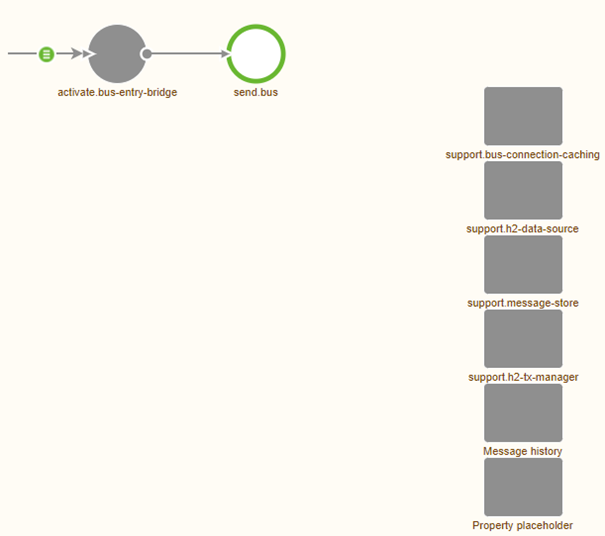

Now we need to make sure that we can consume data from the topic with the help of the eMagiz components that are available in the eMagiz flow designer. In this case, we will need the Kafka message-driven channel adapter.

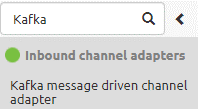

As the name suggests this component waits for messages to arrive at the Kafka topic and when they do it will consume those messages. Secondly, we need a support object that will set up the connection between the eMagiz flow and the eMagiz Event Streaming cluster that hosts the topic. This component is called the Kafka message listener container.

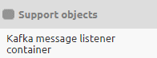

Within this component, you need to fill in several information elements. The first element is the bootstrap server URL. The bootstrap server URL is registered via a property that is build up as follows: ${nl.nameofyourparentcompany.nameofyourcompany.techninalnameofyourproject.bootstrapserver}.

Alongside the bootstrap server URL, you will need to specify the group ID. You can use any name you want. The advice is to give it a descriptive name that is recognizable later on.

The third setting you need to specify is from which topic you want to consume data. Once again these are governed by a certain naming convention:
nl.{nameofyourparentcompany.nameofyourcompany.techninalnameofyourproject}.${emagiz.runtime.environment}.{technicalnameofyourtopic}.

Last but not least on the Basic tab you need to specify that the security protocol is SSL. If you have done all of this it should look like this:

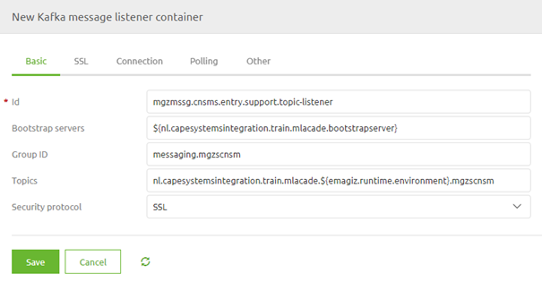

Now that we have filled in the basics for the support object we can fill in the details for our Kafka message-driven channel adapter. Here you select the output channel and link the support object to this component. The result should be similar to this:

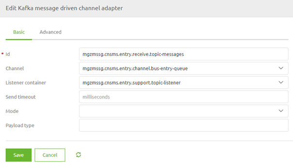

As a result your flow should look similar as shown below:

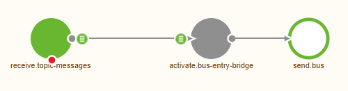

### 3.3 Set up SSL connection

As you probably noticed I skipped the part on configuring the SSL connection that will ensure that the eMagiz flow can connect to the eMagiz cluster. However, there is no room to escape anymore as we need it to correctly set up our connection with the topic. If you have an event processor within your project you can simply re-use the Keystore and truststore that eMagiz will have automatically generated for you. If you have no event processor within your project you first need to configure an external user and do some manual steps.

To reduce the complexity of this microlearning I assume that the Keystore and truststore that you need are already available within your project. The first step will be to add these resources to your flow via the Resources tab on the flow level.

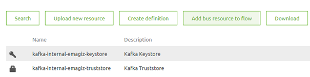

Now that we have these resources added to the flow we can navigate back to the support object and open the SSL tab and fill it in accordingly. For security reasons, I have changed the passwords in the screenshot below.

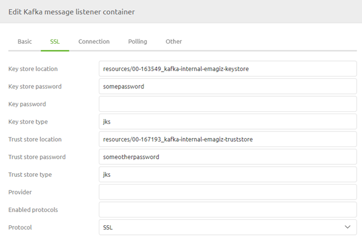

With this configured your flow is ready to consume data from the topic and from there send it via the messaging pattern to your legacy systems.

##### Practice

## 4. Assignment

Build an entry flow that will consume data from a topic and sends it to the onramp.
This assignment can be completed with the help of the (Academy) project that you have created/used in the previous assignment.

## 5. Key takeaways

- This functionality is only necessary in specific hybrid cases
- In most straightforward cases eMagiz has automated this process for you
- Don't forget to correctly connect your eMagiz flow to the eMagiz Event Streaming cluster

## 6. Suggested Additional Readings

If you are interested in this topic and want more information on it please read the help texts within eMagiz.

##### Solution

## 7. Silent demonstration video

This video demonstrates how you can test whether you have done everything correctly with regards to the assignment and gives you some context on what you have just learned.

<iframe width="1280" height="720" src="../../vid/microlearning/intermediate-event-streaming-connectors-emagiz-as-consumer.mp4" frameborder="0" allow="accelerometer; autoplay; clipboard-write; encrypted-media; gyroscope; picture-in-picture" allowfullscreen></iframe>

</main>

