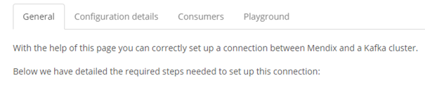
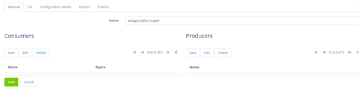
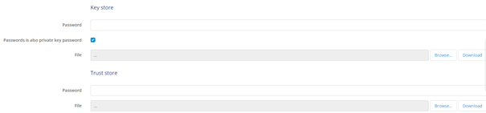
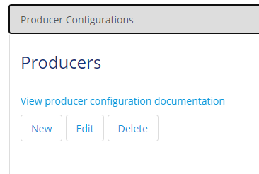
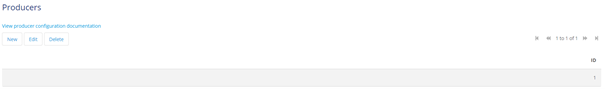
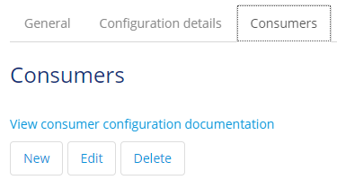
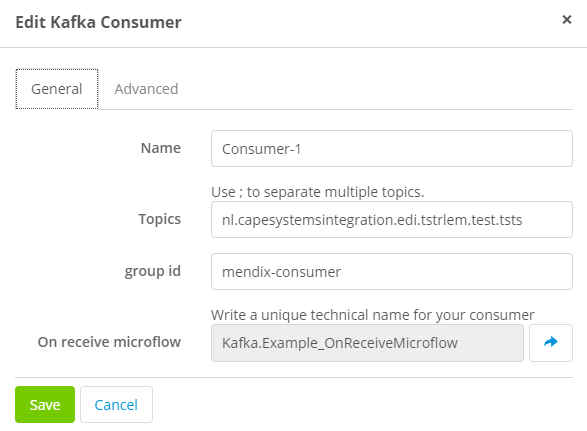
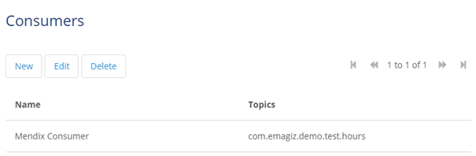
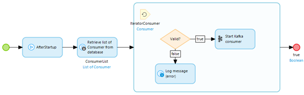

	

		<main class="micro-learning">
		<ul class="doc-nav">
			<li class="doc-nav__item"><a href="../../docs/microlearning/intermediate-event-streaming-connectors-index" class="doc-nav__link">Home</a></li>
			<li class="doc-nav__item"><a href="#intro" class="doc-nav__link">Intro</a></li>
			<li class="doc-nav__item"><a href="#theory" class="doc-nav__link">Theory</a></li>
			<li class="doc-nav__item"><a href="#practice" class="doc-nav__link">Practice</a></li>
			<li class="doc-nav__item"><a href="#solution" class="doc-nav__link">Solution</a></li>
		</ul>

##### Intro

# Using Kafka Module in Mendix

In this microlearning, we will focus on how you can utilize the Kafka Module from Mendix as available in the Mendix Store to consume and produce data from topics managed within the eMagiz Kafka Cluster.

Should you have any questions, please contact academy@emagiz.com.

- Last update: January 13th, 2021
- Required reading time: 10 minutes

## 1. Prerequisites
- Basic knowledge of the eMagiz platform
- Basic knowledge of the Mendix platform
- Mendix project in which you can test this functionality
- Kafka cluster you can use to test against.

## 2. Key concepts
This microlearning centers around using the Kafka module in Mendix.
By using, in this context, we mean: Being able to produce and consume data to and from topics that are managed within an external Kafka Cluster, such as the eMagiz Kafka Cluster.

By knowing how you can easily set up Mendix to consume and produce data from and to topics you have the option to better transport large volumes of data between several systems (i.e. two Mendix applications).

Producing data on a topic means that the external system, in this case, Mendix, writes data to a pre-defined topic where the data is stored temporarily to make sure that the data can be consumed by one or more other systems.
Consuming data from a topic means that the external system, in this case, Mendix, reads data from a pre-defined topic where the data is stored temporarily.

##### Theory

## 3. Using Kafka Module in Mendix

To use the Kafka Module in Mendix you need to be able to do at least the following:
1. Set up a connection to the external Kafka Cluster (i.e the eMagiz Kafka Cluster) from Mendix
2. Configure a Producer that can write (publish) data to a topic
3. Configure a Consumer that can read (listen) data from a topic

When you have configured these steps you would have to think about how you want to transfer data from and to your data model. 
That part is excluded in this microlearning as that focuses solely on how you build microflows in Mendix. 
It is good to notice that the Kafka Module comes with some good examples of microflows that you can use as a starting point.

### 3.1 Set up a connection to the external Kafka Cluster (i.e the eMagiz Kafka Cluster) from Mendix

The first step is to set up the connection to an external Kafka Cluster. Before we can configure anything we first need to retrieve the correct Mendix Modules from the Mendix App Store.

#### 3.1.1 App Store Modules needed

As specified before, Mendix offers the Kafka Module via the Mendix App Store. Therefore it is logical that we need to retrieve the Kafka Module from the App Store.

Apart from the Kafka Module, you will need the following App Store Modules (if you do not yet have them in your Mendix project):

- MxModelReflection
- LibraryLogging
- Encryption

#### 3.1.2 Making the configuration page accessible

After you have imported those four App Store Modules within your project you can take the next step. 
Within the Kafka Module there is a page called Server_NewEdit, make sure an admin can reach this page as this is the central page where you will do the rest of the configuration.

#### 3.1.3 Set up a connection to the external Kafka Cluster

When you run your project, access the page we specified above and press the New button.

After you have pressed the new button Mendix will show you the following page

Let us first focus on the general settings, and when we are finished with those we can turn our attention to setting up the Producer and the Consumer configuration.

To set up the general settings first navigate to the tab called Configuration. This will lead you to the following overview.

This overview holds all generic configuration elements that are needed to set up a connection to a Kafka cluster. As you can see most of it is already filled in, you don't have to change these settings.

The settings you do need to change/fill in however are:

- bootstrap servers (Ask your implementation contact that manages the Kafka cluster for the correct URL)
- security protocol (Change the security protocol to SSL)

If you have done so you can navigate to the SSL tab. In this tab, we define the Truststore and Keystore that are needed to authenticate ourselves with the Kafka Cluster.
Ask your implementation contact for the relevant Keystore and Truststore belonging to your user (including passwords).

If you have received the Keystore and Truststore you can upload them and fill in the password. 
Remember the private key password of the Keystore always needs to match the password of the Keystore itself.

The moment you are satisfied with your configuration press Save. This leads you back to the overview page where you now see one Server entry with the name you have given the Server.

### 3.2 Configure a Producer that can write (publish) data to a topic

To configure a Producer you Edit your Server and press New under where it says, Producers

Give the Producer a name and press Save. The default Configuration Mendix provides works and therefore there is no need to change it. 
The result of this is that you will see a new producer on the configuration page.

### 3.3 Configure a Consumer that can read (listen) data from a topic

To configure a Consumer you Edit your Server and press New under where it says, Consumers

Give the Consumer a name, fill in the topic from which you need to consume data, and select the On Receive Microflow that will handle the incoming data.

To discern between consumer groups you should fill in the group-id under the Configuration tab with a descriptive name so you can link it back to your application.

If you have done all this press Save. The result of this is that you will see a new consumer on the configuration page.

#### 3.3.1 Registering a Consumer

After you have configured the consumer you will need to make sure that every time your application starts up the consumer(s) are registered and are listening to whether new data comes in.

To do so make sure that in the after startup microflow of your project you retrieve the consumer(s) you have configured 
and start them one by one with the help of the Start Kafka Consumer Java Action that is included in the Kafka Module.

### 3.4 Testing the connection

To test the connection (for both the consumer as producer config) you can use the Explore and Publish tabs that are available within the configuration overview.
To test the configuration of the consumer navigate to the Explore tab and press Retrieve Topics. If Mendix returns one or more topics you know that the consumer configuration is done correctly.

To test whether your producer configuration is correct you will have to navigate to the Publish tab. In here you need to select the Producer config, 
enter the topic to which you want to Publish data and enter a message payload that you want to publish on that topic.

If you have done so press the Publish button. If everything is configured correctly you will receive a popup saying Message published in partition x at offset y! where x and y are dynamically determined by Mendix.

Congratulations, you have successfully configured Mendix to produce and consume data from and to topics registered on an external Kafka cluster.

##### Practice

## 4. Assignment

Set up a connection between your Mendix application and a Kafka cluster and test this connection with the help of the Explore and Publish tabs in the configuration overview.

## 5. Key takeaways

- The starting point is importing the correct App Store Modules within your project
- Make sure that your implementation contact has provided you with the relevant information (bootstrap server, Keystore, and Truststore)
- The pre-configured settings Mendix provides you with don't need to be changed except for one
- Testing the configuration and connection can be done via the Explore and Publish tab.

## 6. Suggested Additional Readings

If you are interested in this topic and want more information on it please see the following links:

- https://www.cloudkarafka.com/blog/2016-11-30-part1-kafka-for-beginners-what-is-apache-kafka.html#:~:text=Apache%20Kafka%20is%20a%20publish,add%2C%20process%20and%20reprocess%20records.
- https://kafka.apache.org/documentation/#topicconfigs
- https://medium.com/@tsureshkumar/sizing-kafka-capacity-needed-for-your-application-fdb6f24f67cd
- https://www.confluent.io/blog/how-choose-number-topics-partitions-kafka-cluster/
- https://kafka.apache.org/intro

##### Solution

## 7. Silent demonstration video

This video demonstrates how you can test whether you have done everything correctly with regards to the assignment and gives you some context on what you have just learned.

<iframe width="1280" height="720" src="../../vid/microlearning/intermediate-event-streaming-connectors-using-kafka-module-mendix.mp4" frameborder="0" allow="accelerometer; autoplay; clipboard-write; encrypted-media; gyroscope; picture-in-picture" allowfullscreen></iframe>

</main>

