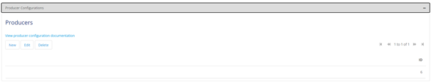

    

        <main class="micro-learning">
        <ul class="doc-nav">
            <li class="doc-nav__item"><a href="../../docs/microlearning/intermediate-event-streaming-connectors-index" class="doc-nav__link">Home</a></li>
            <li class="doc-nav__item"><a href="#intro" class="doc-nav__link">Intro</a></li>
            <li class="doc-nav__item"><a href="#theory" class="doc-nav__link">Theory</a></li>
            <li class="doc-nav__item"><a href="#practice" class="doc-nav__link">Practice</a></li>
            <li class="doc-nav__item"><a href="#solution" class="doc-nav__link">Solution</a></li>
        </ul>

##### Intro

# Using Kafka Module in Mendix

In this microlearning, we will focus on how you can utilize the Kafka Module from eMagiz as available via the portal to consume and produce data from topics managed within the eMagiz Kafka Cluster.

Should you have any questions, please get in touch with academy@emagiz.com.

- Last update: November 1st, 2021
- Required reading time: 10 minutes

## 1. Prerequisites
- Basic knowledge of the eMagiz platform
- Basic knowledge of the Mendix platform
- Mendix project in which you can test this functionality
- A Kafka cluster to which you can connect.
- Access to the eMagiz Event catalog to obtain the required Keystore & Truststore.
    - To learn more about the eMagiz Event Catalog, please refer to the microlearning, which can be found here [eMagiz Event Catalog](crashcourse-eventstreaming-catalog.md)

## 2. Key concepts
This microlearning centers around using the Kafka module of eMagiz in Mendix.
By using, in this context, we mean: Being able to produce and consume data to and from topics that are managed within an external Kafka Cluster, such as the eMagiz Kafka Cluster.

By knowing how you can easily set up Mendix to consume and produce data from and to topics, you have the option to better transport large volumes of data between several systems (i.e., two Mendix applications).

- Producing data on a topic means that the external system, in this case, Mendix, writes data to a pre-defined topic where the data is stored temporarily to ensure that one or more other systems can consume the data.
- Consuming data from a topic means that the external system, in this case, Mendix, reads data from a pre-defined topic where the data is stored temporarily.

##### Theory

## 3. Using Kafka Module in Mendix

To use the Kafka Module in Mendix, you need to be able to do at least the following:
1. Set up a connection to the external Kafka Cluster (i.e., the eMagiz Kafka Cluster) from Mendix
2. Configure a Producer that can write (publish) data to a topic or configure a Consumer that can read (listen) data from a topic

When you have configured these steps, you have to think about how you want to transfer data from and your data model. 
That part is excluded in this microlearning as that focuses solely on how you build microflows in Mendix. 
It is good to notice that the Kafka Module comes with some good examples of microflows that you can use as a starting point. 
These examples can be found in the _USE_ME folder of the Mendix module.

### 3.1 Initial Configuration Kafka Module

The first step is to set up the connection to an external Kafka Cluster. Before we can configure anything, we first need to retrieve the correct Mendix Modules from the Mendix Marketplace to which we have a dependency.

#### 3.1.1 App Store Modules needed - Dependency

You will need the following App Store Modules (if you do not yet have them in your Mendix project):

- MxModelReflection
- LibraryLogging
- Encryption

If you have not yet imported the Encryption module into your project, ensure that you define the constant EncryptionKey based on the information as specified by Mendix. Special attention is warranted for the length of the key, as this length can vary based on the version of the Encryption module that you use.
Furthermore, note that the MxModelReflection can be used to make your microflows accessible as an on receive microflow when you configure your consumer(s).

#### 3.1.2 eMagiz Kafka Module

The eMagiz Kafka Module is available in the Mendix Marketplace and is also made available via the portal (similar to the eMagiz Mendix Connector). If you have trouble finding the correct module, please contact productmanagement@emagiz.com.

#### 3.1.2 Making the configuration page accessible

After you have imported those four modules within your project, you can take the next step. 
Within the Kafka Module, there is a microflow called OpenAdministration. Ensure an admin can reach this microflow as this is the starting point for the rest of the configuration.

#### 3.2 Set up a connection to the external Kafka Cluster

When you run your project, call the microflow. The microflow will lead you to the following page.

This page consists of three tabs. The first tab documents the steps you need to take. The second tab is for the server configuration and the producer config. The third tab is for a consumer config. We will focus our attention on setting up the connection between Mendix and the Kafka cluster in this segment. This is a prerequisite for the configuration of producers and consumers and a working solution.

To set up the general settings, first, navigate to the tab called Configuration Details. This will lead you to the following overview.

This overview holds all generic configuration elements needed to set up a connection to a Kafka cluster. Under the advanced tab, you will see the detailed configuration. You do not have to change any of these settings.

The settings you do need to change/fill in, however, are:

- bootstrap servers
- reference to Keystore and truststore, including passwords.

At first, you fill in the bootstrap server URL. If you have done so, you can continue on this page by filling in the SSL details. In this second part of the overview, we define the Truststore and Keystore needed to authenticate ourselves with the Kafka Cluster.

To retrieve the relevant details that you need to configure here, please ask your implementation contact performing the eMagiz implementation to grant you access to the catalog. For more information on the catalog, please check out this [microlearning](crashcourse-eventstreaming-catalog.md).

If you have received the Keystore and Truststore, you can upload them and fill in the password. 
Remember, it is a best practice to ensure that the private key password of the Keystore always matches the password of the Keystore itself.

The moment you are satisfied with your configuration, press Save. This will show you a popup that the configuration has indeed been saved.

### 3.3 Configure a Producer

To configure a Producer, you navigate to the tab called Configuration Details. On the bottom, you have a section called Producer.

eMagiz will automatically add a producer to your server configuration filled in with all the correct detailed information. This is to make your life a little bit easier.

### 3.4 Configure a Consumer

To configure a Consumer, you navigate to the tab called Consumers and press the New button. 

Fill in the relevant information on the General tab:
- Topic(s) from which the consumer will consume data
- Group ID for identification purposes while managing the cluster
- Reference to the on-receive microflow that will handle the incoming data
    - Note that when you cannot find the on-receive microflow, you should refresh the options with the help of the MxModelReflection module (MxObjects_Overview page)

Once again, the default configuration provided under the advanced tab works, and therefore there is no need to change it.

Suppose you have done all this press Save. The result of this is that you will see a new consumer on the Consumers tab.

#### 3.4.1 Registering a Consumer

After you have configured the consumer, you will need to ensure that every time your application starts up, the consumer(s) are registered and are listening to whether new data comes in.

To do so, make sure that you retrieve the consumer(s) you have configured in the after startup microflow of your project and start them one by one. This can be easily achieved by using the microflow called AfterStartUpConsumersMicroflow, which you can find in the _USE_ME folder of the Kafka Module as part of your own after startup microflow.

Congratulations, you have successfully configured Mendix to produce and consume data from and topics registered on an external Kafka cluster.

##### Practice

## 4. Assignment

Set up a connection between your Mendix application and a Kafka cluster and test this connection with the help of the Explore and Publish tabs in the configuration overview.

## 5. Key takeaways

- The starting point is importing the correct (Marketplace) Modules within your project
- Make sure that your implementation contact has given you access to the catalog so you can retrieve the relevant information (bootstrap server, Keystore, and Truststore)
- The pre-configured settings the eMagiz Kafka Module provides you with don't need to be changed

## 6. Suggested Additional Readings

If you are interested in this topic and want more information on it, please see the following links:

- https://www.cloudkarafka.com/blog/2016-11-30-part1-kafka-for-beginners-what-is-apache-kafka.html#:~:text=Apache%20Kafka%20is%20a%20publish,add%2C%20process%20and%20reprocess%20records.
- https://kafka.apache.org/documentation/#topicconfigs
- https://medium.com/@tsureshkumar/sizing-kafka-capacity-needed-for-your-application-fdb6f24f67cd
- https://www.confluent.io/blog/how-choose-number-topics-partitions-kafka-cluster/
- https://kafka.apache.org/intro

##### Solution

## 7. Silent demonstration video

This video demonstrates how you can test whether you have done everything correctly regarding the assignment and gives you some context on what you have just learned.

<iframe width="1280" height="720" src="../../vid/microlearning/intermediate-event-streaming-connectors-using-kafka-module-mendix.mp4" frameborder="0" allow="accelerometer; autoplay; clipboard-write; encrypted-media; gyroscope; picture-in-picture" allowfullscreen></iframe>

</main>

