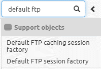
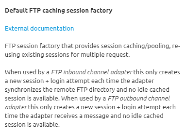
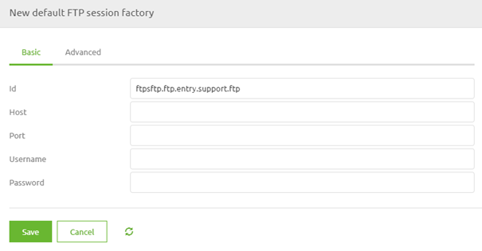
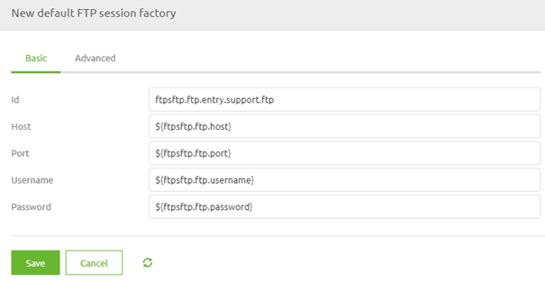
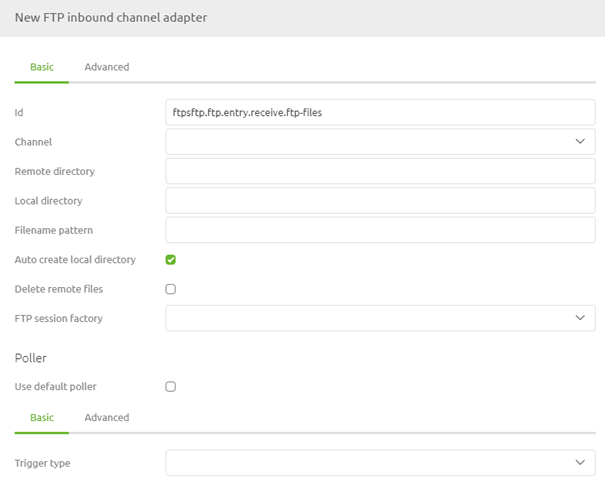
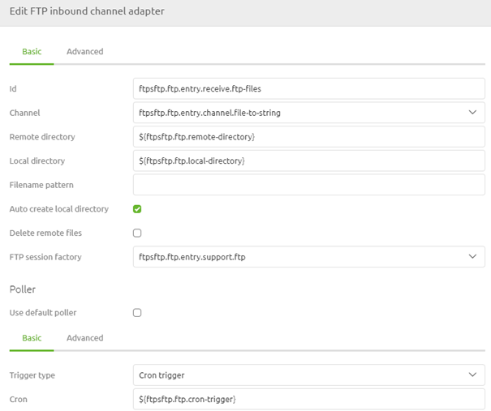

    

        <main class="micro-learning">
        <ul class="doc-nav">
            <li class="doc-nav__item"><a href="../../docs/microlearning/intermediate-file-based-connectivity-index" class="doc-nav__link">Home</a></li>
            <li class="doc-nav__item"><a href="#intro" class="doc-nav__link">Intro</a></li>
            <li class="doc-nav__item"><a href="#theory" class="doc-nav__link">Theory</a></li>
            <li class="doc-nav__item"><a href="#practice" class="doc-nav__link">Practice</a></li>
            <li class="doc-nav__item"><a href="#solution" class="doc-nav__link">Solution</a></li>
        </ul>

##### Intro

# FTP Connectivity
 
In some cases, there is no communication possible with a local file directory. Or there is a requirement from the external party to place the files somewhere else. Mainly the somewhere else is either an FTP or an SFTP. In this microlearning, we will look at the FTP and learn how to set up the connection between eMagiz and the FTP.

Should you have any questions, please get in touch with academy@emagiz.com.

- Last update: August 25th, 2021
- Required reading time: 9 minutes

## 1. Prerequisites
- Basic knowledge of the eMagiz platform
- Novice course on File-based connectivity

## 2. Key concepts
This microlearning is about FTP (connectivity).

By FTP connectivity, we mean: Making sure that eMagiz can communicate with the FTP to exchange file-based data.

- FTP (File Transfer Protocol) is a network protocol for transmitting files between computers over Transmission Control Protocol/Internet Protocol (TCP/IP) connections.
- In an FTP transaction, the end user's computer is typically called the localhost. The second computer involved in FTP is a remote host, which is usually a server.
- Servers must be set up to run FTP services, and the client must have FTP software installed to access these services.
- eMagiz provides several components to set up the FTP connection

##### Theory
  
## 3. FTP Connectivity

In some cases, there is no communication possible with a local file directory. Or there is a requirement from the external party to place the files somewhere else. Mainly the somewhere else is either an FTP or an SFTP. This microlearning will look at the FTP and learn how to set up the connection between eMagiz and the FTP.

- FTP (File Transfer Protocol) is a network protocol for transmitting files between computers over Transmission Control Protocol/Internet Protocol (TCP/IP) connections.
- In an FTP transaction, the end user's computer is typically called the localhost. The second computer involved in FTP is a remote host, which is usually a server.
- Servers must be set up to run FTP services, and the client must have FTP software installed to access these services.
- eMagiz provides several components to set up the FTP connection

So, where the file pickup component searches on the local host for the correct directory, the idea of the FTP setup is that the directory with whom to communicate exists on a remote host. The local host and the remote host can talk to each other via the FTP protocol. That is, in a nutshell, the difference between setting up an FTP connection and communicating with local directories.

eMagiz provides two support objects to connect to an FTP:
- Default FTP caching session factory
- Default FTP session factory

The main difference between the two is the caching part. The caching session factory comes with the option to re-use the existing session for multiple requests. In other words, this way, you do not have to authenticate yourself every time you want to communicate with the FTP. This behavior is beneficial if a high frequency of communication is needed between eMagiz and the FTP to handle the incoming and outgoing data packages.

If you only initiate communication infrequently, for example, once per day, the default session factory becomes more interesting as this closes the session after each transmission. This behavior is beneficial in cases of low-frequency communication because otherwise, the session would remain active for an extensive period.

### 3.1 Best practices for using FTP

#### 3.1.1 Which session factory do I need?

When occasionally retrieving or writing files to FTP, use the *Default FTP session factory*. A new connection will be set up when you use the *Default FTP session factory* for every message/file. On some FTP servers, this might take up to seconds for each login. This fact might impact the performance of your flow.

When you need better performance (say writing multiple files in a minute or retrieving files every minute), use the *Default FTP **caching** session factory*. The *Default FTP **caching** session factory* shares FTP sessions for messages in your flow.

#### 3.1.2 Do I have to set up a retry mechanism?

When writing files to FTP, it is advisable to set a retry mechanism. Find the advanced tab on your *FTP outbound channel adapter*. Under *Request handler advice chain* add a *Retry Advice*.

#### 3.1.3 I get a *Failed to list files/items* or a *Failed to obtain pooled item*. What can I do?

Incorrect connection settings can cause this. Check whether the correct properties have been set and whether the runtime has retrieved the latest properties.

#### 3.1.4 I get a *Failed to list files / items*, a *Pipe closed* or an *input stream is closed*. What can I do?

A closed FTP session can cause these notifications due to inactivity. For the *Default FTP **caching** session factory*, always set the *Server alive interval* property to 30000 (ms).

#### 3.1.6 I get a *Failed to write to*. What can I do?

Maybe the target folder does not exist, and the *Auto-create directory* is off. It is also possible that the connection settings are incorrect. Check whether the correct properties have been set and whether the runtime has retrieved the latest properties.

#### 3.1.7 I often get 'Disconnecting from sftp.example.com port 22' and then a 'Caught an exception, leaving main loop due to Socket closed' warnings.

Too many connections can cause this to the same server at the same time. If you have many flows connecting to the same FTP server, ensure that the crons do not trigger simultaneously. 

#### 3.1.8 I get a 'Failed to create SFTPClient'

SFTP, FTP, and FTPS are three different remote file transfer protocols with their *session factory* components in the eMagiz flow designer. Make sure you use the one that corresponds to the server's protocol.

#### 3.1.9 One of my remote files is not picked up from the SFTP server (without any warning)

The default local filter is *AcceptOnceFileListFilter*. This can be replaced by your file list filter on the *FTP inbound channel adapter's*.
If every day you retrieve a file with the same filename and the *Delete remote files* property is set, it is advised to use a different local filename. You can add the current timestamp, for example.

### 3.2 Configuration in eMagiz

To configure the connection between eMagiz and the FTP, we need two (or three) components. This depends on whether we want to read, write or do both while communicating with the FTP. If we're going to do both, we need both of the functional components. In all other scenarios, you only need one of the functional components. The functional components that you might need are called:

- FTP Inbound Channel adapter
- FTP Outbound Channel adapter

On top of that, you need one of the following support objects. If you are unsure of which to use, please check out the information above in this microlearning.

- Default FTP caching session factory
- Default FTP session factory

In this microlearning, we will use the FTP Inbound channel adapter combined with the Default FTP session factory to illustrate the configuration. Please note that any other combination works similarly. To configure the connection with the FTP, we first navigate to the Create phase of eMagiz. Here we open the flow we want to edit. In this example, that will be an entry flow as we want to retrieve (read) data from the FTP.

When you have opened the flow, you need to enter "Start Editing" mode. After you have done so, we first add the support object to our flow. In this case, we will use the Default FTP session factory.

Here, we need to define at least the host and the port. Note that the username and password are optional for an FTP, which makes it less secure. Although in practice, we generally see that the FTP is secured with the help of a username-password combination. As a best practice, we use property references to fill in the various elements.

The settings on the Advanced tab don't have to be changed in most cases. If your specific setup does require a change to these settings, please consult the help texts on the component level for advice.

Now that we have configured the support object adding the FTP inbound channel adapter to the flow has become time.

In this component, we need to define the remote directory where the original files are located. We need to specify the local directory used to store the files before they are processed temporarily. Furthermore, we need to link the support object we have just created and define a poller. For that last one, the best practice is the use of a cron trigger.

Apart from these configurations, you could also add a filter, just as we learned in the Crash Course Messaging on file-based connectivity. Finishing things off, we should consider the delete behavior we will use. Based on the filter and the business requirements, whether to delete and when to delete could differ. So please consider all your options in that regard. This concludes our microlearning, in which we learned how to set up the connectivity with an FTP.

##### Practice

## 4. Assignment

Configure an entry that holds the logic needed to read a file from an FTP.
This assignment can be completed with the help of the (Academy) project that you have created/used in the previous assignment.

## 5. Key takeaways

- FTP (File Transfer Protocol) is a network protocol for transmitting files between computers over Transmission Control Protocol/Internet Protocol (TCP/IP) connections.
- In an FTP transaction, the end user's computer is typically called the localhost. The second computer involved in FTP is a remote host, which is usually a server.
- Servers must be set up to run FTP services, and the client must have FTP software installed to access these services.
- eMagiz provides several components to set up the FTP connection

##### Solution

## 6. Suggested Additional Readings

If you are interested in this topic and want more information, please read the release notes provided by eMagiz. Furthermore, check out these links:
- https://docs.spring.io/spring-integration/docs/2.1.x/reference/html/ftp.html#ftp-inbound
- https://docs.spring.io/spring-integration/docs/4.3.x/reference/html/ftp.html#ftp-session-factory
- https://searchnetworking.techtarget.com/definition/File-Transfer-Protocol-FTP

## 7. Silent demonstration video

<iframe width="1280" height="720" src="../../vid/microlearning/intermediate-file-based-connectivity-ftp-connectivity.mp4" frameborder="0" allow="accelerometer; autoplay; clipboard-write; encrypted-media; gyroscope; picture-in-picture" allowfullscreen></iframe>

</main>

