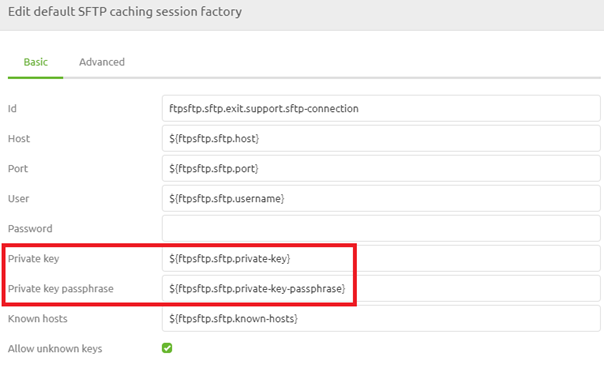

    

        <main class="micro-learning">
        <ul class="doc-nav">
            <li class="doc-nav__item"><a href="../../docs/microlearning/intermediate-file-based-connectivity-index" class="doc-nav__link">Home</a></li>
            <li class="doc-nav__item"><a href="#intro" class="doc-nav__link">Intro</a></li>
            <li class="doc-nav__item"><a href="#theory" class="doc-nav__link">Theory</a></li>
            <li class="doc-nav__item"><a href="#practice" class="doc-nav__link">Practice</a></li>
            <li class="doc-nav__item"><a href="#solution" class="doc-nav__link">Solution</a></li>
        </ul>

##### Intro

# SFTP Security
 
In the last microlearning, we discussed how to connect to an SFTP from eMagiz. In this microlearning, we want to expand our knowledge and look at a more complex security configuration when connecting to SFTP instances. The configuration we are talking about is the private key configuration.

Should you have any questions, please get in touch with academy@emagiz.com.

- Last update: August 25th, 2021
- Required reading time: 9 minutes

## 1. Prerequisites
- Basic knowledge of the eMagiz platform
- Novice course on File-based connectivity

## 2. Key concepts
This microlearning is about SFTP security.

By SFTP security, we mean: Making sure that the SFTP we connect to knows that we are indeed eMagiz

- Private key is unique per client
- Private key should only be known to the client
- Public key should be known to the SFTP (server), so they trust us when we set up the communication
- A private key comes with a passphrase

##### Theory
  
## 3. SFTP Security

In the last microlearning, we discussed how to connect to an SFTP from eMagiz. In this microlearning, we want to expand our knowledge and look at a more complex security configuration when connecting to SFTP instances. The configuration we are talking about is the private key configuration.

- Private key is unique per client
- Private key should only be known to the client
- Public key should be known to the SFTP (server), so they trust us when we set up the communication
- A private key comes with a passphrase

If you are looking for some introductory reading into certificates, please check this [microlearning](novice-securing-your-data-traffic-what-are-certificates.md).

As the private key is yours, you can ask a trusted party to generate the key, or you could create it yourself. The latter part happens a lot when connecting to an SFTP. You could use a tool like PuttyGen to achieve this. As a result, you will have a keypair. The private key should be kept safely with you in eMagiz, and you need to share the public key with the SFTP server party. In this microlearning, I will not explain how PuttyGen works in detail. Instead, we will focus on the part in eMagiz. In eMagiz, we need to refer to the key file (linked under Resources), and we need to refer to the password we use to save our key file securely.

Note that the use of a password and a private key are mutually exclusive. So you need to either provide a password or a private key for authentication. In the help text provided by eMagiz, you can see how the reference to the key file should be made. 

When you have configured these settings, you have finished the configuration in eMagiz. Now you could test whether the configuration is set up correctly between eMagiz and the SFTP. If this is not the case, eMagiz will notify you via the Manage phase, either as an error message or a log entry.

Using this setting gives the server the option to verify if the communication request came from eMagiz (or at least from the party that holds the private key of eMagiz). This is an additional security measure to ensure data integrity and quality.

##### Practice

## 4. Assignment

Check within your project(s) whether an SFTP connection is secured with the help of private key construction.
This assignment can be completed with the help of the (Academy) project that you have created/used in the previous assignment.

## 5. Key takeaways

- Private key is unique per client
- Private key should only be known to the client
- Public key should be known to the SFTP (server), so they trust us when we set up the communication
- A private key comes with a passphrase

##### Solution

## 6. Suggested Additional Readings

If you are interested in this topic and want more information, please read the release notes provided by eMagiz. Furthermore, check out these links:
- https://docs.spring.io/spring-integration/docs/2.2.6.RELEASE/reference/html/sftp.html#sftp-outbound
- https://docs.spring.io/spring-integration/docs/2.2.6.RELEASE/reference/html/sftp.html#sftp-session-factory
- https://www.2brightsparks.com/resources/articles/sftp-authentication.html

## 7. Silent demonstration video

As this is a more theoretical microlearning, there is no video.

</main>

