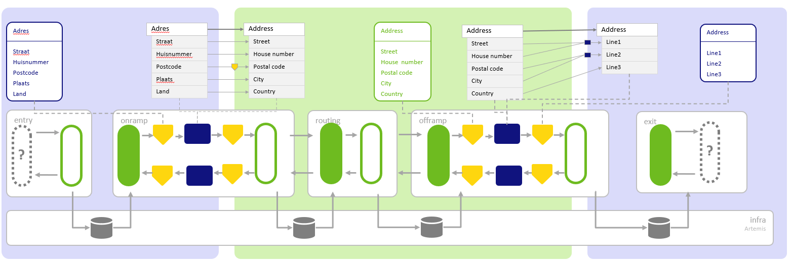

    

        <main class="micro-learning">
        <ul class="doc-nav">
            <li class="doc-nav__item"><a href="../../docs/microlearning/intermediate-key-concepts-emagiz-messaging-index" class="doc-nav__link">Home</a></li>
            <li class="doc-nav__item"><a href="#intro" class="doc-nav__link">Intro</a></li>
            <li class="doc-nav__item"><a href="#theory" class="doc-nav__link">Theory</a></li>
            <li class="doc-nav__item"><a href="#practice" class="doc-nav__link">Practice</a></li>
            <li class="doc-nav__item"><a href="#solution" class="doc-nav__link">Solution</a></li>
        </ul>

##### Intro

# Messaging Synchronous

In this microlearning, we will explain the basics of the synchronous messaging pattern.

Should you have any questions, please get in touch with academy@emagiz.com.

- Last update: August 10th, 2021
- Required reading time: 5 minutes

## 1. Prerequisites
- Basic knowledge of the eMagiz platform

## 2. Key concepts
This microlearning centers around the synchronous messaging pattern in eMagiz.
By synchronous, we mean The process that processes data and subsequently informs the caller what the status is.

Key characteristics of asynchronous messaging are:

- Blocking. The sender initiates the process and waits for a response before continuing with the following message
- Systems depend on the responses of other systems for their function
- Messages have a time limit. The response needs to be back within 25 seconds (eMagiz default)
- Uses a request-response structure that talks to one system at a time

##### Theory

## 3. Messaging Synchronous

Synchronous messaging is the less used, the less advised option when implementing a messaging integration via eMagiz. In case you want to learn more about asynchronous messaging, please check out this [microlearning](crashcourse-messaging-messaging-asynchronous.md)

Key characteristics of synchronous messaging are:

- Blocking. The sender initiates the process and waits for a response before continuing with the following message
- Systems depend on the responses of other systems for their function
- Messages have a time limit. The response needs to be back within 25 seconds (eMagiz default)
- Uses a request-response structure that talks to one system at a time

With this method, the sending party supplies the data to eMagiz via a push mechanism. eMagiz, in turn, places the data on a queue (in most cases an onramp queue). The subsequent process (the onramp) will process the message and will put the message on the next queue (the synchronous routing). That process will route each message to the correct offramp. This process continues until the message eMagiz delivers to the external system. At that point, eMagiz will wait for a response. If that response is received, the message will travel back to the starting point to deliver the reaction to the caller. If something goes wrong, for example, a timeout, the error message is also given back to the caller, and eMagiz will log the exception. If you want to learn more on that, please check out this [microlearning](intermediate-understanding-error-handling-in-emagiz-messaging-synchronous.md)

Note that this means that when one message is currently being processed, all other messages have to patiently wait until the message is processed as we speak delivered back to the caller. As there is a time constraint on the messages (25 seconds as eMagiz default), you can see why this option is less suitable within the messaging engine. The most pain is felt in the routing. Just as with asynchronous routing, the synchronous routing processes all synchronous messages that pass through your messaging engine. As a result, this means that when one synchronous process is busy, it can even hold up other synchronous processes. The API Gateway pattern is a more suitable alternative for handling the request-response pattern via an integration platform such as eMagiz. If you want to learn more on that, please check out the [crashcourse](crashcourse-api-gateway-index.md).

Another aspect of the synchronous messaging pattern to consider is that the system from which you want to retrieve data (or push data to) based on the request made by the caller needs to be online. If it is not online, eMagiz won't receive a response, and the caller cannot continue their work. This fact creates a dependency between systems that could reduce the perceived reliability of your integration solution. With asynchronous messaging, you could take measures to mitigate these risks, such as a retry mechanism.

### 3.1 Practical use case

A practical use case in which you would most likely want to handle your integration synchronously is the following use case:

Imagine you want to order something at a webshop. After you have selected the product(s), you want to open the payment process to pay. Upon payment, you also need to supply the relevant address information, so the webshop knows where to deliver the product. In doing so, you often see that when you provide your postal code (and house number), the system will automatically fill in the remainder of your address information. This functionality is there for two reasons. Your convenience and because the webshop needs this information to deliver the product you paid for correctly. If the webshop does not know where to deliver the product, the webshop cannot complete the order process. As a result, the webshop needs to send out a request that will promptly be followed by a response (a synchronous call). 

Even in this scenario, most web shops give the user the option to manually fill in the remainder of the information as they know that even when the call fails, the user still needs a way to continue. So in a sense, the webshop has taken the responsibility of handling success and failure responses.

### 3.2 Asynchronous vs Synchronous

The decision to handle an integration process in a specific manner depends on various relevant business and technical checks and balances that should be answered before choosing which integration pattern to choose and then subsequently which alternative method within an integration pattern to choose. If you want more information on how to decide this correctly, please check out this [microlearning](intermediate-discover-your-integration-landscape-determining-integration-pattern.md)

##### Practice

## 4. Assignment

Analyze a synchronous messaging flow from entry to exit and learn what happens within this process. 
This assignment can be completed with the help of your (Academy) project you have created/used in the previous assignment.

## 5. Key takeaways

- Synchronous messaging is the less used, the less advised option when implementing a messaging integration via eMagiz
- Key characteristics of synchronous messaging are:
    - Blocking. The sender initiates the process and waits for a response before continuing with the following message
    - Systems depend on the responses of other systems for their function
    - Messages have a time limit. The response needs to be back within 25 seconds (eMagiz default)
    - Uses a request-response structure that talks to one system at a time
- Using the API Gateway pattern can be a valid alternative when dealing with a synchronous integration demand.

##### Solution

## 6. Suggested Additional Readings

If you are interested in this topic and want more information, please read the help text provided by eMagiz.

## 7. Silent demonstration video

As this is a more theoretical microlearning, we have no video for this.

</main>

