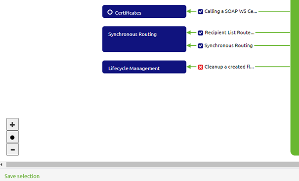
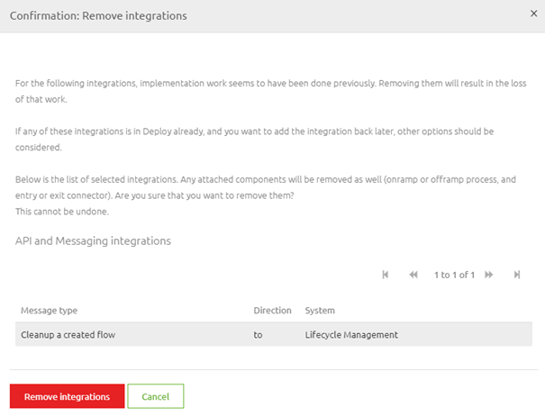

    

        <main class="micro-learning">
        <ul class="doc-nav">
            <li class="doc-nav__item"><a href="../../docs/microlearning/intermediate-lifecycle-management-index" class="doc-nav__link">Home</a></li>
            <li class="doc-nav__item"><a href="#intro" class="doc-nav__link">Intro</a></li>
            <li class="doc-nav__item"><a href="#theory" class="doc-nav__link">Theory</a></li>
            <li class="doc-nav__item"><a href="#practice" class="doc-nav__link">Practice</a></li>
            <li class="doc-nav__item"><a href="#solution" class="doc-nav__link">Solution</a></li>
        </ul>

##### Intro

# Cleanup a created integration
 
In this microlearning, we will focus on cleaning up your integration in Create. As we learned in previous microlearnings, the lifecycle management process starts in Manage and ends in Capture. Following that logic, we should ask ourselves some questions before removing an integration from the Create phase.

Should you have any questions, please get in touch with academy@emagiz.com.

- Last update: August 26th, 2021
- Required reading time: 5 minutes

## 1. Prerequisites
- Basic knowledge of the eMagiz platform
- Basic knowledge of lifecycle management

## 2. Key concepts
The focus of this microlearning will be on cleaning up a created integration.

By created integration, we mean: A line that symbolizes data traffic between a system and eMagiz for which the solution is created (i.e., components build and structured)

There are three critical considerations before cleaning up a created integration:

- Is the integration/flow not mentioned anymore in any alerting in Manage?
- Is the integration removed from all releases?
- Is it okay that I lose all my work in Create?

##### Theory
  
## 3. Cleanup a created integration

In this microlearning, we will focus on cleaning up your integration in Create. As we learned in previous microlearnings, the lifecycle management process starts in Manage and ends in Capture. Following that logic, we should ask ourselves some questions before removing an integration from the Create phase.

There are three critical considerations before cleaning up a created integration:

- Is the integration/flow not mentioned anymore in any alerting in Manage?
- Is the integration removed from all releases?
- Is it okay that I lose all my work in Create?

As you can see, a theme starts to develop itself. Each of the considerations focuses on a particular phase within eMagiz. We begin at Manage, move to Deploy, and when we end up in Create, we need to decide whether we are sure that we want to clean up the created integration.

For this microlearning, it is good to know that apart from the custom resources, everything in Create will be cleaned up when you clean up the created integration. This includes the relevant flows linked to your integration (i.e. the entry and the onramp). It includes the resources generated by eMagiz (i.e. the message definition and transformation). And last but not least it also included any associated references to the integration in question. This means that when you delete an integration to a system for which a messaging pattern is used the associated components in the (a)synchronous routing are also automatically deleted. Note that this could impact the way the routing currently functions so think carefully before you remove anything from Create.

In addition it is also good to know that we now prevent you from deleting any integration in Create if it is still linked to any release.

### 3.1 How-To

To remove an integration from Create, navigate to the Create phase and open the Add integrations overview. Here you can remove integrations by clicking on the blue icon with a checkbox. As a result, each one you select will turn red with a cross in the middle. This change happens to indicate they are candidates for removal.

When you are satisfied with your selection, you can press the Save button to execute the action. After you press Save, eMagiz will ask for confirmation. Please read the confirmation carefully as it details what could go wrong when you do this lightheartedly.

The moment you are satisfied with your selection, you press the red button called Remove integrations. That is the signal for eMagiz to remove the integration from Create. When eMagiz is done, you can press Enter to return to the Create overview.

##### Practice

## 4. Assignment

Determine whether you can clean up a created integration within your project. If so, execute the action.
This assignment can be completed with the help of the (Academy) project that you have created/used in the previous assignment.

## 5. Key takeaways

- There are three critical considerations before cleaning up a created integration:
    - Is the integration/flow not mentioned anymore in any alerting in Manage?
    - Is the integration removed from all releases?
    - Is it okay that I lose all my work in Create?
- Before deletion, eMagiz will ask for confirmation
- Deletion means that you cannot get it back anymore
- How you can remove custom resources will be discussed in a separate microlearning

##### Solution

## 6. Suggested Additional Readings

If you are interested in this topic and want more information on it, please read the release notes provided by eMagiz

## 7. Silent demonstration video

As this is a more theoretical microlearning, we have no video for this

</main>

