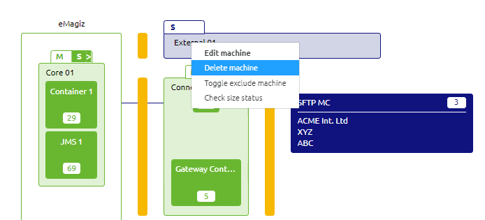

    

        <main class="micro-learning">
        <ul class="doc-nav">
            <li class="doc-nav__item"><a href="../../docs/microlearning/intermediate-lifecycle-management-index" class="doc-nav__link">Home</a></li>
            <li class="doc-nav__item"><a href="#intro" class="doc-nav__link">Intro</a></li>
            <li class="doc-nav__item"><a href="#theory" class="doc-nav__link">Theory</a></li>
            <li class="doc-nav__item"><a href="#practice" class="doc-nav__link">Practice</a></li>
            <li class="doc-nav__item"><a href="#solution" class="doc-nav__link">Solution</a></li>
        </ul>

##### Intro

# Cleanup Design Architecture
 
In this microlearning, we will focus on the verifying the Design Architecture when deleting a specific flow or system. 

Should you have any questions, please contact academy@emagiz.com.

- Last update: August 26st, 2021
- Required reading time: 5 minutes

## 1. Prerequisites
- Basic knowledge of the eMagiz platform 

## 2. Key concepts
This microlearning centers around cleaning up Design Architecture. The Design Architecture as you have seen in previous microlearnings is the place to place the designed system at the right connector machine (Cloud or on-premises). When cleaning your model it can happen that a specific system needs to be removed or relocated. The cleaned flow might be the last in the system, and therefore the system needs to be removed. Next to that, the removed flow may cause a different design decision towards the location of the system.

##### Theory
  
## 3. Cleanup Design Architecture

**1. Removal of a machine**

We are assuming that the flow in question is already removed untill the Capture phase. The system would already be removed in case it was the last flow of the system

- Go to Design Architecture
- Find an empty machine in case there is one
- Remove the machine using the menu under right click

**2. Relocate system**
We are assuming that the flow in question is already removed untill the Capture phase. The system would still be present as more flows exist

Steps
- Go to Design Architecture
- Find an runtime in case there is one
- Using drag & drop you can move the runtime to the new machine as required

Considerations
- Move the runtime to a new machine in case an existing machine has sufficient memory for the updated runtime (which has a new memory advice). See the microlearning ([Understanding Design Architecture - Basic](crashcourse-platform-design-understanding-design-architecture-basic.md)) section 3.3 for more information on checking the size of a machine.

##### Practice

## 4. Assignment

Determine whether whether your Design Architecture requires cleaning. This assignment can be completed with the help of the (Academy) project that you have created/used in the previous assignment.

## 5. Key takeaways

- Review of the Design Architecture is very important to do at a regular basis. Cleaning a flow should be always be followed by the review if the Design Architecture needs a cleanup
- Cleaning up the Design phase may also result in an update of the memory settings of the connector runtime. Please take a moment to review the appropriate microlearning for this: ([Intermediate Cloud Management](intermediate-emagiz-cloud-management-index.md)).

##### Solution

## 6. Suggested Additional Readings

If you are interested in this topic and want more information on it please read the release notes provided by eMagiz

## 7. Silent demonstration video

As this is a more theoretical microlearning we have no video for this

</main>

