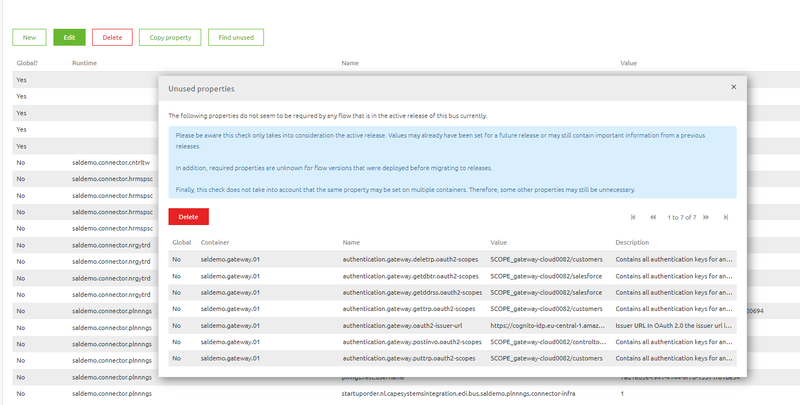

    

        <main class="micro-learning">
        <ul class="doc-nav">
            <li class="doc-nav__item"><a href="../../docs/microlearning/intermediate-lifecycle-management-index" class="doc-nav__link">Home</a></li>
            <li class="doc-nav__item"><a href="#intro" class="doc-nav__link">Intro</a></li>
            <li class="doc-nav__item"><a href="#theory" class="doc-nav__link">Theory</a></li>
            <li class="doc-nav__item"><a href="#practice" class="doc-nav__link">Practice</a></li>
            <li class="doc-nav__item"><a href="#solution" class="doc-nav__link">Solution</a></li>
        </ul>

##### Intro

# Cleanup properties
 
In this microlearning, we will focus on cleaning up your properties that you use in a particular environment (TEST, ACCEPTANCE or PRODUCTION)
Should you have any questions, please contact academy@emagiz.com.

- Last update: August 26th, 2021
- Required reading time: 5 minutes

## 1. Prerequisites
- Basic knowledge of the eMagiz platform

## 2. Key concepts
This microlearning centers around cleaning up properties. Properties are an important mean to add variable values to flows that usually depend on the environment where the flow is running. Please refer to the ([Property Management microlearning](crashcourse-platform-deploy-property-management.md)) for more information.

##### Theory
  
## 3. Cleanup properties

Navigate to the Deploy and select the environment for which you want to verify unused properties. In the properties page there is a button called Find Unused that will check if properties are unused based on the active release.

Things to consider:
- In case you have duplicated properties for your process container (to keep them the same across), you may experience that there are unused properties in case a flow is only present on 1 process container. Take care to review before pressing the delete button

##### Practice

## 4. Assignment

Determine whether properties in your project can be cleaned up. This assignment can be completed with the help of the (Academy) project that you have created/used in the previous assignment.

## 5. Key takeaways

- Ensure to keep your properties manageable by reviewing this list after each production release, or during the peer review of a flow

##### Solution

## 6. Suggested Additional Readings

If you are interested in this topic and want more information on it please read the release notes provided by eMagiz

## 7. Silent demonstration video

As this is a more theoretical microlearning we have no video for this

</main>

