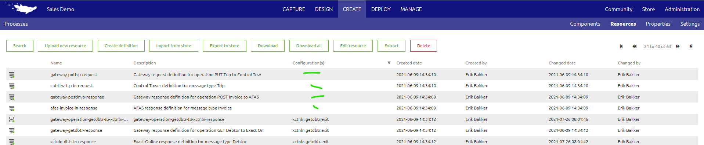

    

        <main class="micro-learning">
        <ul class="doc-nav">
            <li class="doc-nav__item"><a href="../../docs/microlearning/intermediate-lifecycle-management-index" class="doc-nav__link">Home</a></li>
            <li class="doc-nav__item"><a href="#intro" class="doc-nav__link">Intro</a></li>
            <li class="doc-nav__item"><a href="#theory" class="doc-nav__link">Theory</a></li>
            <li class="doc-nav__item"><a href="#practice" class="doc-nav__link">Practice</a></li>
            <li class="doc-nav__item"><a href="#solution" class="doc-nav__link">Solution</a></li>
        </ul>

##### Intro

# Cleanup a resource in Create
 
In this microlearning, we'll take a look how to delete a resource from an eMagiz project.

Should you have any questions, please get in touch with academy@emagiz.com.

- Last update: August 25th, 2021
- Required reading time: 2 minutes

## 1. Prerequisites
- Novice knowledge of the eMagiz platform

## 2. Key concepts
This microlearning is about cleaning up a resource from the Create phase. Resources are attached to flows and can be definition files, transformation files, key stores, or others. These resources can actively be used by flows, and are attached properly. As flows are deleted, or changed in functionality, resources can still be attached to your project but not used by any flow.

##### Theory
  
## 3. Cleanup a resource

Step 1: Navigate to the Create phase and press the resources link on the top right of the screen
Step 2: Locate the resources that are no longer attached to any flow. Whenever the value in the Configuration column is empty, it means that that specific resource is no longer used. See the view below.

Step 3: Press the delete button to remove the resource from the project

##### Practice

## 4. Assignment

Determine whether you can clean up a resource from the project that you work on. If so, execute the cleanup.
This assignment can be completed with the help of the (Academy) project that you have created/used in the previous assignment.

## 5. Key takeaways

- Cleaning up properties is relatively easy, and the eMagiz platform indicates properly which are unused
- Please note that resources with type Message definition & Message transformation are automatically created by eMagiz (with the green dot in the icon). In case you use a custom definition, that resource will remain as a resource on your project (so can't be really cleaned).
- Add a manual step to your ACCP or PROD deployment plan to clean the resources section at every release to keep things manageable.

##### Solution

## 6. Suggested Additional Readings

None

## 7. Silent demonstration video

None

</main>

