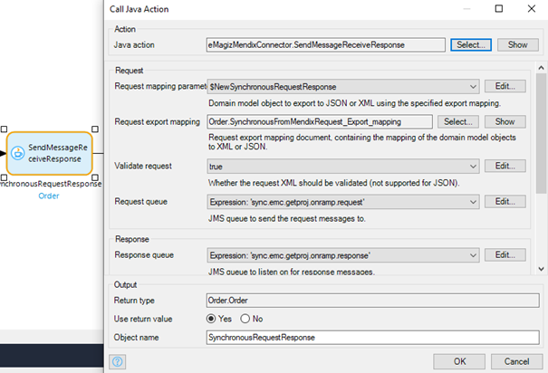

    

        <main class="micro-learning">
        <ul class="doc-nav">
            <li class="doc-nav__item"><a href="../../docs/microlearning/intermediate-mendix-connectivity-index" class="doc-nav__link">Home</a></li>
            <li class="doc-nav__item"><a href="#intro" class="doc-nav__link">Intro</a></li>
            <li class="doc-nav__item"><a href="#theory" class="doc-nav__link">Theory</a></li>
            <li class="doc-nav__item"><a href="#practice" class="doc-nav__link">Practice</a></li>
            <li class="doc-nav__item"><a href="#solution" class="doc-nav__link">Solution</a></li>
        </ul>

##### Intro

# Calling a synchronous web service from Mendix

With the help of the eMagiz Mendix module created by the eMagiz team, you can easily connect between Mendix and eMagiz for data integration. In this microlearning, we will focus on calling a synchronous web service from Mendix.

Should you have any questions, please get in touch with academy@emagiz.com.

- Last update: October 29th, 2021
- Required reading time: 6 minutes 

## 1. Prerequisites
- Intermediate knowledge of the eMagiz platform
- Access to a Mendix application
- Access to the Deploy phase of your eMagiz project
- A connection between Mendix and eMagiz Designed and Created
- Using eMagiz Mendix version 5.0.0 or higher.

## 2. Key concepts
This microlearning centers around calling a synchronous web service from Mendix
With eMagiz Mendix Connector, we mean: A Mendix module developed and maintained by eMagiz that simplifies connect a Mendix application to an eMagiz project for data traffic between both systems.

To call a synchronous web service from Mendix, you need the following:

- Export object (including mapping)
- Name of the queue on which you want to publish the data
- Import object (including mapping)

##### Theory

## 3. Calling a synchronous web service from Mendix

With the help of the eMagiz Mendix module created by the eMagiz team, you can easily connect between Mendix and eMagiz for data integration. In this microlearning, we will focus on calling a synchronous web service from Mendix. For sending data to eMagiz, we offer the following options to send data to the queue:
- Send a message and receive a single response
- Send a message and receive a list response

### 3.1 Sending synchronous messages and returning a single object

### 3.1.1 Request
1. Request Mapping parameter - Mendix Domain Model object to export JSON or XML using specified export mapping
2. Request Export mapping - Contains the export mapping from domain model object to XML or JSON
3. Validate Request - Whether request should be validated or not
4. Request Queue - enter the proper value for the onramp request queue of eMagiz where the request message needs to be put on.

### 3.1.2 Response
1. Response queue - enter the proper value for the onramp queue of eMagiz where the response message needs to be picked up from
2. Validate Response - Whether response should be validated or not
3. Response import mapping - Mapping object from XML/JSON to domain model object
4. Response Object type - Output domain model object of the import mapping and input for the microflow

### 3.2 Sending synchronous messages and returning a list

### 3.1.1 Request
1. Request Mapping parameter - Mendix Domain Model object to export JSON or XML using specified export mapping
2. Request Export mapping - Contains the export mapping from domain model object to XML or JSON
3. Validate Request - Whether request should be validated or not
4. Request Queue - enter the proper value for the onramp request queue of eMagiz where the request message needs to be put on.

### 3.1.2 Response
1. Response queue - enter the proper value for the onramp queue of eMagiz where the response message needs to be picked up from
2. Validate Response - Whether response should be validated or not
3. Response import mapping - Mapping object from XML/JSON to domain model object
4. Response Object type - Output domain model object of the import mapping and input for the microflow

##### Practice

## 4. Assignment

The assignment is simple this time. Configure a microflow that sends data to an onramp. Ideally, work on both options.
This assignment can be completed with the help of an associated Mendix project linked to the (Academy) project that you have created/used in the previous assignment.

## 5. Key takeaways

To call a synchronous web service from Mendix, you need the following:

- Export object (including mapping)
- Name of the queue on which you want to publish the data
- Import object (including mapping)

Note: To make a connection in allowing data to travel between A and B, you need to fill in the correct constants and set up your Keystore and Truststore correctly. For more information check out this [course](novice-mendix-connectivity-index.md)

##### Solution

## 6. Suggested Additional Readings

If you are interested in this topic and want more information, please read the release notes provided by eMagiz that accompany the eMagiz Mendix Connector version you have selected.

## 7. Silent demonstration video

As most of this configuration occurs in Mendix and not in eMagiz, we have chosen not to make a video on this topic. 
The pictures and text provided above should give you enough guidance to configure the connection between Mendix and eMagiz.

</main>

