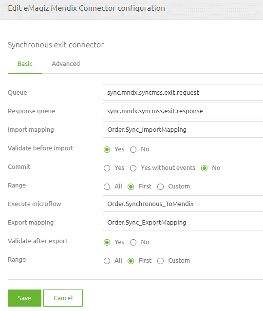
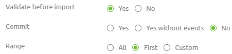
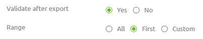
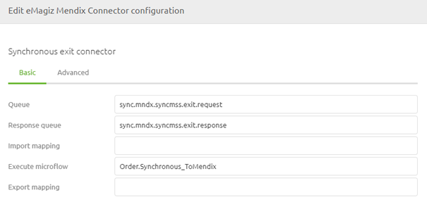

    

        <main class="micro-learning">
        <ul class="doc-nav">
            <li class="doc-nav__item"><a href="../../docs/microlearning/intermediate-mendix-connectivity-index" class="doc-nav__link">Home</a></li>
            <li class="doc-nav__item"><a href="#intro" class="doc-nav__link">Intro</a></li>
            <li class="doc-nav__item"><a href="#theory" class="doc-nav__link">Theory</a></li>
            <li class="doc-nav__item"><a href="#practice" class="doc-nav__link">Practice</a></li>
            <li class="doc-nav__item"><a href="#solution" class="doc-nav__link">Solution</a></li>
        </ul>

##### Intro

# Calling a synchronous web service in Mendix

With the help of the eMagiz Mendix module created by the eMagiz team, you can easily connect between Mendix and eMagiz for data integration. In this microlearning, we will focus on calling a synchronous web service in Mendix.

Should you have any questions, please get in touch with academy@emagiz.com.

- Last update: October 29th, 2021
- Required reading time: 6 minutes 

## 1. Prerequisites
- Intermediate knowledge of the eMagiz platform
- Access to a Mendix application
- Access to the Deploy phase of your eMagiz project
- A connection between Mendix and eMagiz Designed and Created
- Using eMagiz Mendix version 5.0.0 or higher.

## 2. Key concepts
This microlearning centers around calling a synchronous web service in Mendix
With eMagiz Mendix Connector, we mean: A Mendix module developed and maintained by eMagiz that simplifies connect a Mendix application to an eMagiz project for data traffic between both systems.

To call a synchronous web service in Mendix, you need the following:

- Execute microflow (the microflow that will process the incoming data)
- Optionally, you can define an import mapping and subsequent option

##### Theory

## 3. Calling a synchronous web service in Mendix

With the help of the eMagiz Mendix module created by the eMagiz team, you can easily connect between Mendix and eMagiz for data integration. In this microlearning, we will focus on calling a synchronous web service in Mendix. For sending data to Mendix, we offer three options to send data:
- Using the import and export mapping to send data to Mendix
- Sending a string to and from messages directly to Mendix
- Any combination of the two above

Below, we will detail how to configure each option for sending data synchronously to Mendix.

### 3.1 Sending synchronous messages with import and export mapping

To send data to Mendix, you need to define several configuration options in the exit flow within the eMagiz portal. You want to connect your eMagiz solution to Mendix. In this example, we will look at the configuration for using the import and export mapping in Mendix. In the subsequent paragraph, we will take a closer look at how to configure the exit if you do **not** want to use the import and export mapping.

You will see the following overview within the exit flow, which you can configure (in "Start Editing" mode). Here, you need to define the import mapping (complete name in Mendix including module name), the export mapping (complete name in Mendix including module name), and the execute microflow (complete name in Mendix including module name).

When selecting the import mapping, several additional options need to be chosen within the exit. What each specific option does is detailed in the accompanying help text. Below you will see an example of how you could configure this. 

Note that the Range is a critical piece of the configuration as it defines whether the root of the result of the import mapping is a list (All), a single object (First), or a limited list (Custom). Note that the parameter of your import microflow should match this to prevent errors. So, for example, when your parameter upon the import microflow is an Object, you should select the option First. If the parameter on your import microflow is a List, you should select the option All. In cases where you want to reduce the number of entries in the List, you can use the Custom option to reduce the amount to a predefined limit.

On the Export mapping level, there are similar settings you need to consider to set things up correctly within eMagiz. Once again, the Range is crucial here.

When satisfied with this setup, please create a new version of the flow and include it in your latest release. That will allow Mendix to retrieve the newest version upon the next restart of Mendix (or by manually downloading the release in Mendix).

### 3.2 Sending synchronous messages without import and export mapping

We just saw the example when working with the import and export mapping. Now we turn our attention to an instance without those mappings. In these cases, the string is just passed to the execute microflow, and you can determine in Mendix yourself what to do with it. The same applies to the export part of the logic.

You will see the following overview within the exit flow, which you can configure (in "Start Editing" mode). Here you need to define the execute microflow (complete name in Mendix including module name).

When satisfied with this setup, please create a new version of the flow and include it in your latest release. That will allow Mendix to retrieve the newest version upon the next restart of Mendix (or by manually downloading the release in Mendix).

##### Practice

## 4. Assignment

The assignment is simple this time. Configure the exit flow to send data to Mendix correctly. Ideally, work on both options.
This assignment can be completed with the help of an associated Mendix project linked to the (Academy) project that you have created/used in the previous assignment.

## 5. Key takeaways

To call a synchronous web service in Mendix, you need the following:

- Execute microflow (the microflow that will process the incoming data)
- Optionally, you can define an import mapping and subsequent option
- Setting the Range option correctly is critical to prevent 'unexpected' errors

Note: To make a connection in allowing data to travel between A and B, you need to fill in the correct constants and set up your Keystore and Truststore correctly. For more information check out this [course](novice-mendix-connectivity-index.md)

##### Solution

## 6. Suggested Additional Readings

If you are interested in this topic and want more information, please read the release notes provided by eMagiz that accompany the eMagiz Mendix Connector version you have selected.

## 7. Silent demonstration video

We have opted not to make a video on this for now.
The pictures and text provided above should give you enough guidance to configure the connection between Mendix and eMagiz.

</main>

