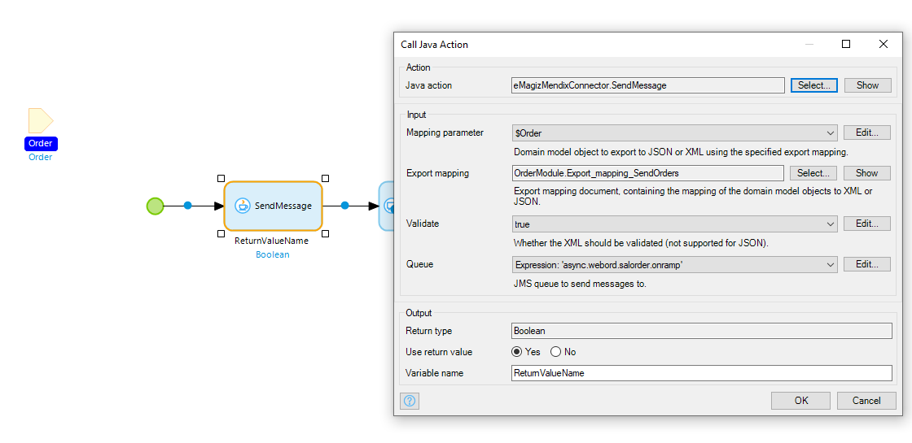
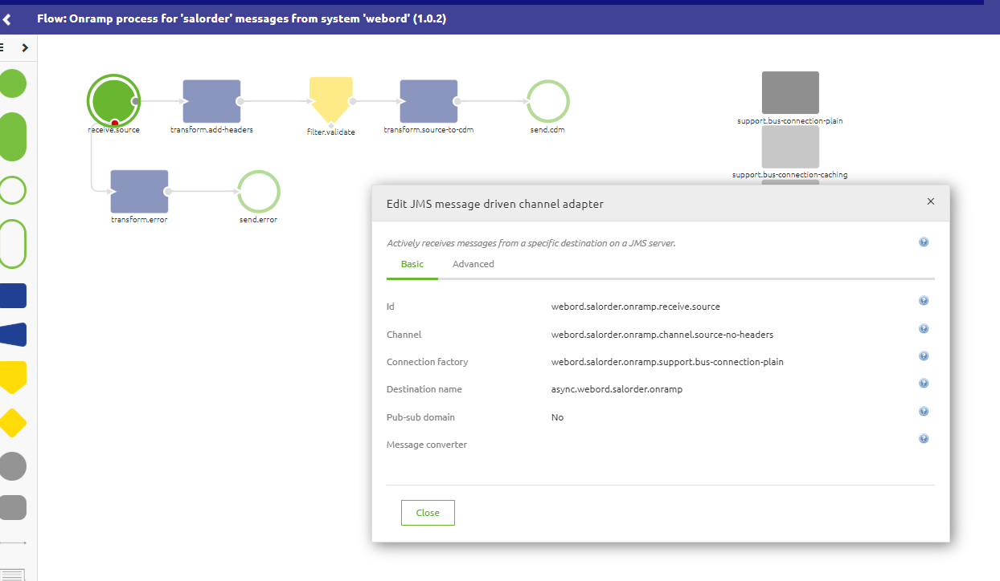
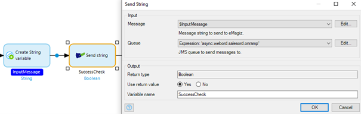

    

        <main class="micro-learning">
        <ul class="doc-nav">
            <li class="doc-nav__item"><a href="../../docs/microlearning/intermediate-mendix-connectivity-index" class="doc-nav__link">Home</a></li>
            <li class="doc-nav__item"><a href="#intro" class="doc-nav__link">Intro</a></li>
            <li class="doc-nav__item"><a href="#theory" class="doc-nav__link">Theory</a></li>
            <li class="doc-nav__item"><a href="#practice" class="doc-nav__link">Practice</a></li>
            <li class="doc-nav__item"><a href="#solution" class="doc-nav__link">Solution</a></li>
        </ul>

##### Intro

# Calling an asynchronous web service from Mendix

With the help of the eMagiz Mendix module created by the eMagiz team, you can easily connect between Mendix and eMagiz for data integration. In this microlearning, we will focus on calling an asynchronous web service from Mendix.

Should you have any questions, please get in touch with academy@emagiz.com.

- Last update: October 29th, 2021
- Required reading time: 6 minutes 

## 1. Prerequisites
- Intermediate knowledge of the eMagiz platform
- Access to a Mendix application
- Access to the Deploy phase of your eMagiz project
- A connection between Mendix and eMagiz Designed and Created
- Using eMagiz Mendix version 5.0.0 or higher.

## 2. Key concepts
This microlearning centers around calling an asynchronous web service from Mendix
With eMagiz Mendix Connector, we mean: A Mendix module developed and maintained by eMagiz that simplifies connect a Mendix application to an eMagiz project for data traffic between both systems.

To call an asynchronous web service from Mendix, you need the following:

- Export object (including mapping) or string to export
- Name of the queue on which you want to publish the data

##### Theory

## 3. Calling an asynchronous web service from Mendix

With the help of the eMagiz Mendix module created by the eMagiz team, you can easily connect between Mendix and eMagiz for data integration. In this microlearning, we will focus on calling an asynchronous web service from Mendix. For sending data to eMagiz, we offer two options to send data to our messaging engine:
- Using the export mapping to send data to the queue
- Sending a string message directly to the queue

Alternatively, you could use the eMagiz Kafka connector to connect to the event broker that eMagiz offers. For more information on that, please check out this [microlearning](intermediate-event-streaming-connectors-using-Kafka-module-mendix.md).

Below, we will detail how to configure each option for sending data asynchronously to the messaging engine.

### 3.1 Sending asynchronous messages via Send Message Java Action
Below is the example of the Send Message microflow that contains this Java Action.

1. Mapping parameter - select the Mendix entity that holds the data to be sent to eMagiz for further processing
2. Export mapping - ensure to have created a Mendix Export mapping object so that the data can be appropriately processed by eMagiz. Consider sequence, data types, and other aspects of attributes to ensure the message can be adequately processed
3. Validate - select if the message needs to be validated in Mendix
4. Queue - enter the proper value for the onramp queue of eMagiz where the message needs to be put on. Below is an example of an onramp queue / select the destination name as the queue name.

### 3.2 Sending asynchronous messages via Send String Java Action
Below is the example of the Send Message microflow that contains this Java Action.

1. Message - a string representation of a message that you want to place on the queue
2. Queue - enter the proper value for the onramp queue of eMagiz where the message needs to be put on. Below is an example of an onramp queue / select the destination name as the queue name.

##### Practice

## 4. Assignment

The assignment is simple this time. Configure a microflow that sends data to an onramp. Ideally, work on both options.
This assignment can be completed with the help of an associated Mendix project linked to the (Academy) project that you have created/used in the previous assignment.

## 5. Key takeaways

To call an asynchronous web service from Mendix you need the following:

- Export object (including mapping) or string to export
- Name of the queue on which you want to publish the data
- Depending on your needs, there is a separate Java action available

Note: To make a connection in allowing data to travel between A and B, you need to fill in the correct constants and set up your Keystore and Truststore correctly. For more information check out this [course](novice-mendix-connectivity-index.md)

##### Solution

## 6. Suggested Additional Readings

If you are interested in this topic and want more information, please read the release notes provided by eMagiz that accompany the eMagiz Mendix Connector version you have selected.

## 7. Silent demonstration video

As most of this configuration occurs in Mendix and not in eMagiz, we have chosen not to make a video on this topic. 
The pictures and text provided above should give you enough guidance to configure the connection between Mendix and eMagiz.

</main>

